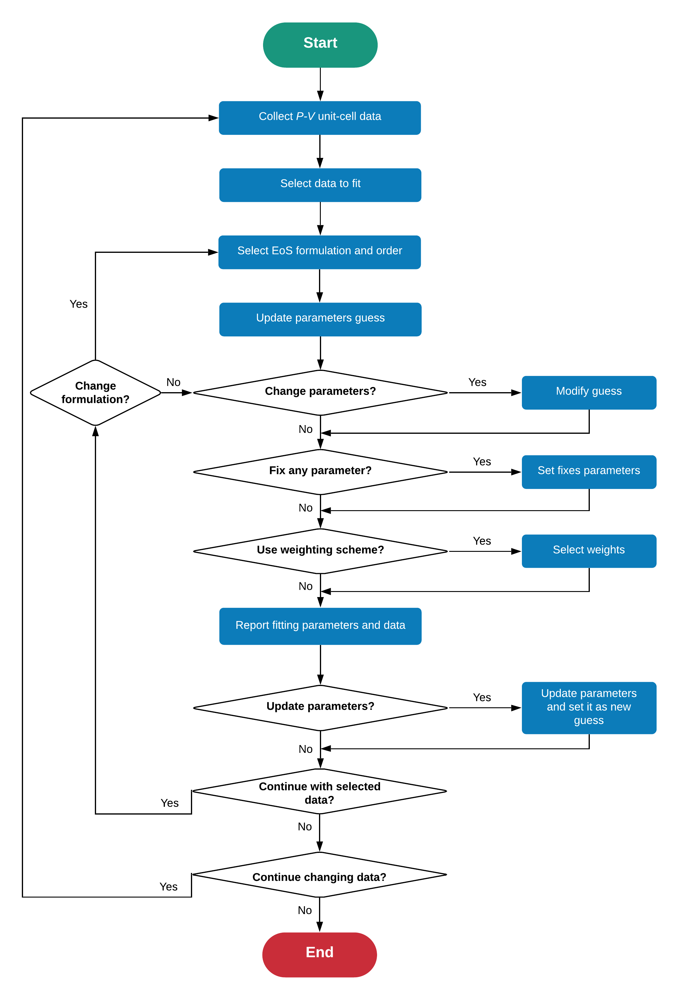

.. _background_eos:

===========================
Equation of State (EoS) fit
===========================

.. topic:: Overview

    The equation of state (EoS) of a material describe how its volume changes
    with pressure. Here, the EoS formulations coded into **Quantas** are 
    briefly presented.

    :Last update: |today|
    :Author: **Gianfranco Ulian**

.. note::

    Currently, **Quantas** provides isothermal equation of states. Thermal
    expansion models and P-T-V EoS will be provided in future releases.

Equation of State formulations
==============================

In both experimental and theoretical settings, the volumetric behaviour of a 
solid phase with pressure can be described in a functional form called 
*equation of state* (EoS).

The volume of the solid is related to its unit cell, which is obtained from 
high-pressure diffraction experiments. The equation of state is a parametrized 
function, containing from two to four parameters that are adjusted to fit the 
experimental data. There are several works in literature that provide a 
detailed description of the theory behind the EoS formulations, [1]_:sup:`,` 
[2]_ and here only the relevant information is discussed.

In **Quantas**, there are five isothermal equation of state formulation coded:

  1. Murnaghan: [3]_

  .. math::
      
      P_{VT} = \frac{K_{0T}}{K^{\prime}_{0T}} \Bigg[ \Big(
      \frac{V_{0T}}{V} \Big)^{K^{\prime}_{0T}} - 1 \Bigg] 

  2. Birch-Murnaghan: [4]_

  .. math::
              
     P_{VT} = 3K_{0T}f_E \big(1 + 2f_E \big)^{5/2} \Bigg[
     1 + \frac{3}{2}\big(K^{\prime}_{0T} - 4\big)f_E + 

  .. math::

     \frac{3}{2} \Big(K_{0T}K^{\prime \prime}_{0T}+ \big(K^{\prime}_{0T} - 
     4\big)\big(K^{\prime}_{0T} - 3\big) + \frac{35}{9} \Big) f^2_E \Bigg]
          
  
  .. math::

     f_E = \frac{1}{2}\Bigg[\bigg( \frac{V_{0T}}{V} \bigg)^{\frac{2}{3}} -1 
     \Bigg]
     
  3. Natural Strain: [5]_

  .. math::

     P_{VT} = 3K_{0T}\Big(\frac{V_{0T}}{V_{PT}}\Big)f_N \Bigg[
     1 + af_N + bf^2_N \Bigg]

  .. math::

     f_N = \frac{1}{3} ln\Big(\frac{V_0}{V}\Big)

  .. math::

     a = \frac{3}{2} \big(K^{\prime}_{0T} - 2 \big)

  .. math::

     b = \frac{3}{2} \Big[ 1 + K_{0T} K^{\prime \prime}_{0T} + 
     \big(K^{\prime}_{0T} -2\big) + \big(K^{\prime}_{0T} -2\big)^2 \Big]
      
  4. Vinet: [6]_

  .. math::

     P_{VT} = K_{0T} \frac{3f_V}{\big(1-f_V\big)^2} 
     exp\big(\eta f_V\big)

  .. math::
        
     f_V = 1- \Big( \frac{V_{PT}}{V_{0T}} \Big)^{1/3}
            
  .. math::
        
     \eta = \frac{3}{2} \big(K^{\prime}_{0T} - 1 \big)

  5. Tait: [7]_

  .. math::

     P_{VT} = \frac{1}{b} \Bigg\{ \Bigg[\frac{\big(V_{PT}/V_{0T}\big) + a - 1 
     }{a} \Bigg]^{-1/c} - 1 \Bigg\}

  .. math::
        
     a = \frac{1 + K^{\prime}_{0T}}{1 + K^{\prime}_{0T} + K_{0T} K^{\prime 
     \prime}_{0T}}
        
  .. math::
        
     b = \frac{K^{\prime}_{0T}}{K_{0T}} - \frac{K^{\prime \prime}_{0T}}{1 + 
     K^{\prime}_{0T}}
        
  .. math::
            
     c =  \frac{1+K^{\prime}_{0T}+K_{0T} K^{\prime 
     \prime}_{0T}}{\big(K^{\prime}_{0T} \big)^2 + K^{\prime}_{0T} - 
     K_{0T} K^{\prime \prime}_{0T}} 

where :math:`V_{0T}` is the unit cell volume, :math:`K_{0T}` is the bulk 
modulus, :math:`K^{\prime}_{0T}` is the first derivative of the bulk modulus 
with respect to pressure and :math:`K^{\prime \prime}_{0T}` is the second 
derivative of :math:`K_{0T}`. Worth remembering that the subscripts *0* and 
*T* mean that each parameter is obtained at reference pressure zero and 
reference temperature T. 

The modified Tait (T) and Murnaghan (M) EoS are *invertible* formulations, as 
it is possible to express the unit cell volume as a function of pressure by 
inverting the equation. Also, the Tait equation of state can be reduced to the Murnaghan one by imposing :math:`K^{\prime \prime}_{0T} = 0`.

Birch-Murnaghan (BM), Natural strain (NS) equations of state are *finite 
strain EoS*, which were formulated considering that the energy of the 
compressed solid can be expressed as a Taylor series in the linear strain 
:math:`f` (Eulerian strain, :math:`f_E`, for the BM EoS and Natural strain, 
:math:`f_N`, for the NS EoS). Both of them are 4th-order expansions, but 
they can be truncated to 3th- and 2nd-order expressions by using implied 
values for the :math:`K^{\prime}_{0T}`  and :math:`K^{\prime \prime}_{0T}` 
parameters, respectively.

The Vinet (V) equation of state was derived from molecular mechanics models 
for very high compression regimes and is a third-order EoS.

Data fitting approach
=====================

According to literature and to the reported formulations, the fitting 
strategy considers the volume as the independent variable and the pressure as 
the dependent one, as the experimental uncertainties on :math:`V` are 
generally much lower those on :math:`P`. Then, a least-squares method is used 
to fit the data, employing the errors on the variables as weights during the 
procedure. For example, this is the approach adopted by the well-known EOSFit 
software. [8]_  The goodness of fit is given by the residual variance (weighted chi-squared, :math:`\chi^2`), which is equal to unity (1) if the EoS model perfectly match the weighted experimental data. 
On the contrary, if :math:`\chi^2 > 1` it means that the equation of state 
correctly represent only a portion of the data, for several possible reasons. 
Some compression states were not adequately obtained (wrong data), the errors 
of the values were underestimated or the model is not accurate enough to 
describe all the data set (for example, it is discouraged to use the Murnaghan 
EoS for unit cell compressions higher that 10%). A value of :math:`\chi^2 < 1` does not represent a better fit and may be also an overfitting of the data.

In **Quantas**, a different fitting approach in employed, namely the software
employs Orthogonal Distance Regression (ODR) to calculate the parameters of the
different EoS formulations. [9]_ With this approach, the experimental 
uncertainties on pressure can also be included as a weight in the fitting 
procedure.

Workflow of EoS fitting procedure
=================================

The following scheme reports how the Equation of State fitting procedure is performed in 
Quantas. It is worth noting that the procedure is interactive, meaning that the user has complete control on the choices reported in the graph.

.. rubric:: References

.. [1] Anderson, O.L., 1995. Equation of state of solids for geophysics and
   ceramic science. Oxford University Press, New York, US.

.. [2] Angel, R.J., Gonzalez-Platas, J., Alvaro, M., 2014. EosFit7c and a 
   Fortran module (library) for equation of state calculations. Z. 
   Kristallogr. 229, 405-419.

.. [3] Murnaghan, F.D., 1937. Finite deformations of an elastic solid. 
   American Journal of Mathematics 49, 235-260.

.. [4] Birch, F., 1947. Finite elastic strain of cubic crystal. Physical 
   Review 71, 809-824.

.. [5] Poirier, J.P., Tarantola, A., 1998. A logarithmic equation of state. 
   Phys. Earth Planet. Inter. 109, 1-8.

.. [6] Vinet, P., Ferrante, J., Rose, J.H., Smith, J.R., 1987. Compressibility 
   of Solids. J Geophys Res-Solid 92, 9319-9325.

.. [7] Freund, J., Ingalls, R., 1989. Inverted Isothermal Equations of State 
   and Determination of B0' and B0''. J. Phys. Chem. Solids 50, 263-268.

.. [8] Angel, R.J., 2001. EOS-FIT6.0. Computer Program 
   (http://www.rossangel.com).
   
.. [9] P. T. Boggs and J. E. Rogers, Orthogonal Distance Regression, in 
   *Statistical analysis of measurement error models and applications: 
   proceedings of the AMS-IMS-SIAM joint summer research conference held June 
   10-16, 1989*, Contemporary Mathematics, vol. 112, pg. 186, 1990.