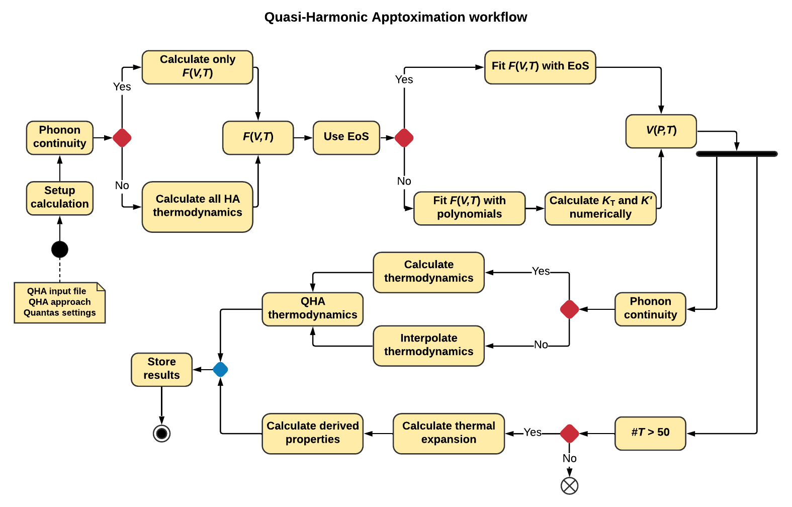

.. _background_qha:

==============================
(Quasi-)Harmonic Approximation
==============================

.. topic:: Overview

    **Quantas** allows calculating thermodynamic and some thermoelastic
    properties of materials by means of both harmonic and quasi-harmonic
    approximations. In the following, the theory behind these approaches are 
    briefly explained.

    :Last update: |today|
    :Author: **Gianfranco Ulian**

In standard quantum mechanical methods, temperature-related properties can be
modeled by explicitly treating the lattice dynamics. The most adopted approach
in this framework is given by the harmonic approximation (HA) of the lattice 
potential. HA is very effective in predicting vibration properties 
(for example, Infrared and Raman spectroscopic features) of several materials,
from molecules to bulk solids, particularly so when very light atoms are not
involved.

However, there is a great drawback in solving the the lattice dynamics of a 
crystal by the sole harmonic approximation: the vibration frequencies are 
independent of interatomic distances and, consequently, the vibrational 
contribution to the internal energy of the material results as independent of 
volume. 

It immediately follows that, within HA, a several physical properties would be 
wrongly described, or even not described at all: thermal expansion would be 
zero, isobaric and isochoric heat capacities (specific heats) would not 
differ, elastic constants would not depend on temperature, thermal 
conductivity would be infinite, and so on.

A simple, yet powerful approach to overcome the above cited issues is given by 
the so-called Quasi-Harmonic Approximation (QHA), which introduces the missing 
volume dependence of phonon frequencies by retaining the harmonic expression 
for the Helmholtz free energy. The QHA approach allows also the combination of 
temperature and pressure effects.

In the next sections, a detailed description of the HA and QHA approaches are 
provided.

Harmonic Approximation
======================

In quantum mechanical simulations of periodic three-dimensional systems 
(crystals), the harmonic thermodynamic properties of any system under 
investigation can be obtained by knowing all its vibrational modes in the first 
Brillouin zone (FBZ), namely at :math:`\Gamma` point.  
The Born\-Oppenheimer potential energy surface :math:`E(\boldsymbol{x})` of a 
system is a function of the position :math:`\boldsymbol{x}` of the :math:`N` 
nuclei. For a finite system, at the equilibrium nuclear configuration and 
within the harmonic approximation, :math:`V(\boldsymbol{x})` takes the form:

.. math::

    E(\boldsymbol{x}) = \frac{1}{2} \sum_{ij}u_i H_{ij} u_j

where the :math:`i`, :math:`j` summations run over all the :math:`3N` 
coordinates; :math:`u_i` represents a displacement of the :math:`i`\-th 
Cartesian coordinate from its equilibrium value; :math:`H_{ij}` is the 
:math:`(i, j)` element of the matrix of the second derivatives of the 
potential, evaluated at equilibrium, with respect to the displacement 
coordinates:

.. math::
    
    H_{ij} = \frac{1}{2} \bigg[ \frac{\partial^2 E(\boldsymbol{x})}{\partial u_i
             \partial u_j} \bigg]_0

In periodic systems and within the harmonic approximation, phonon frequencies 
are then evaluated as the eigenvalues of the weighted Hessian matrix :math:`W` 
at :math:`\Gamma` point :math:`(k = 0)`, whose :math:`(i, j)` element is 
defined as

.. math::
    
    W_{ij}(k = 0) = \sum_{G} \frac{H_{ij}^{0G}}{\sqrt{M_i M_j}}

where :math:`M_i` and :math:`M_j` are the masses of the atoms associated with 
the :math:`i` and :math:`j` coordinates, respectively. :math:`H_{ij}^{0G}` is 
the second derivative of the electronic and nuclear repulsion energy 
:math:`E(\boldsymbol{x})` evaluated at equilibrium :math:`\boldsymbol{u} = 0` 
with respect to the displacement of atom A in cell 0 :math:`(u_i = x_i-x_i^*)` 
and displacement  of atom B in cell G :math:`(u_j=x_j-x_j^*)` from their 
equilibrium position :math:`x_i^*`, :math:`x_j^*`:

.. math::
    
    \sum_G H_{ij}^{0G} = \bigg[
                            \frac{\partial^2 E(\boldsymbol{x})}
                            {\partial u_i^0\partial u_j^G} 
                            \bigg]_0

.. math::

    i = 1,...,3N; j = 1,...,3N

How energy first and second derivatives are obtained depend on the quantum 
mechanical code used by the researcher. For example, they could be computed 
numerically using a "two-point" formula or a "three-point" formula.

At :math:`\Gamma` point there are :math:`3N` phonon modes, each one associated 
to an energy level given by the harmonic expression 

.. math::
    
    \varepsilon_m^i = \bigg(m + \frac{1}{2} \bigg) \nu_i

with :math:`m` an integer number and :math:`\nu_i` the frequency of the 
harmonic oscillator. It is then possible to express the vibrational canonical 
partition function of the system as:

.. math::
    
    Q_{vib} = \sum_{i=0}^{3N} \sum_{m=0}^{\infty}e^{-\varepsilon_i/k_BT}

where :math:`k_B` is the Boltzmann\'s constant. The statistical thermodynamics 
allows to obtain the entropy :math:`S(T)`, the internal thermal energy 
:math:`U_{th}(T)` and the isochoric heat capacity :math:`C_V(T)` of a system 
as:

.. math::

    S\big(T \big) = k_BT \bigg(\frac{\partial Q_{vib}}{\partial T} \bigg) +
                    k_B log Q_{vib}

.. math::

    U_{th}\big(T \big) = k_BT^2 \bigg(\frac{\partial Q_{vib}}{\partial T}
                         \bigg)

.. math::

    C_V\big(T \big) = \bigg(\frac{\partial U_{th}}{\partial T} \bigg)

Then, it is possible to express the harmonic expression 
of the thermodynamic properties [1]_:

.. math::

    S\big(T \big) = k_BT \sum_{i=0}^{3N} \Bigg[ \frac{h \nu_i}{e^{X_i} - 1} - 
                    log \bigg( 1 - e^{X_i} \bigg) \Bigg]

.. math::

    U_{th}\big(T \big) = \sum_{i=0}^{3N} h \nu_i \Bigg[ \frac{1}{2} + 
                         \frac{1}{e^{X_i} -1} \Bigg]

.. math::

    C_V \big(T \big) = \sum_{i=0}^{3N} \frac{\big(h \nu_i \big)^2}{k_BT^2} 
                        \frac{e^{X_i}}{\big(e^{X_i} -1 \big)^2}

In the above formulas, the term :math:`X_i = h \nu_i / k_BT` was employed to 
simplify the expressions.

Quasi-Harmonic Approximation
============================

While the harmonic approach was successfully adopted in predicting vibrational 
(spectroscopic) and thermodynamic properties of several systems, it suffers 
from several well-known limitations (i.e. elastic constants and bulk modulus 
not dependent of temperature, equality of constant-pressure and constant-
volume heat capacities, zero thermal expansion, etc.). There are several 
methods that can add the contribution of volume (pressure) to the 
thermodynamics of a solid system, but one of the most powerful is the quasi-
harmonic approximation (QHA) [2]_, which includes an explicit dependence of 
the vibrational phonons on the crystal volume in the harmonic description of 
the Helmholtz free energy [3]_:

.. math::

    F^{QHA}\big( V,T \big) = U_0\big(V\big) + F_{vib}^{QHA}\big(V,T\big) 

where :math:`U_0\big(V\big)` represents the static (electronic) internal 
energy of the system at :math:`T = 0 K` and without any vibrational 
contributions. This quantity is obtained by any quantum mechanical code by 
geometry optimization of the unit cell at selected (and constrained) volumes. 
The thermal contributions in the QHA term is defined as:

.. math::

    F_{vib}^{QHA}\big(V,T\big) = U_0^{ZP}\big(V\big) + U_th\big(V,T\big) - 
                                 TS\big(V,T\big) =
                               

.. math::

    = U_0^{ZP}\big(V\big) + k_BT \sum_{i=0}^{3N} \Bigg[ ln \bigg(1 - e^{X_i} 
      \bigg) \Bigg]

where :math:`U_0^{ZP}\big(V\big) = \sum_{i = 0}{3N} h \nu_i / 2` is the zero-
point energy. From the previous equation, it is possible to calculate the 
equilibrium volume at selected temperatures by minimizing the 
:math:`F_{vib}^{QHA}\big(V,T\big)` term with respect to volume. 
The volumetric thermal expansion coefficient at selected (constant) pressure 
can be expressed as:

.. math::

    \alpha_V\big(T\big) = \frac{1}{V\big(T\big)} \Bigg( \frac{\partial 
                          V\big(T\big)}{\partial T} \Bigg)_P

It is possible to describe the isothermal bulk modulus (:math:`K_T`) of the 
crystal from the energy second derivative of the Helmholtz free energy 
at fixed temperature:

.. math::

    K_T\big(T\big) = V\big(T\big) \Bigg( \frac{\partial^2 F^{QHA}\big( V,T 
                     \big)}{\partial V^2} \Bigg)_T 

and also the adiabatic bulk modulus (:math:`K_S`), which is a preferred way to 
report the elastic behaviour of the solid when comparing the theoretical 
results with experimental techniques characterized by short time-scales 
(*e.g.* employing elastic waves):

.. math::

    K_S\big(T\big) = K_T\big(T\big) + \frac{\alpha_V^2 V T K_T^2}{C_V}

The great advantage of the QHA approach is the combination of pressure and 
temperature effects, as the pressure is calculated as 

.. math::

    P\big(V,T\big) = - \frac{\partial F^{QHA}\big(V,T\big)}{\partial V}

and its knowledge allows calculating all the other properties at selected P-T 
conditions. 

Now it is possible to calculate the isobaric heat capacity (:math:`C_P`):

.. math::

    C_P\big(T\big) = C_V \big(T\big) + \alpha_V^2\big(T\big) K_T\big(T\big) 
                     V\big(T\big) T

Finally, other thermodynamic properties could be calculated, such as enthalpy 
and Gibbs free energy.

.. math::

    H\big(V,T\big) = U\big(V,T\big) + P\big(V,T\big)V\big(T\big)

.. math::

    G\big(V,T\big) = H\big(V,T\big) - TS\big(T\big)

Workflow of Quasi-Harmonic Approximation
========================================

The following picture briefly shows how quasi-harmonic properties are calculated by Quantas.
Two key points of the QHA approach are worth to be considered:

  1. the treatment of the dependence of the phonon frequencies as a function of the unit cell 
     volume :math:`\nu(V)`, which in Quantas can be considered by:
     
       - interpolation of the :math:`\nu(V)` curves, or
       - interpolation of harmonic thermodynamic properties 
       
     where in both interpolation schemes polynomial functions are employed;
     
  2. the minimization of the :math:`F(V,T)`, namely finding the unit cell volume at selected 
     temperature and pressure conditions. This can be achieved:
     
       - numerically, by fitting the :math:`F(V,T)` data with polynomial functions, or
       - phenomenologically, by fitting the same data using volume-integrated equation of 
         state formulations.

.. rubric:: References

.. [1] Ulian, G., Valdre, G., 2015. Density functional investigation of the thermo-physical and thermo-chemical properties of 2M(1) muscovite. Am. Miner. 100, 935-944.

.. [2] Anderson, O.L., 1995. Equation of state of solids for geophysics and ceramic science. Oxford University Press, New York, US.

.. [3] Erba, A., 2014. On combining temperature and pressure effects on structural properties of crystals with standard ab initio techniques. J. Chem. Phys. 141.