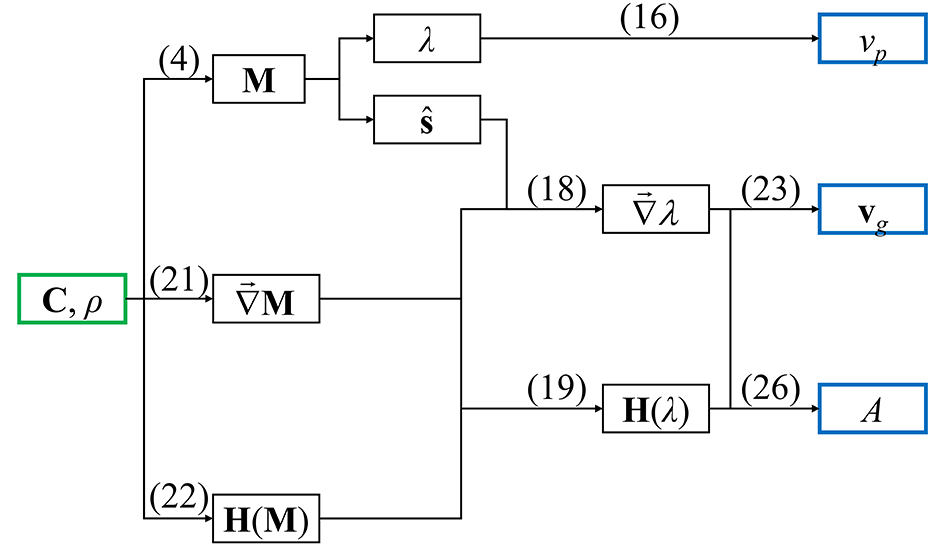

.. _background_seismic:

===============================================================
Analysis of the acoustic wave propagation in crystalline solids
===============================================================

.. topic:: Overview

    Second-order elastic moduli are typically obtained from Brillouin 
    scattering techniques, which analyse the propagation of the acoustic
    (seismic) waves inside a crystalline material. Conversely, it is possible
    to obtain information on how the sound waves travel inside a homogeneous
    crystal by solving the Christoffel's equation. In the following, a brief 
    description of the theory and capabilities of **Quantas** within this 
    framework is provided.

    :Last update: |today|
    :Author: **Gianfranco Ulian**

The basic property used to calculate the acoustic wave propagation in a 
homogeneous material (e.g., a perfect crystal) is the elastic tensor, which 
describes the relationship between stress :math:`\sigma` and strain 
:math:`\epsilon` according to the following formula:

.. math:: \sigma_{ij} = C_{ijkl} \epsilon_{kl}
   :label: eq_1

where the :math:`C_{ijkl}` terms are the component of the 3 :math:`\times` 3 
:math:`\times` 3 :math:`\times` 3 stiffness tensor [1]_. For the sake of 
clearness, all the sums here reported run over the three Cartesian coordinates 
x, y and z. Generally, Eq.(1) is written using the 6 :math:`\times` 6 Voigt's 
matrix notation of elastic tensor [1]_:

.. math::
   :label: eq_2

   \begin{equation}
   \begin{bmatrix} \sigma_{1} \\ \sigma_{2} \\ \sigma_{3} \\
                   \sigma_{4} \\ \sigma_{5} \\ \sigma_{6} \end{bmatrix}
   =               
   \begin{bmatrix} C_{11} & C_{12} & C_{13} & C_{14} & C_{15} & C_{16} \\
                   C_{21} & C_{22} & C_{23} & C_{24} & C_{25} & C_{26} \\
                   C_{31} & C_{32} & C_{33} & C_{34} & C_{35} & C_{36} \\
                   C_{41} & C_{42} & C_{43} & C_{44} & C_{45} & C_{46} \\
                   C_{51} & C_{52} & C_{53} & C_{54} & C_{55} & C_{56} \\
                   C_{61} & C_{62} & C_{63} & C_{64} & C_{65} & C_{66}
   \end{bmatrix}
   \begin{bmatrix} \epsilon_{1} \\ \epsilon_{2} \\ \epsilon_{3} \\
                   2\epsilon_{4} \\ 2\epsilon_{5} \\ 2\epsilon_{6} 
   \end{bmatrix}
   \end{equation}
   
with the subscripts being mapped as 1 = :math:`xx`, 2 = :math:`yy`, 
3 = :math:`zz`, 4 = :math:`yz`, 5 = :math:`xz`, 6 = :math:`xy`, and the double
counting is accounted by the factor 2 in the strain tensor.

To access information on the elastic (acoustic) waves that travel through the
material, it is necessary to solve Christoffel's equation [2]_. Let's define 
:math:`\textbf{q}` a monochromatic wave vector with angular frequency 
:math:`\omega` and polarization :math:`\boldsymbol{\hat{\mathbf{p}}}` that 
travels inside a crystalline material with density :math:`\rho`. The 
Christoffel equation is an eigenvalue problem defined as:

.. math::
   :label: eq_3

   \sum_{ij} \bigg[ M_{ij} - \rho \omega^2 \delta_{ij} \bigg] s_j = 0

where :math:`M_{ij}` are the terms of the Christoffel'matrix :math:`\textbf{M}`
that are written as

.. math::
   :label: eq_4

   M_{ij} = \sum_{kl} q_k C_{iklj} q_j

:eq:`eq_3` can be solved for any given :math:`\textbf{q}`. From now on, the
notation suggested by Jaeken and Cottenier will be used [3]_, which introduces 
the reduced stiffness tensor :math:`\textbf{C}' = \textbf{C} / \rho` and the 
reduced Christoffel matrix :math:`\textbf{M}' = \textbf{M} / \rho`. For 
convenience, the prime on these two tensor quantities will be dropped. In 
addition, :eq:`eq_3` and :eq:`eq_4` show :math:`\omega (\textbf{q})` is a 
linear function of :math:`\textbf{q}` in a single direction, which means the 
sound velocities are independent of the wavelength :math:`\textbf{q}` but its 
direction. Hence, :math:`\textbf{q}` will be considered from now on a 
dimensionless unit vector that describes only the travel direction of the 
monochromatic plane wave. These considerations lead to the following formula:

.. math::
   :label: eq_5

   \sum_{ij} \bigg[ M_{ij} - \nu_p^2 \delta_{ij} \bigg] s_j = 0

with :math:`\nu_p` the velocity of the monochromatic plane wave that travels in
the direction given by :math:`\boldsymbol{\hat{\mathbf{q}}}`. The subscript 
:math:`p` denotes this quantity as the phase velocity. The non-trivial solutions
of :eq:`eq_5` are three eigenvalues, i.e. three velocities subdivided into one 
primary (P-mode) and two secondary (S-mode), which are related to the (pseudo-)
longitudinal and (pseudo-)transversal polarizations, respectively. As a 
convention, the two secondary velocities are one fast S-mode and a slow S-mode,
so that in general :math:`\nu_{p,P} > \nu_{p,S_{fast}} > \nu_{p,S_{slow}}`, and
the difference :math:`\nu_{p,S_{fast}} - \nu_{p,S_{slow}}` is called shear-wave
splitting. The three eigenvector solutions of the Christoffel equation are 
associated with the polarization directions.

The above formulas consider the sound as a monochromatic plane wave, an ideal 
situation. Indeed, real sound could be considered as a wave packet whose 
wavelength and travelling direction show a certain amount of spreading. Thus, 
the sound (acoustic energy) travels through a homogeneous medium as a wave 
packet given by the superposition of several phase waves, whose velocity is 
described by the following formula:

.. math::
   :label: eq_6

   \textbf{v}_g = \vec{\nabla} \nu_p

where :math:`\textbf{v}_g` is the so-called group velocity, whose direction is
the travel direction of (acoustic) energy if the medium does not dissipate 
energy. The gradient (in reciprocal space) is given by the derivative of the 
components of the dimensionless vector :math:`\boldsymbol{\hat{\mathbf{q}}}`. 
It is worth noting that :math:`\textbf{v}_g` is a vector that typically does 
not line in the direction of :math:`\boldsymbol{\hat{\mathbf{q}}}`, and the 
power flow angle  :math:`\psi` describes the angular difference between the 
directions of the group and phase velocity according to:

.. math::
   :label: eq_7

   \nu_p = \nu_g \cos ( \psi )

If we introduce the normalized directions of the phase velocity, 
:math:`\boldsymbol{\hat{\mathbf{n}}}_p`, and of the group velocity, 
:math:`\boldsymbol{\hat{\mathbf{n}}}_g`, we can re-write :eq:`eq_7` as:

.. math::
   :label: eq_8

   \cos ( \psi ) = \boldsymbol{\hat{\mathbf{n}}}_p \cdot 
                   \boldsymbol{\hat{\mathbf{n}}}_g

Since the energy travelling direction typically is not the same of the phase 
velocity, the power flow concentration changes depending on the direction, with
the enhancement factor :math:`A` providing the quantification of this effect 
according to:

.. math::
   :label: eq_9

   A = \frac {\Delta \Omega_p} {\Delta \Omega_g}

In :eq:`eq_9`, :math:`\Omega_p` and :math:`\Omega_g` are the solid angles
subtended by beams of phase :math:`\boldsymbol{\hat{\mathbf{n}}}_p` and group 
:math:`\boldsymbol{\hat{\mathbf{n}}}_g` wave vectors, respectively.
 
The most simple way to determine the enhancement factor is to consider its
infinitesimal value, which is easily described in spherical coordinates, as
suggested by Jaeken and Cottenier [3]_. With this approach, the solid angle is
equal to the area of a quadrangle described on the unit sphere by the partial
derivatives of the phase vector :math:`\boldsymbol{\hat{\mathbf{n}}}_p` or 
group vector :math:`\boldsymbol{\hat{\mathbf{n}}}_p` to :math:`\theta` and
:math:`\phi`. This translates into

.. math::
   :label: eq_10

   d \Omega_p = \sin ( \theta ) d \theta d \phi

and

.. math::
   :label: eq_11

   d \Omega_g =  \left\lVert
                  \frac {\partial \boldsymbol{\hat{\mathbf{n}}}_g}
                        {\partial \theta}
                  \times
                  \frac {\partial \boldsymbol{\hat{\mathbf{n}}}_g}
                        {\partial \phi}
                \right\rVert \sin ( \theta ) d \theta d \phi

Thus, the enhancement factor is given by

.. math::
   :label: eq_12

   A =  \left\lVert
          \frac {\partial \boldsymbol{\hat{\mathbf{n}}}_g}
                {\partial \theta}
          \times
          \frac {\partial \boldsymbol{\hat{\mathbf{n}}}_g}
                {\partial \phi}
        \right\rVert^{-1},

which can be also expressed as 

.. math::
   :label: eq_13

   \big( 
     \hat{\theta} \cdot \vec{\nabla} \boldsymbol{\hat{\mathbf{n}}}_g 
   \big) \times
   \big( 
     \hat{\phi} \cdot \vec{\nabla} \boldsymbol{\hat{\mathbf{n}}}_g 
   \big) = &
   \big| \vec{\nabla} \boldsymbol{\hat{\mathbf{n}}}_g \big|
   \big( \vec{\nabla} \boldsymbol{\hat{\mathbf{n}}}_g \big)^{-T}
   \cdot
   \big( \hat{\theta} \times \hat{\phi} \big) \\
   = & \big| \vec{\nabla} \boldsymbol{\hat{\mathbf{n}}}_g \big|
       \big( \vec{\nabla} \boldsymbol{\hat{\mathbf{n}}}_g \big)^{-T}
       \cdot \boldsymbol{\hat{\mathbf{q}}} \\ 
   = & \mathbf{Cof} (\vec{\nabla} \boldsymbol{\hat{\mathbf{n}}}_g) \cdot 
       \boldsymbol{\hat{\mathbf{q}}}

where Cof() indicates the matrix of cofactors, and

.. math::
   :label: eq_14

   \hat{\theta} =  \frac {\partial \hat{\mathbf{q}}} {\partial \theta}, \\
   \hat{\phi} =  \frac {\partial \hat{\mathbf{q}}} {\partial \phi}. \\  

By substituting :eq:`eq_13` into :eq:`eq_14`, the enhancement factor is given
by the following expression

.. math::
   :label: eq_15

   A =  \left\lVert
          \mathbf{Cof} \big( \vec{\nabla} \boldsymbol{\hat{\mathbf{n}}}_g \big)
        \right\rVert^{-1},

which is not dependent on the spherical coordinates and can be evaluated from 
the derivatives of the Christoffel's matrix eigenvalues.

Workflow of elastic constant analysis
=====================================

The following picture shows a schematic workflow of the analysis of the 
second-order elastic moduli to obtain the seismic wave velocities.

The green box reports the input data (tensor of the elastic moduli in Voigt's
notation and crystal density), whereas the blue ones are the output of the
calculation. The numbers in parentheses are references to the equations shown
along the text.

As previously suggested [3]_, the implemented computational approach uses the
eigenvalues of the Christoffel's matrix, :math:`\lambda`, as the key quantity
to obtain all the measurable properties (phase velocity :math:`\nu_p`, group
velocity :math:`\nu_g` and enhancement factor A). Hence, the phase velocity is
defined as 

.. math::
   :label: eq_16

   \nu_p = \sqrt{ \lambda }

that can be substituted in :eq:`eq_6` to give

.. math::
   :label: eq_17

   \textbf{v}_g = \vec{\nabla} \nu_p = \vec{\nabla} \sqrt{ \lambda }
                = \frac {\vec{\nabla} \lambda} {2 \sqrt{ \lambda }}.

Except for the phase velocities, all the other quantities are obtained from the
first and second derivatives of the matrix :math:`\lambda`. The gradient of the
generic eigenvalue :math:`\lambda_i` can be expressed as

.. math::
   :label: eq_18

   \frac{\partial \lambda_i}{\partial q_k} = 
     \boldsymbol{\hat{\mathbf{s}}}_i \cdot 
     \frac {\partial \mathbf{M}}{\partial q_k} 
     \cdot \boldsymbol{\hat{\mathbf{s}}}_i

with :math:`\boldsymbol{\hat{\mathbf{s}}}_i` the normalized eigenvector related 
to :math:`\lambda_i`. The Hessian matrix :math:`\mathbf{H}(\lambda)` is given
by the second-order derivatives of the Christoffel's eigenvalues, according to 
the following expression

.. math::
   :label: eq_19

   \mathbf{H}(\lambda_i) = 
     \frac{\partial^2 \lambda_i}{\partial q_k \partial q_m} =
     \boldsymbol{\hat{\mathbf{s}}}_i \cdot
       \frac{\partial^2 \mathbf{M}}{\partial q_k \partial q_m} \cdot
       \boldsymbol{\hat{\mathbf{s}}}_i + 
     2\boldsymbol{\hat{\mathbf{s}}}_i \cdot 
       \frac{\partial \mathbf{M}}{\partial q_k} \cdot
       \big( \lambda_i \mathbf{I} - \mathbf{M} \big)^{+} \cdot
       \frac{\partial \mathbf{M}}{\partial q_m} \cdot \cdot
       \boldsymbol{\hat{\mathbf{s}}}_i

which is obtained from the derivative of the gradient of the eigenvectors given by [4]_

.. math::
   :label: eq_20

   \frac{\boldsymbol{\hat{\mathbf{s}}}_i}{\partial q_k} =
     \big( \lambda_i \mathbf{I} - \mathbf{M} \big)^{+} \cdot
     \frac{\partial \mathbf{M}}{\partial q_k} \cdot \cdot
     \boldsymbol{\hat{\mathbf{s}}}_i

In this framework, the derivative of the Christoffel's matrix, 
:math:`\vec{\nabla} \mathbf{M}` (third-order tensor), is simply

.. math::
   :label: eq_21

   \vec{\nabla} \mathbf{M} = \frac{\partial M_{ij}}{\partial q_k} =
     \sum_m \big( C_{ikmj} + C_{imkj} \big) q_m,

and its Hessian is 

.. math::
   :label: eq_22

   \mathbf{H}(\mathbf{M}) = 
     \frac {\partial^2 M_{ij}}{\partial q_k \partial q_m} =
     C_{ikmj} + C_{imkj}.

It is worth noting that (i) :eq:`eq_21` depends on q, whereas :eq:`eq_22` does
not, and (ii) the group velocities can be straightforwardly obtained from the
solution of :eq:`eq_21`, :eq:`eq_18`, and :eq:`eq_17`, which require just the
eigenvalues and eigenvectors of :math:`\mathbf{M}`:

.. math::
   :label: eq_23

   \mathbf{v}_g^i = 
     \frac { \boldsymbol{\hat{\mathbf{s}}}_i \cdot \vec{\nabla} \mathbf{M}
             \cdot \boldsymbol{\hat{\mathbf{s}}}_i} {2 \sqrt{\lambda_i}}.

The calculation of the enhancement factor considers the gradient of the vector
field of the normalized group velocity with respect to :math:`\lambda`,

.. math::
   :label: eq_24

   \vec{\nabla} \boldsymbol{\hat{\mathbf{n}}}_g = 
     \vec{\nabla} \frac {\mathbf{v}_g} { \lVert \mathbf{v}_g \rVert } =
     \vec{\nabla} \frac {\vec{\nabla} \nu_p} { \lVert \vec{\nabla} \nu_p \rVert } =
     \vec{\nabla} \frac {\vec{\nabla} \lambda} { \lVert \vec{\nabla} \lambda \rVert }.

Considering that the gradient of a differentiable and positive vector field v is given by

.. math::
   :label: eq_25

   \vec{\nabla} \frac {\mathbf{v}}{\lVert \mathbf{v} \rVert} =
     \frac {\vec{\nabla} \mathbf{v}}{\lVert \mathbf{v} \rVert} -
     \frac {\mathbf{v} \otimes \big( \vec{\nabla} \mathbf{v} \big) \cdot \mathbf{v}}
           {\lVert \mathbf{v} \rVert^3},

where  :math:`\otimes` is the Kronecker's product, it follows that

.. math::
   :label: eq_26

   \vec{\nabla} \boldsymbol{\hat{\mathbf{n}}}_g = 
     \frac{\mathbf{H}(\lambda)} {\lVert \vec{\nabla} \lambda \rVert} -
     \frac {\vec{\nabla} \lambda \otimes \mathbf{H}(\lambda) \times \vec{\nabla} \lambda}
           {\lVert \vec{\nabla} \lambda \rVert^3},

It is important to highlight that the outer product in :eq:`eq_26` does not
commute, hence   is not equal to its transposed matrix, i.e., the matrix is not symmetric [3]_.
  

.. rubric:: References

.. [1] Nye, J.F., 1957. Physical properties of crystals. Oxford University 
       Press, Oxford.

.. [2] Musgrave, M.F.P., 1970. Crystal Acoustics: Introduction to the Study of 
       Elastic Waves and Vibrations in Crystals, Holden-Day, San Francisco, CA,
       USA.

.. [3] Jaeken J.W, Cottenier S., 2016. Solving the Christoffel equation: Phase
       and group velocities. Comput. Phys. Commun. 207, 445-451.

.. [4] Petersen K.B., Pedersen M.S., 2012. The Matrix Cookbook. Version 15 
       November 2012. http://matrixcookbook.com
