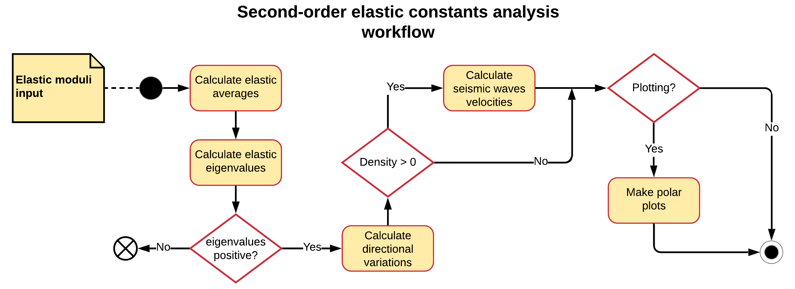

.. _background_soec:

=============================
Analysis of elastic constants
=============================

.. topic:: Overview

    The analysis of the second-order elastic constant tensor of a material may
    provide many useful information. In the following, a brief description of 
    the theory and capabilities of **Quantas** within this framework is 
    provided.

    :Last update: |today|
    :Author: **Gianfranco Ulian**

In the theory of linear elasticity, the stress tensor can be expressed in 
terms of strain by:

.. math::

   \sigma_{ij} = C_{ijkl} \epsilon_{kl}

with :math:`C_{ijkl}` the components of the stiffness matrix, a fourth order 
tensor, whose coordinates depend on the choice of the axes. The previous 
equation can be inverted:

.. math::

   \epsilon_{ij} = S_{ijkl} \sigma_{kl}

where :math:`S_{ijkl}` are the component of the compliance tensor, the inverse 
of the SOECs one. A fourth-order tensor has 81 components, but they can be 
reduced to just 21 by considering translational and rotational symmetry. It is 
also common to express the stiffness and compliance tensor components using 
(engineering) notation of Voigt [1]_, which is often adopted because of its 
simplicity.

Several mechanical properties can be calculated from the SOECs matrix. Those 
mainly reported in literature regards the polycrystalline (isotropic) elastic 
behaviour of a material, by means of the Voigt, Reuss and Hill averages:

.. math::

   K_V = \frac{1}{9} \big[ C_{11} + C_{22} + C_{33} + 2\big( C_{12} + C_{13} + 
   C_{23} \big) \big]

.. math::

   K_R = \big[ S_{11} + S_{22} + S_{33} + 2\big( S_{12} + S_{13} + S_{23} 
   \big) \big]^{-1}

.. math::

   \mu_V = \frac{1}{15} \big[ C_{11} + C_{22} + C_{33} + 3\big( C_{44} + 
   C_{55} + C_{66} \big) - \big( C_{11} + C_{13} + C_{23} \big) \big]

.. math::

   \mu_R = \frac{15}{4} \Big[ S_{11} + S_{22} + S_{33} - \big( S_{11} + S_{13} 
   + S_{23} \big) + 3\big( S_{44} + S_{55} + S_{66} \big) \Big]^{-1}

.. math::

   K_{VRH} = \frac{K_V + K_R}{2}

.. math::

   \mu_{VRH} = \frac{\mu_V + \mu_R}{2}

.. math::

   E_{VRH} = \frac{9 K_{VRH} \mu_{VRH}}{3K_{VRH} + \mu_{VRH}}

.. math::

   \nu_{VRH} = \frac{3 K_{VRH} - 2\mu_{VRH}}{2(3K_{VRH} + \mu_{VRH})}

where :math:`K` is the bulk modulus, :math:`\mu` is the shear modulus, 
:math:`E` is the elastic (Young) modulus and :math:`\nu` is the Poisson's ratio.
The subscripts *R* and *V* indicate the Reuss (lower) and Voigt (upper) bounds, respectively.

Mean seismic wave velocities can be calculated from the *VRH* average of the bulk and shear 
moduli and from the density of the crystal as:

.. math::

  v_s = \sqrt{\frac{\mu_{VRH}}{\rho}}

.. math::

  v_p = \sqrt{\frac{4 K_{VRH} + 3\mu_{VRH}}{3\rho}}

The calculation of the six eigenvalues of the second-order elastic constants 
matrix allows to define the mechanical stability of the solid: if any of 
the eigenvalues is negative, the system is unstable. [2]_ 

If the system is mechanically stable, the spatial variation of the cited properties (Young's, bulk and shear moduli, Poisson's ratio and seismic wave velocities) can be calculated. Young's modulus, :math:`E` and linear compressibility, :math:`\beta = 1 / K` are obtained by considering a single unit vector :math:`\vec{a}`, which can be parametrized in spherical coordinates by considering two angles, :math:`0 \leq \theta \leq \pi` and 
:math:`0 \leq \phi \leq 2\pi`:

.. math::

  \vec{a} = \begin{bmatrix}
  \sin(\theta)\cos(\phi) \\
  \sin(\theta)\sin(\phi) \\  
  \cos(\theta)
  \end{bmatrix}

The shear modulus, :math:`\mu` and the Poisson's ratio, :math:`\nu` depends on two unit 
vectors, :math:`\vec{a}` (stress direction) and :math:`\vec{b}` (measurement direction). In this case, according to literature, [3]_ :math:`,` [4]_ three angles are required, with :math:`\theta` and :math:`\phi` the same as above and the third angle 
:math:`0 \leq \chi \leq 2\pi`. This leads to the parametrization of the :math:`\vec{b}`
vector as :

.. math::

  \vec{b} = \begin{bmatrix}
  \cos(\theta)\cos(\phi)\cos(\chi) - \sin(\phi)\sin(\chi) \\
  \cos(\theta)\sin(\phi)\cos(\chi) - \cos(\phi)\sin(\chi) \\
  -\sin(\theta)\cos(\chi)
  \end{bmatrix}

Workflow of elastic constant analysis
=====================================

The following picture briefly shows the workflow followed by Quantas for calculating the 
elastic properties of any input SOEC matrix.

  
.. rubric:: References

.. [1] Nye, J.F., 1957. Physical properties of crystals. Oxford University Press, Oxford.

.. [2] Mouhat, F., Coudert, F.X., 2014. Necessary and sufficient elastic stability conditions 
       in various crystal systems. Phys. Rev. B 90.

.. [3] Marmier, A., Lethbridge, Z.A.D., Walton, R.I., Smith, C.W., Parker, S.C., Evans, K.E., 
       2010. ElAM: A computer program for the analysis and representation of anisotropic 
       elastic properties. Comput. Phys. Commun. 181, 2102-2115.

.. [4] Mouhat, F., Coudert, F.X., 2014. Necessary and sufficient elastic stability conditions 
       in various crystal systems. Phys. Rev. B 90, 224104, 224104.