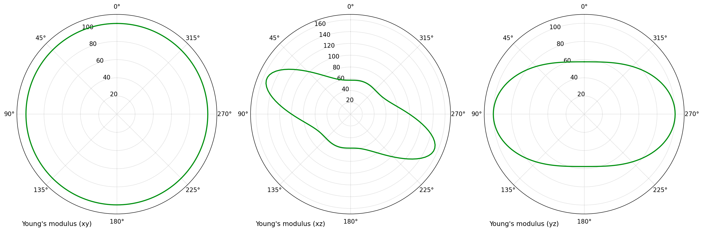
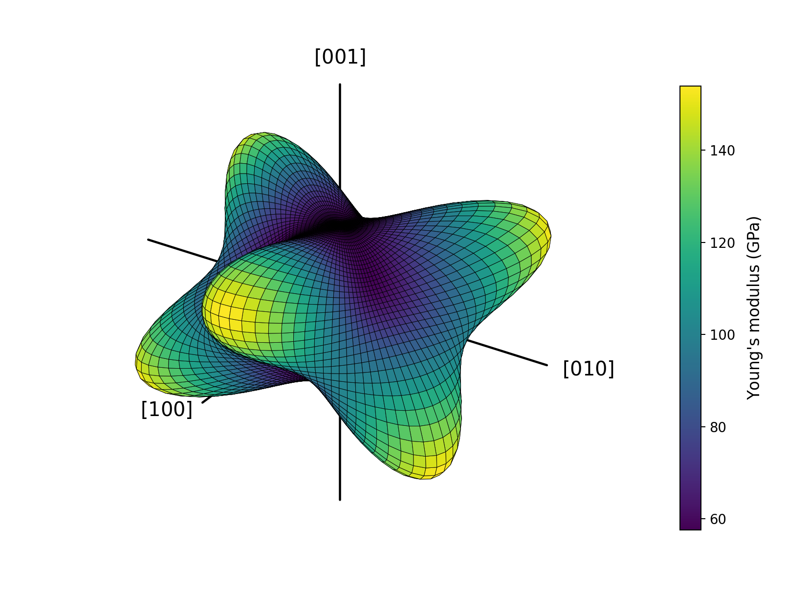

Elasticity analysis
===================

This tutorial analyzes the second-order elastic tensor of calcite.  It follows
one complete calculation from the text input to the native HDF5 result, the
plain-text report, tabular export, and selected two- and three-dimensional
figures.  The same scientific workflow is then repeated through the public
Python API.

The scientific background for the quantities used here is presented in
:doc:`../theory/elasticity`; the operational organization of the module is
summarized in :doc:`../workflows/elasticity`.

Scientific questions
--------------------

The tutorial asks the following questions.

- Is the supplied stiffness tensor mechanically stable?
- What isotropic bulk, shear, and Young moduli would be assigned to a randomly
  oriented polycrystalline aggregate?
- How strongly do the single-crystal properties depend on direction?
- Which directions are mechanically soft or stiff?
- How do a principal-plane section and a complete three-dimensional surface
  represent the same directional property?

Dataset
-------

The curated input is a B3LYP stiffness tensor for calcite.  It is distributed
with Quantas at ``examples/elasticity/calcite.dat``.

:download:`Download calcite.dat <../_downloads/calcite.dat>`

The file contains a job title followed by the upper triangular part of the
stiffness matrix in Voigt notation.  Elastic constants are expressed in GPa.
A density may appear after the matrix so that the same text convention can be
reused by SEISMIC; the Elasticity workflow itself reads the stiffness tensor.

.. code-block:: text

   Calcite (B3LYP)
     162.859000    63.582000    60.233000     0.000000    20.670000     0.000000
                  162.859000    60.233000     0.000000   -20.670000     0.000000
                                 89.647000     0.000000     0.000000     0.000000
                                              36.640000     0.000000   -20.670000
                                                           36.640000     0.000000
                                                                        49.638000
   2680.000

The triangular representation is expanded to a symmetric :math:`6\times6`
matrix.  The signs and positions of :math:`C_{15}` and :math:`C_{46}` encode
the selected Cartesian representation of the trigonal tensor; they must not be
silently removed or made positive.

Running Elasticity from the command line
----------------------------------------

Calculate the tensor characterization, exact directional extrema, and
principal-plane fields:

.. code-block:: console

   quantas elasticity run examples/elasticity/calcite.dat \
       --2d \
       --ntheta 181 \
       --output calcite_elasticity.hdf5 \
       --report calcite_elasticity.log \
       --verbosity standard \
       --no-progress \
       --force

The calculation produces two complementary files.

``calcite_elasticity.hdf5``
   Native scientific result containing the normalized input, options,
   stiffness and compliance tensors, averages, stability result, extrema, and
   sampled principal-plane data.

``calcite_elasticity.log``
   Deterministic text rendering intended for inspection, archiving, and
   publication records.  It is not a replacement for the structured HDF5
   result.

The ``--2d`` option requests directional curves on the ``xy``, ``xz``, and
``yz`` planes.  The global extrema reported by the workflow are not inferred
from those three plots: Quantas calculates the transverse extrema using the
full directional formulation.

Reading the report
------------------

Input and crystal system
^^^^^^^^^^^^^^^^^^^^^^^^

The report first records the options and identifies the symmetry compatible
with the matrix:

.. code-block:: text

   Elasticity input
   ----------------

        Property    |              Value
     ---------------+--------------------------------
     Job name       | Calcite (B3LYP)
     Crystal system | trigonal_low
     Source         | examples/elasticity/calcite.dat

The inferred crystal system is a diagnostic of the matrix pattern.  It does not
replace a crystallographic analysis of the original structure, and it depends
on the tensor being supplied in the intended frame.

Stiffness and compliance
^^^^^^^^^^^^^^^^^^^^^^^^

The stiffness matrix :math:`C` is reported in GPa.  Its inverse, the compliance
matrix :math:`S=C^{-1}`, is also available in the complete report and HDF5
payload.  Directional Young modulus, compressibility, shear modulus, and
Poisson ratio are calculated from the compliance tensor.

Voigt--Reuss--Hill averages
^^^^^^^^^^^^^^^^^^^^^^^^^^^

For calcite, the report contains:

.. code-block:: text

   Voigt-Reuss-Hill average properties
   -----------------------------------

     Scheme | K / GPa | E / GPa  | G / GPa |    nu
     -------+---------+----------+---------+---------
     Voigt  | 87.0512 | 104.0720 | 40.0047 | 0.300746
     Reuss  | 79.1474 | 81.0336  | 30.4784 | 0.329361
     Hill   | 83.0993 | 92.6302  | 35.2416 | 0.314218

The Voigt and Reuss estimates are upper and lower aggregate bounds under their
respective assumptions.  Their separation is itself useful: the larger spread
in shear modulus than in bulk modulus indicates that the aggregate shear
response is more sensitive to crystallographic orientation.  The Hill values
are arithmetic means of the two bounds; they describe an isotropic aggregate,
not the directional response of one calcite crystal.

Mechanical stability
^^^^^^^^^^^^^^^^^^^^^

All six stiffness eigenvalues are positive:

.. code-block:: text

   Mechanical stability
   --------------------

     Eigenvalue | Value / GPa
     -----------+------------
     1          | 21.471377
     2          | 25.117559
     3          | 48.800336
     4          | 64.806623
     5          | 110.799441
     6          | 267.287664

The tensor is therefore positive definite at the represented state.  The
smallest eigenvalue identifies the softest generalized elastic distortion, but
it should not be interpreted as a particular Cartesian elastic constant.

Directional extrema
^^^^^^^^^^^^^^^^^^^^

Selected results are:

.. list-table::
   :header-rows: 1
   :widths: 28 18 18 18

   * - Property
     - Minimum
     - Maximum
     - Maximum/minimum
   * - Young modulus / GPa
     - 57.6032
     - 154.0608
     - 2.6745
   * - Linear compressibility / TPa⁻¹
     - 2.2550
     - 8.1246
     - 3.6029
   * - Shear modulus / GPa
     - 21.4714
     - 64.8069
     - 3.0183
   * - Poisson ratio
     - 0.01139
     - 0.76532
     - 67.2133

The minimum Young modulus occurs along the input-frame :math:`z` axis, whereas
the stiffest direction is oblique to that axis.  The compressibility is largest
along :math:`z`, consistent with the comparatively soft longitudinal response
normal to the calcite basal plane.

The very large maximum/minimum ratio reported for Poisson ratio must be read
with care.  Poisson ratio depends on both a loading direction and a transverse
measurement direction.  A small positive minimum makes a ratio-based
anisotropy numerically large; the minimum and maximum values and their two
associated directions are more informative than the ratio alone.

Exporting principal-plane data
------------------------------

The persisted 2D fields can be exported without repeating the calculation:

.. code-block:: console

   quantas elasticity export calcite_elasticity.hdf5 \
       --output calcite_elasticity_2d.dat

The file contains one block for each principal plane.  Every row records the
angular direction and the available branches of compressibility, shear
modulus, Poisson ratio, and Young modulus.  A shortened ``xy`` excerpt is:

.. code-block:: text

   # Plane: xy
   # theta_deg phi_deg ... shear_modulus_1 shear_modulus_2 young_modulus
   9.000000e+01 0.000000e+00 ... 2.803279e+01 3.797728e+01 9.980837e+01
   9.000000e+01 2.000000e+00 ... 2.783666e+01 3.834327e+01 9.980837e+01

The two shear values correspond to the minimum and maximum transverse response
for the selected propagation/loading direction.  Young modulus has only one
value for each direction.

Selected plots
--------------

Two-dimensional Young modulus
^^^^^^^^^^^^^^^^^^^^^^^^^^^^^^^

Render the three principal-plane sections from the stored result:

.. code-block:: console

   quantas elasticity plot calcite_elasticity.hdf5 \
       --2d \
       --property young \
       --preset publication \
       --dpi 180 \
       --output calcite_young

   Young modulus of calcite on the ``xy``, ``xz``, and ``yz`` planes.  The
   nearly circular basal-plane section reflects the threefold symmetry, while
   sections containing :math:`z` reveal the much larger contrast between soft
   and stiff directions.

A 2D plot is an interpretable section, not a complete representation of the
three-dimensional directional field.  An extremum that lies outside the three
selected planes need not be visible in these curves.

Three-dimensional physical surface
^^^^^^^^^^^^^^^^^^^^^^^^^^^^^^^^^^^

The complete Young-modulus surface can be rebuilt transiently from the stored
tensor:

.. code-block:: console

   quantas elasticity plot calcite_elasticity.hdf5 \
       --3d \
       --property young \
       --geometry physical \
       --mesh \
       --mesh-color black \
       --mesh-linewidth 0.35 \
       --ntheta 61 \
       --nphi 121 \
       --preset publication \
       --dpi 180 \
       --output calcite_young_3d

   Physical Young-modulus surface.  The radial distance and color both encode
   :math:`E(\mathbf n)`.  Lobes identify stiff orientations; indentations
   identify soft orientations.  Mesh lines show the angular sampling and are
   graphical aids rather than crystallographic planes.

With ``--geometry unit-sphere``, the radius is fixed and only color carries the
property value.  That representation is often preferable when several
properties must be compared on identical geometry.

Running the same workflow from Python
-------------------------------------

The complete script is distributed with the examples:

:download:`Download the Elasticity API script <../_downloads/tutorials/elasticity/tutorial_api.py>`

.. literalinclude:: ../_downloads/tutorials/elasticity/tutorial_api.py
   :language: python
   :linenos:

Run it from the repository root:

.. code-block:: console

   python examples/elasticity/tutorial_api.py \
       examples/elasticity/calcite.dat \
       --output-dir elasticity_tutorial

The script uses only the supported namespaces:

.. code-block:: python

   from quantas.api import elasticity, rendering

It performs the same sequence as the CLI:

#. read and normalize the text input;
#. construct :class:`quantas.api.elasticity.Options`;
#. calculate the tensor properties;
#. obtain the typed result payload;
#. build and render the report;
#. write the native HDF5 result;
#. construct neutral 2D and 3D plot specifications;
#. render the figures with the public rendering entry point.

The final checkpoint output is:

.. code-block:: text

   Crystal system: trigonal_low
   Mechanically stable: True
   Hill bulk modulus / GPa: 83.099307
   Hill shear modulus / GPa: 35.241563
   Young minimum / GPa: 57.603207
   Young maximum / GPa: 154.060777

Inspecting structured results
-----------------------------

The HDF5 envelope can be reopened and converted to the typed payload:

.. code-block:: python

   from quantas.api import elasticity

   result = elasticity.read_result("calcite_elasticity.hdf5")
   payload = elasticity.get_result(result)

   print(payload.crystal_system)
   print(payload.stability.is_stable)
   print(payload.averages.hill.bulk_modulus)
   print(payload.variations["young_modulus"].minimum_axis)
   print(payload.variations["young_modulus"].maximum_axis)
   print(payload.variations["shear_modulus"].minimum_axis)
   print(payload.variations["shear_modulus"].minimum_measurement_axis)

Young's modulus depends only on the primary direction ``a``. Shear modulus and
Poisson's ratio additionally expose the orthogonal transverse measurement
direction ``b`` through ``minimum_measurement_axis`` and
``maximum_measurement_axis``. The text report presents these property families
in separate tables so that the roles of ``a`` and ``b`` remain explicit.

The raw numerical arrays remain available at full ``float64`` precision.  The
number of displayed digits in a report or figure does not change the stored
values.

CLI/API equivalence
-------------------

The two frontends can be compared directly:

.. code-block:: python

   import numpy as np
   from quantas.api import elasticity

   cli = elasticity.get_result(
       elasticity.read_result("calcite_elasticity.hdf5")
   )
   api = elasticity.get_result(
       elasticity.read_result(
           "elasticity_tutorial/calcite_elasticity_api.hdf5"
       )
   )

   np.testing.assert_allclose(cli.stiffness, api.stiffness)
   np.testing.assert_allclose(cli.compliance, api.compliance)
   assert cli.averages == api.averages
   assert cli.stability.is_stable == api.stability.is_stable

Reproducibility checkpoints
---------------------------

Using the distributed input without rotation, the following values should be
reproduced to the displayed precision:

.. list-table::
   :header-rows: 1

   * - Quantity
     - Expected value
   * - Crystal system
     - ``trigonal_low``
   * - Stable tensor
     - ``True``
   * - Hill :math:`K` / GPa
     - 83.099307
   * - Hill :math:`G` / GPa
     - 35.241563
   * - Minimum :math:`E` / GPa
     - 57.603207
   * - Maximum :math:`E` / GPa
     - 154.060777
   * - :math:`E_{\max}/E_{\min}`
     - 2.674517

Changing the angular resolution changes sampled curves and surfaces, but it
must not change the stiffness matrix, compliance matrix, VRH averages, or exact
directional-extrema calculation.

Further exploration
-------------------

Useful extensions are:

- plot linear compressibility and identify the most compressible axis;
- plot minimum and maximum shear-modulus branches;
- inspect the two transverse directions associated with Poisson-ratio extrema;
- repeat the calculation after an explicit tensor rotation and verify that
  scalar extrema and VRH averages are invariant while their Cartesian
  directions rotate;
- compare physical and unit-sphere geometry for the same property.
