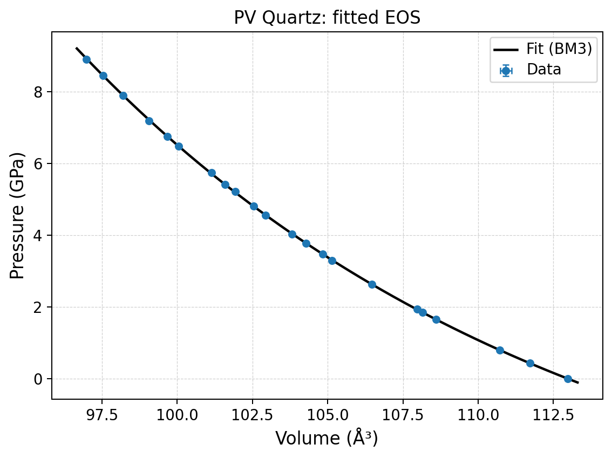
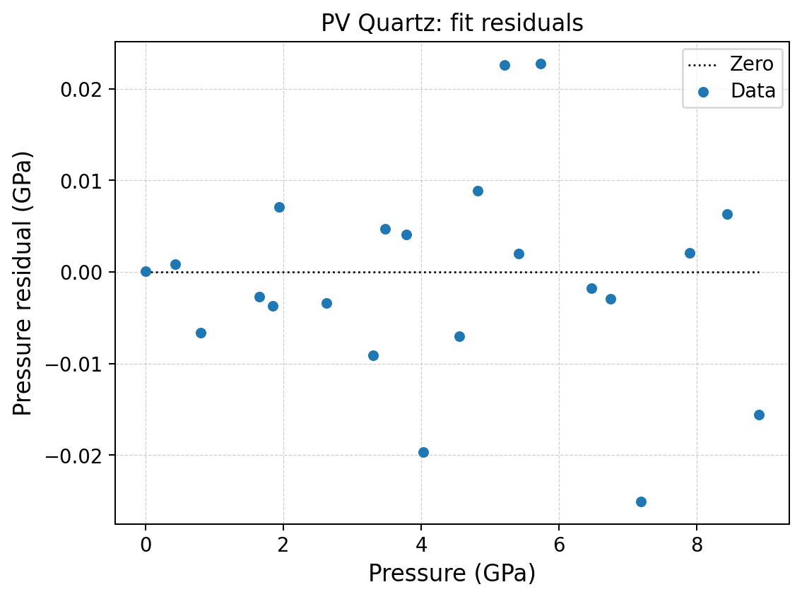
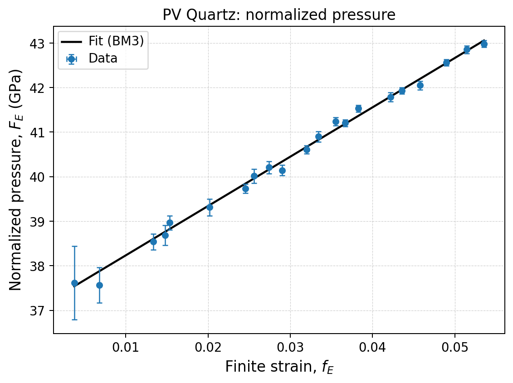

P--V tutorial: quartz compression
=================================

Scientific objective
--------------------

This tutorial determines the reference volume, bulk modulus, and pressure
derivative of quartz from an isothermal compression dataset.  It also shows how
model order and uncertainty treatment affect the inferred parameters.

The curated file is:

.. code-block:: text

   examples/eos/PV_quartz.dat

It contains 22 observations from approximately 0 to 8.9 GPa, with standard
uncertainties for both pressure and volume.

Inspecting the input
--------------------

The header declares the column order:

.. code-block:: text

   format 1 P V SigP SigV

and the first observations are:

.. code-block:: text

   0.000  112.981   1.000E-6  0.002
   0.430  111.725   0.008     0.014
   0.794  110.711   0.008     0.006

The zero-pressure point strongly constrains :math:`V_0`.  Its tiny pressure
uncertainty also makes the distinction between WLS and coordinate-aware methods
particularly visible.

A single direct fit
-------------------

Run a third-order Birch--Murnaghan fit with effective variance:

.. code-block:: console

   quantas eos run examples/eos/PV_quartz.dat \
       --domain pv \
       --fit volume \
       --pv-eos birch-murnaghan \
       --pv-order 3 \
       --solver effective-variance \
       --max-iterations 50 \
       --inner-max-iterations 10000 \
       --show-uncertainties \
       --verbosity extended \
       --output quartz_bm3_ev.hdf5 \
       --report quartz_bm3_ev.log \
       --force

The principal result is:

.. code-block:: text

   V0   = 112.980884 ± 0.001993 ų
   K0   =  37.125926 ± 0.091051 GPa
   K′   =   5.988260 ± 0.045302
   K″   =  -0.264783 ± 0.006703 GPa⁻¹  [implied]

   RMSE                 = 0.011133 GPa
   reduced chi-square   = 0.952062
   selected observations = 22

The third-order model has three free parameters: :math:`V_0`, :math:`K_0`, and
:math:`K'_0`.  The reported :math:`K''_0` is implied by the selected EOS and
must not be interpreted as a fourth independently fitted parameter.

Running the comparison batch
----------------------------

The supplied specification performs three solver comparisons and three model
comparisons:

.. code-block:: console

   quantas eos run examples/eos/PV_quartz.dat \
       --spec examples/eos/specs/quartz_pv_tutorial.spec \
       --dry-run

   quantas eos run examples/eos/PV_quartz.dat \
       --spec examples/eos/specs/quartz_pv_tutorial.spec \
       --output quartz_pv.hdf5 \
       --report quartz_pv.log \
       --verbosity extended \
       --force

The complete generated comparison is available as
:download:`quartz_pv_comparison.csv <../_downloads/tutorials/eos/quartz_pv_comparison.csv>`.

Solver comparison
-----------------

.. list-table::
   :header-rows: 1
   :widths: 22 17 17 17 14 14

   * - Solver
     - :math:`V_0` (ų)
     - :math:`K_0` (GPa)
     - :math:`K'_0`
     - RMSE (GPa)
     - Reduced :math:`\chi^2`
   * - OLS
     - 112.967525
     - 37.285421
     - 5.933527
     - 0.010898
     - —
   * - WLS
     - 112.981000
     - 37.145494
     - 5.976661
     - 0.011033
     - 1.571859
   * - Effective variance
     - 112.980884
     - 37.125926
     - 5.988260
     - 0.011133
     - 0.952062

The RMSE values are similar because all three methods describe the same smooth
curve.  The parameters nevertheless shift because the objective functions are
different.  OLS does not use the precision information.  WLS gives very high
weight to the near-zero-pressure observation through :math:`\sigma_P` but does
not project :math:`\sigma_V`.  Effective variance includes both uncertainty
components.

Model-order comparison
----------------------

Keeping effective variance fixed isolates the effect of the EOS formulation:

.. list-table::
   :header-rows: 1

   * - Model
     - :math:`V_0` (ų)
     - :math:`K_0` (GPa)
     - :math:`K'_0`
     - RMSE (GPa)
     - Reduced :math:`\chi^2`
   * - BM2
     - 112.968349
     - 41.475671
     - 4.000000 fixed
     - 0.133695
     - 128.265150
   * - BM3
     - 112.980884
     - 37.125926
     - 5.988260
     - 0.011133
     - 0.952062
   * - PT3
     - 112.981299
     - 36.396317
     - 6.909770
     - 0.012001
     - 1.156613
   * - V3
     - 112.980947
     - 37.025430
     - 6.103146
     - 0.010795
     - 0.902934

BM2 is clearly too restrictive for this dataset: fixing :math:`K'_0=4` forces
:math:`K_0` upward and leaves large systematic residuals.  BM3 and V3 agree
closely in :math:`V_0` and :math:`K_0`, while PT3 requires a larger
:math:`K'_0`.  Agreement in RMSE alone is not enough to claim that the
parameters of different functional forms are interchangeable.

Fit and residual figures
------------------------

Generate the accepted BM3 figures with:

.. code-block:: console

   quantas eos plot quartz_pv.hdf5 --slot pv/volume \
       --plot fit --plot residuals --plot normalized-pressure \
       --preset publication --format png --dpi 180 \
       --output quartz_pv_plots

At the scale of the full compression curve, the fit appears almost exact.  The
residual panel is therefore essential:

The residuals fluctuate around zero without the strong curvature seen in the
BM2 fit.  Individual points near 4, 5.2, 5.7, and 7.2 GPa deserve attention,
but no single observation controls the entire curve.

Normalized-pressure diagnostic
------------------------------

For Birch--Murnaghan, the :math:`F_E-f_E` representation is a model-order
diagnostic.  A non-zero slope indicates that BM2 is inadequate.  The exact
zero-pressure point is hidden by default because normalized pressure is
singular at zero strain; the observation remains part of the fit and archive.

Post-fit calculation
--------------------

Calculate volumes and moduli without refitting:

.. code-block:: console

   quantas eos calculate quartz_pv.hdf5 --slot pv/volume \
       --pressure-range 0:10:1 \
       --output quartz_pv_properties.csv

Values above the maximum measured pressure are flagged as extrapolated.  A
smooth EOS curve does not remove the scientific uncertainty of extrapolation.

Python API
----------

:download:`Download pv_fit_api.py <../_downloads/tutorials/eos/pv_fit_api.py>`

.. literalinclude:: ../_downloads/tutorials/eos/pv_fit_api.py
   :language: python
   :linenos:

Exercise 1: is BM4 justified?
-----------------------------

Add an effective-variance ``BM4`` job.  Record :math:`K''_0`, its E.S.D., the
largest parameter correlations, RMSE, and reduced chi-square.

.. list-table::
   :header-rows: 1

   * - Model
     - :math:`K_0`
     - :math:`K'_0`
     - :math:`K''_0`
     - E.S.D. of :math:`K''_0`
     - Reduced :math:`\chi^2`
   * - BM3
     - 37.125926
     - 5.988260
     - −0.264783 implied
     - 0.006703 propagated
     - 0.952062
   * - BM4
     - ``...``
     - ``...``
     - ``...``
     - ``...``
     - ``...``

A fourth-order model is justified only if the additional independent curvature
is resolved and scientifically stable, not merely because RMSE decreases.

Exercise 2: axial compression of topaz
--------------------------------------

Repeat the workflow with ``PV_topaz.dat`` and ``targets = volume, a, b, c``.
Compare the axial moduli and remember that Quantas fits the auxiliary cubed
length while reporting physical lengths and linear moduli.
