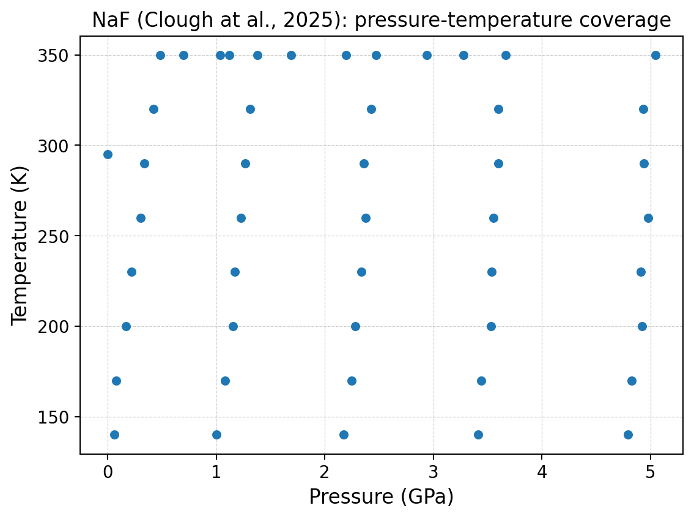
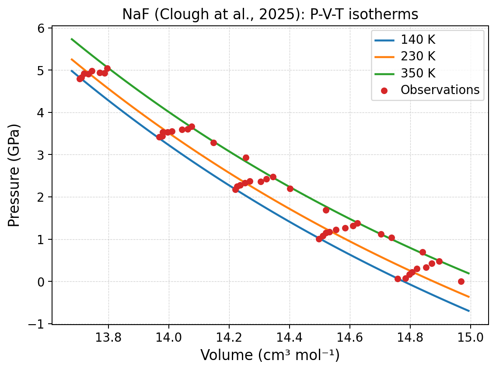
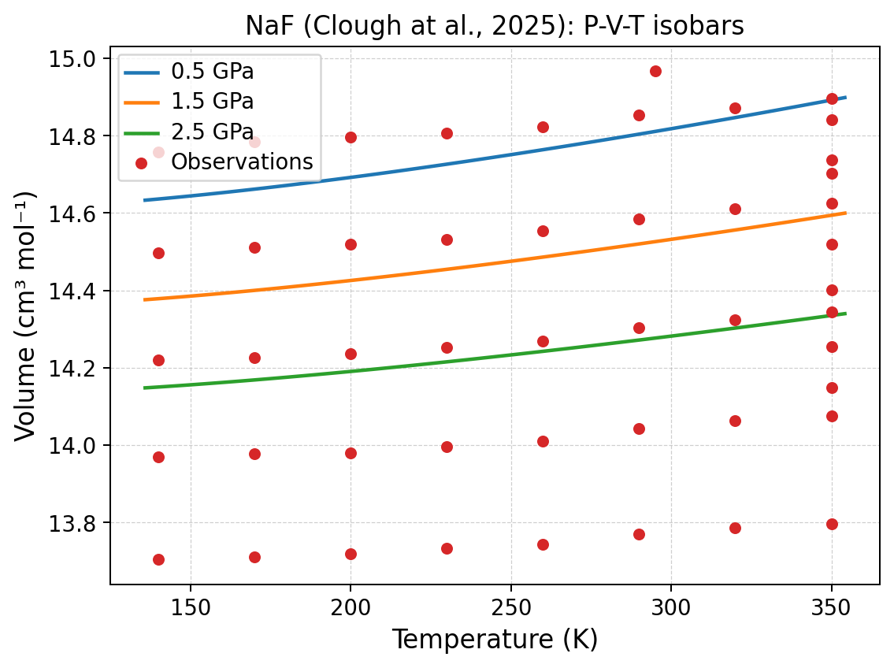
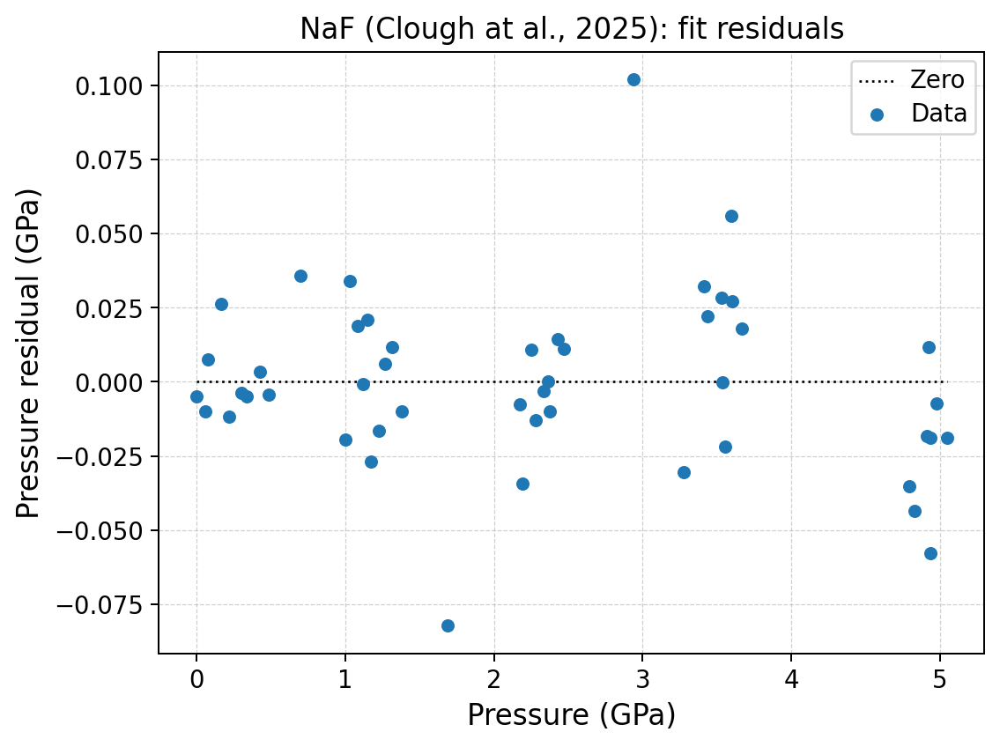
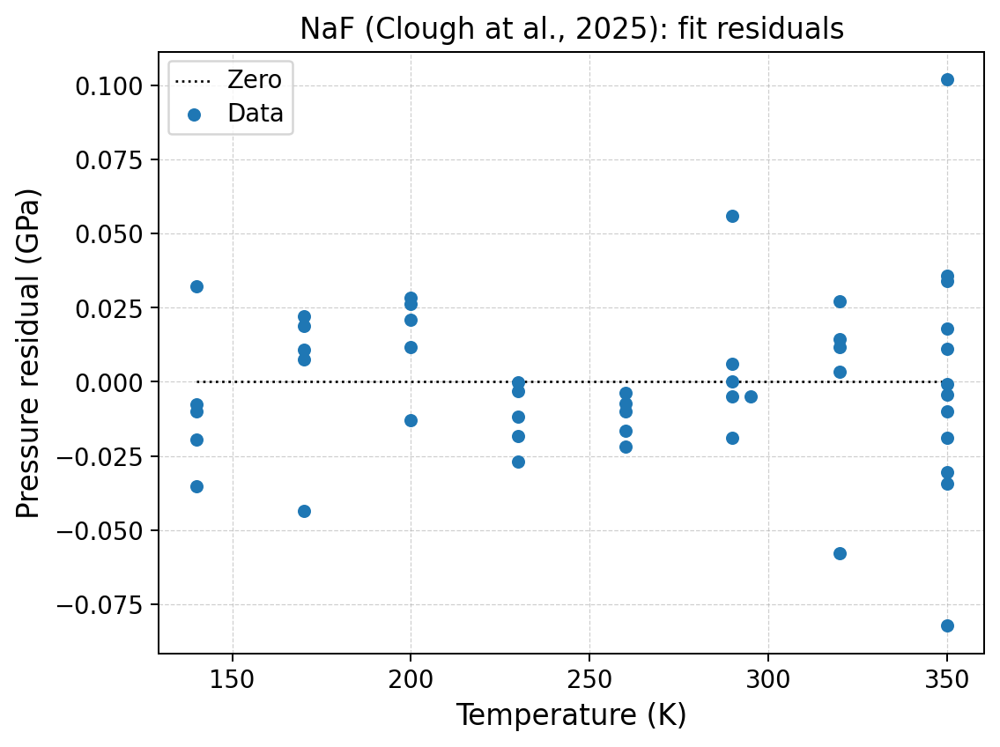

P--V--T tutorial: coupled EOS of NaF
====================================

Scientific objective
--------------------

A P--V--T dataset samples several temperatures and pressures simultaneously.
The goal is not only to fit compression and expansion, but to choose a coupling
that describes how the zero-pressure reference state and elastic response vary
with temperature.

The curated NaF dataset contains 48 observations from 140 to 350 K and up to a
few gigapascals.  It declares:

.. code-block:: text

   VSCALE cm^3/mol
   format: T, sigT, P, sigP, V, sigV

The volume is molar volume per formula unit.  This matters for Mie--Grüneisen--
Debye normalization: the formula ``NaF`` represents two atoms per molar formula
unit.

Why use the batch specification here?
-------------------------------------

P--V--T models are compositions of several scientific choices.  The supplied
specification makes those choices explicit and compares four couplings:

#. BM3 + quadratic Berman + linear :math:`K_0(T)`;
#. BM3 + quadratic Berman + Anderson--Grüneisen coupling;
#. BM3 + Holland--Powell Einstein thermal pressure;
#. BM4 + full Mie--Grüneisen--Debye thermal pressure.

Validate and run:

.. code-block:: console

   quantas eos run examples/eos/PVT_NaF.dat \
       --spec examples/eos/specs/naf_pvt_tutorial.spec \
       --dry-run

   quantas eos run examples/eos/PVT_NaF.dat \
       --spec examples/eos/specs/naf_pvt_tutorial.spec \
       --output naf_pvt.hdf5 \
       --report naf_pvt.log \
       --verbosity extended \
       --force

All four records are retained; the full-MGD record is accepted for post-fit
examples.

Parameter constraints in the MGD job
------------------------------------

The reference temperature is fixed:

.. code-block:: ini

   fix.temperature_ref = 295.0

The thermal parameters are free but physically bounded:

.. code-block:: ini

   initial.theta_d0 = 459.0
   bound.theta_d0 = 1.0 : 5000.0
   initial.gamma0 = 1.5
   bound.gamma0 = 0.01 : 10.0
   initial.q = 1.0
   bound.q = -10.0 : 10.0

The normalization is explicit:

.. code-block:: ini

   volume_basis = molar-formula-unit
   formula = NaF

Bounds are not a substitute for information in the data.  A parameter that is
strongly correlated or weakly resolved should be fixed from an independent
source or reported cautiously.

Coupling comparison
-------------------

The full generated table is available as
:download:`naf_pvt_coupling_comparison.csv <../_downloads/tutorials/eos/naf_pvt_coupling_comparison.csv>`.

.. list-table::
   :header-rows: 1
   :widths: 22 14 12 14 16 16 14

   * - Coupling
     - :math:`K_0` (GPa)
     - :math:`K'_0`
     - :math:`V_0`
     - :math:`V(1.5\,\mathrm{GPa},230\,\mathrm K)`
     - :math:`\alpha(1.5\,\mathrm{GPa},230\,\mathrm K)`
     - RMSE (GPa)
   * - Linear :math:`K_0(T)`
     - 44.868125
     - 6.720167
     - 14.974354
     - 14.453937
     - 6.840725e−5
     - 0.028589
   * - Anderson--Grüneisen
     - 44.900978
     - 6.745525
     - 14.974230
     - 14.454340
     - 6.877433e−5
     - 0.028091
   * - HP Einstein thermal pressure
     - 44.813167
     - 7.023415
     - 14.974418
     - 14.453650
     - 7.149799e−5
     - 0.034077
   * - Full MGD
     - 45.339416
     - 6.149515
     - 14.969663
     - 14.454408
     - 6.995470e−5
     - 0.029156

The predicted volume at an interior state is very similar for all models, even
though the reference elastic parameters differ.  The data therefore constrain
interpolation more tightly than they uniquely identify a coupling model.

Full-MGD result
---------------

.. code-block:: text

   V0       = 14.969663 ± 0.002184 cm³ mol⁻¹
   K0       = 45.339416 ± 0.966802 GPa
   K′       =  6.149515 ± 1.413508
   K″       =  0.117985 ± 0.926164 GPa⁻¹
   theta_D0 = 523.146380 ± 52.021961 K
   gamma0   =  1.624893 ± 0.071257
   q        =  2.040148 ± 0.788557

   RMSE                 = 0.029156 GPa
   reduced chi-square   = 2.802172

The large uncertainty in :math:`K''_0` and the substantial uncertainties in
:math:`K'_0` and :math:`q` must be reported.  The fit is useful, but the dataset
does not determine every curvature parameter with equal precision.

Pressure--temperature coverage
-------------------------------

Coverage is not a rectangular grid.  Before interpreting a P--V--T surface,
identify where observations actually constrain it.  A calculated state inside
the bounding box may still be distant from measured combinations of pressure
and temperature.

Isotherms
---------

The isotherms shift to larger volume with increasing temperature.  Their
spacing and curvature reflect both thermal pressure and the volume dependence
of the cold compression curve.

Generate them with:

.. code-block:: console

   quantas eos plot naf_pvt.hdf5 --slot pvt/volume \
       --plot isotherms \
       --isotherm 140 --isotherm 230 --isotherm 350 \
       --curve-points 60 \
       --preset publication \
       --output naf_isotherms

Isobars
-------

Higher pressure lowers the volume and changes the thermal-expansion response.
The nearly parallel curves over this restricted range do not imply that the
coupling remains linear outside it.

Residuals
---------

Both projections are necessary.  A pattern invisible against pressure may be
obvious against temperature, and vice versa.  Residual plots should be read
together with parameter correlations and the P--T coverage.

Post-fit property calculation
-----------------------------

Evaluate a Cartesian state grid:

.. code-block:: console

   quantas eos calculate naf_pvt.hdf5 --slot pvt/volume \
       --pressure-range 0.5:2.5:0.5 \
       --temperature-range 140:350:30 \
       --output naf_pvt_properties.csv

The result includes volume, :math:`K_T`, its pressure derivatives,
:math:`\alpha(P,T)`, :math:`(\partial K/\partial T)_P`, thermal pressure where
available, propagated parameter uncertainty, and extrapolation flags.

Python API
----------

:download:`Download pvt_fit_api.py <../_downloads/tutorials/eos/pvt_fit_api.py>`

.. literalinclude:: ../_downloads/tutorials/eos/pvt_fit_api.py
   :language: python
   :linenos:

The script uses molar-formula-unit MGD normalization, matching the volume unit
declared by the input file.

Exercise 1: release fewer parameters
------------------------------------

Repeat the MGD fit with :math:`\theta_{D0}=459` K and :math:`q=1` fixed, leaving
only :math:`\gamma_0` free among the thermal parameters.

.. list-table::
   :header-rows: 1

   * - Fit
     - Free thermal parameters
     - :math:`K_0`
     - :math:`K'_0`
     - :math:`\gamma_0`
     - RMSE
     - Largest correlation
   * - Full MGD
     - :math:`\theta_{D0},\gamma_0,q`
     - 45.339416
     - 6.149515
     - 1.624893
     - 0.029156
     - ``inspect report``
   * - Controlled MGD
     - :math:`\gamma_0`
     - ``...``
     - ``...``
     - ``...``
     - ``...``
     - ``...``

Discuss the trade-off between a slightly less flexible fit and more stable,
externally constrained parameters.

Exercise 2: compare outside the dense data region
-------------------------------------------------

Calculate each coupling at 0.5 GPa and 140 K, at 1.5 GPa and 230 K, and at
2.5 GPa and 350 K.  Then add one state outside the observed temperature range.
Complete:

.. list-table::
   :header-rows: 1

   * - Coupling
     - Interior volume
     - Interior :math:`K_T`
     - Interior :math:`\alpha`
     - Extrapolated volume
     - Extrapolation flag
   * - Linear
     - 14.453937
     - 56.846399
     - 6.840725e−5
     - ``...``
     - ``...``
   * - Anderson--Grüneisen
     - 14.454340
     - 57.015775
     - 6.877433e−5
     - ``...``
     - ``...``
   * - HP Einstein
     - 14.453650
     - 56.933508
     - 7.149799e−5
     - ``...``
     - ``...``
   * - Full MGD
     - 14.454408
     - 56.853635
     - 6.995470e−5
     - ``...``
     - ``...``

The divergence outside the measured domain is more informative about model
assumptions than the near-equality of interpolated volumes.
