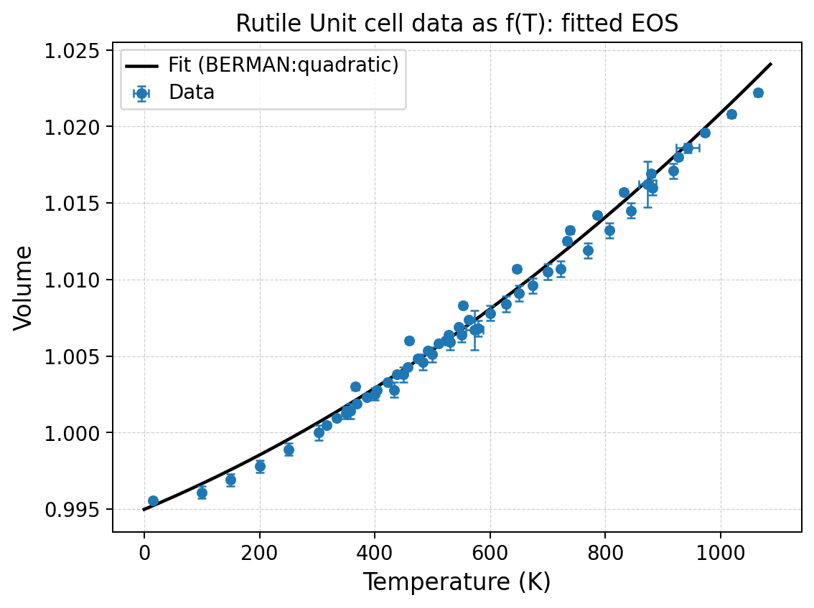
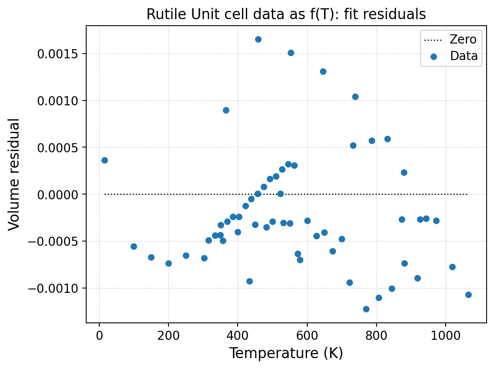

V--T tutorial: thermal expansion of rutile
==========================================

Scientific objective
--------------------

The rutile dataset collects relative unit-cell volume and axial lengths over a
broad temperature interval at approximately constant pressure.  The tutorial
fits the volumetric expansion, compares solver assumptions and thermal models,
and then resolves the anisotropic expansion of the ``a`` and ``c`` axes.

Input conventions
-----------------

The file declares:

.. code-block:: text

   SYSTEM tetragonal
   TSCALE K
   VSCALE V/V0
   LSCALE L/L0
   format: T, sigT, P, sigP, V, sigV, a, siga, c, sigc

The normalized values are dimensionless.  Consequently the fitted reference
``V0`` is a scale factor close to one, not an absolute crystallographic volume
in ų.

The pressure is nearly constant, so the dataset is accepted as isobaric.  A
V--T fit would be scientifically invalid if pressure varied enough to produce a
significant compression signal.

Direct CLI fit
--------------

.. code-block:: console

   quantas eos run examples/eos/VT_rutile.dat \
       --domain vt \
       --fit volume \
       --vt-eos berman \
       --vt-variant quadratic \
       --solver effective-variance \
       --max-iterations 30 \
       --inner-max-iterations 5000 \
       --show-uncertainties \
       --verbosity extended \
       --output rutile_berman_ev.hdf5 \
       --report rutile_berman_ev.log \
       --force

The accepted result is:

.. code-block:: text

   V0      = 1.000576906 ± 0.000071542
   Tref    = 298.15 K  [fixed]
   alpha0  = 2.178651e-05 ± 3.881976e-07 K^-1
   alpha1  = 2.031522e-08 ± 1.542115e-09 K^-2

   RMSE                 = 6.49548e-04
   reduced chi-square   = 8.10868

The reduced chi-square substantially exceeds one.  With ``inflate-only``
covariance scaling, the fitted minimum is unchanged but the reported parameter
errors are enlarged.  This is a warning that scatter between literature groups
is larger than implied by the supplied standard uncertainties.

Batch comparison
----------------

.. code-block:: console

   quantas eos run examples/eos/VT_rutile.dat \
       --spec examples/eos/specs/rutile_vt_tutorial.spec \
       --output rutile_vt.hdf5 \
       --report rutile_vt.log \
       --verbosity extended \
       --force

Download the full table:
:download:`rutile_vt_comparison.csv <../_downloads/tutorials/eos/rutile_vt_comparison.csv>`.

Solver sensitivity
------------------

For the same quadratic Berman model:

.. list-table::
   :header-rows: 1

   * - Solver
     - :math:`V_0`
     - :math:`\alpha(300\,\mathrm K)`
     - :math:`\alpha(1000\,\mathrm K)`
     - RMSE
     - Reduced :math:`\chi^2`
   * - OLS
     - 1.000387868
     - 2.288707e−5
     - 3.319814e−5
     - 5.95657e−4
     - —
   * - WLS
     - 1.000540118
     - 2.195726e−5
     - 3.602436e−5
     - 6.86642e−4
     - 13.742329
   * - Effective variance
     - 1.000576906
     - 2.182321e−5
     - 3.532779e−5
     - 6.49548e−4
     - 8.108683

The three fits are visually similar but differ in the inferred high-temperature
expansion.  Temperature uncertainty matters because the derivative
:math:`dV/dT` is the quantity of interest.

Thermal-model sensitivity
-------------------------

At fixed effective variance:

.. list-table::
   :header-rows: 1

   * - Model
     - :math:`V_0`
     - :math:`\alpha(300\,\mathrm K)`
     - :math:`\alpha(1000\,\mathrm K)`
     - RMSE
     - Reduced :math:`\chi^2`
   * - Berman quadratic
     - 1.000576906
     - 2.182321e−5
     - 3.532779e−5
     - 6.49548e−4
     - 8.108683
   * - Fei inverse-square
     - 1.000027989
     - 2.683717e−5
     - 3.022912e−5
     - 6.48632e−4
     - 4.106359
   * - Salje
     - 0.995585814
     - 2.623640e−5
     - 2.932552e−5
     - 6.40656e−4
     - 3.781740

All three reproduce the measured range with similar RMSE, but their reference
parameters and extrapolated expansion differ.  This is the central lesson of a
V--T model comparison: **fit quality inside the sampled interval does not make
low- or high-temperature extrapolations equivalent**.

Fit and residual plots
----------------------

The full curve is smooth and the different literature groups overlap closely.
The residual plot reveals the remaining structure:

Systematic offsets between groups are more scientifically informative than the
small absolute scale of the residuals.

The plotting path also enforces the physical lower bound on temperature: curve
padding is clipped above zero kelvin rather than evaluating the thermal model at
negative temperature.

Axial thermal expansion
-----------------------

The specification also fits the tetragonal ``a`` and ``c`` axes.  Quantas uses
the same cubed-length convention as EosFit and converts results back to physical
lengths and linear expansion coefficients.

.. code-block:: text

   a axis:
       L0      = 1.000161205
       alpha0  = 1.976343e-05 K^-1
       alpha1  = 1.911215e-08 K^-2

   c axis:
       L0      = 1.000203045
       alpha0  = 2.478942e-05 K^-1
       alpha1  = 3.482191e-08 K^-2

The ``c`` direction expands more strongly than ``a`` in this model.  For a
tetragonal cell, the volumetric response is related to the two linear responses,
but independently fitted noisy datasets need not satisfy the identity exactly.

Post-fit calculation
--------------------

.. code-block:: console

   quantas eos calculate rutile_vt.hdf5 --slot vt/volume \
       --temperature-range 300:1100:100 \
       --output rutile_thermal_properties.csv

The output includes fitted volume, expansion coefficient, temperature
derivative, propagated parameter uncertainty, and extrapolation flags.

Python API
----------

:download:`Download vt_fit_api.py <../_downloads/tutorials/eos/vt_fit_api.py>`

.. literalinclude:: ../_downloads/tutorials/eos/vt_fit_api.py
   :language: python
   :linenos:

Exercise 1: complete the ODR row
--------------------------------

Add a Berman quadratic ODR job and complete:

.. list-table::
   :header-rows: 1

   * - Solver
     - :math:`V_0`
     - :math:`\alpha_0`
     - :math:`\alpha_1`
     - RMSE
     - Strongest correlation
   * - Effective variance
     - 1.000576906
     - 2.178651e−5
     - 2.031522e−8
     - 6.49548e−4
     - ``inspect report``
   * - ODR
     - ``...``
     - ``...``
     - ``...``
     - ``...``
     - ``...``

Explain whether the differences arise from model physics or from the regression
objective.

Exercise 2: test extrapolation
------------------------------

Calculate :math:`\alpha(T)` at 50, 300, 1000, and 1500 K for Berman, Fei, and
Salje records.  Mark which states lie outside the sampled temperature interval.
Do not rank the models from extrapolated values alone; compare their limiting
assumptions in the scientific-background chapter.
