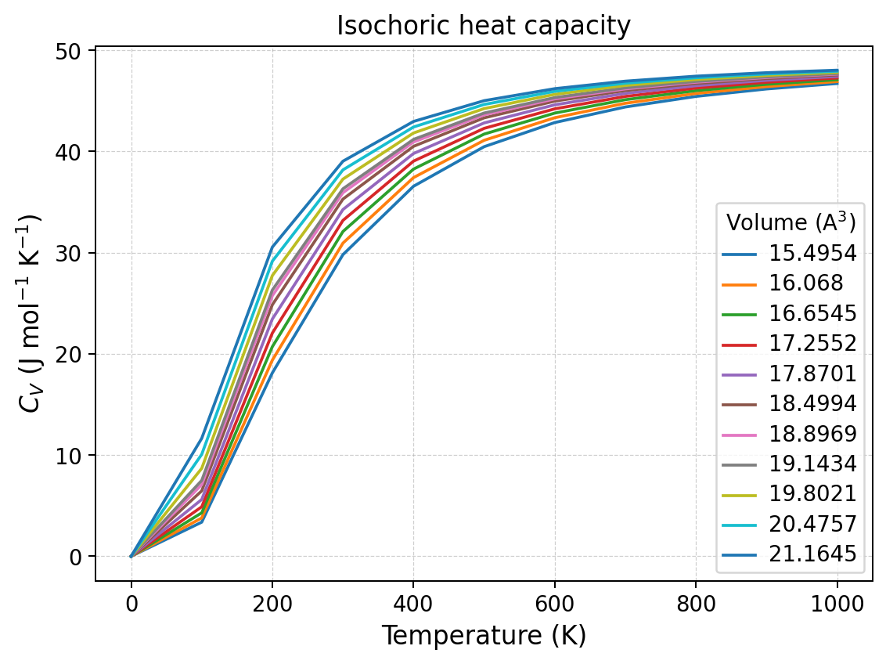
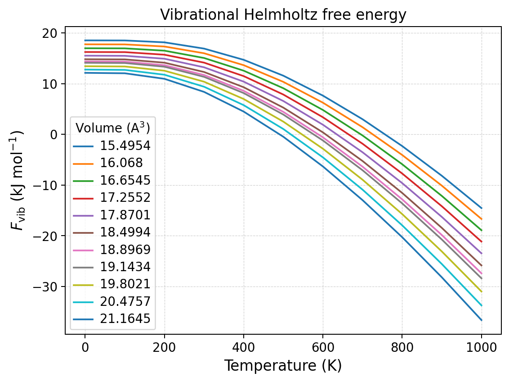

Harmonic Approximation
======================

This tutorial calculates harmonic thermodynamic properties for periclase
(MgO) over a series of eleven volumes.  The same calculation is performed
through the command-line interface and the public Python API.

The tutorial demonstrates an important property of the HA workflow: a single
input may contain several volumes.  Quantas evaluates the harmonic
thermodynamic functions independently at every sampled volume; it does **not**
select an equilibrium volume in this workflow.  Equilibrium as a function of
pressure and temperature is introduced later by the QHA tutorial.

Scientific objective
--------------------

For each sampled volume and temperature, calculate:

- zero-point energy, :math:`U_{\mathrm{zp}}(V)`;
- thermal vibrational energy, :math:`U_{\mathrm{th}}(T,V)`;
- total internal energy, :math:`U(T,V)`;
- entropy, :math:`S(T,V)`;
- vibrational and total Helmholtz free energy;
- isochoric heat capacity, :math:`C_V(T,V)`.

Dataset
-------

The example is derived from a CRYSTAL17 quasi-harmonic calculation for MgO.
The normalized Quantas YAML contains:

- 2 atoms in the primitive cell;
- 1 formula unit per cell;
- 32 supplied q-points;
- 6 phonon branches at every q-point;
- 11 volumes from approximately 15.50 to 21.16 ų;
- one static energy and one phonon-frequency set for every volume.

The complete input is distributed at
``examples/qha/crystal-qha/mgo_b3lyp.yaml``.

:download:`Download the MgO YAML input <../_downloads/mgo_b3lyp.yaml>`

A shortened excerpt is shown below.  The complete file also contains the
volume-dependent structures and all frequency arrays.

.. code-block:: yaml

   job: MgO Periclase (CRYSTAL17 QHA)
   natom: 2
   formula_units: 1
   units:
     energy: Ha
     volume: angstrom^3
     frequency: cm^-1
     length: angstrom
   mode_continuity: verified
   mode_continuity_metadata:
     method: crystal-qha
     source: crystal
   supercell:
     - [-2,  2,  2]
     - [ 2, -2,  2]
     - [ 2,  2, -2]
   structure:
     representation: primitive
     reference_index: 6
     volume_series:
       volume: [15.495426716592775, 16.068019225910940, ..., 21.164485271468507]
   qpoints: 32
   phonon:
     - q-position: [0.0, 0.0, 0.0]
       weight: 1
       band:
         - frequency: [0.0, 0.0, 0.0, ...]
         # ... remaining branches and q-points ...

.. note::

   Quantas uses the q-point weights supplied by the input.  It does not derive
   symmetry multiplicities during an HA or QHA run.  Input weights must
   therefore already represent the intended sampling convention.

The normalized tutorial input can be regenerated directly from the distributed
native CRYSTAL QHA output:

.. code-block:: console

   quantas ha inpgen examples/qha/crystal-qha/mgo-b3lyp-crystal-qha.out \
       --interface crystal-qha \
       --jobname "MgO Periclase (CRYSTAL17 QHA)" \
       --output mgo_b3lyp.yaml

The generated file records CRYSTAL's source-managed mode-continuity result.
That metadata is not required by HA itself, but it allows the same normalized
file to be reused by the QHA tutorial without weakening the input contract.
See :doc:`../workflows/phonon_input_generation` for the complete generation
procedure.

Temperature grid
----------------

The calculation uses temperatures from 0 to 1000 K in steps of 100 K.  This
coarse grid is chosen for a readable tutorial.  Production calculations should
use a resolution appropriate to the scientific question.

Running HA from the command line
--------------------------------

From the repository root, run:

.. code-block:: console

   quantas ha run examples/qha/crystal-qha/mgo_b3lyp.yaml \
       --temperature 0 1000 100 \
       --output mgo_ha.hdf5 \
       --report mgo_ha.log \
       --verbosity standard \
       --no-progress \
       --force

The command produces:

``mgo_ha.hdf5``
   Native scientific result containing normalized metadata and all HA arrays.

``mgo_ha.log``
   Deterministic plain-text report.

The beginning of the report confirms that the full multi-volume dataset was
accepted:

.. code-block:: text

   Input summary: 2 atoms, 32 q-points, 11 volumes

   Selected options
   ----------------

              Option          |  Value
     -------------------------+--------
     Temperature minimum      | 0
     Temperature maximum      | 1000
     Temperature step         | 100
     Temperature unit         | K
     Energy unit              | Ha
     Volume unit              | A
     Frequency unit           | cm^-1
     Numerical precision      | float64

Understanding the HA report
---------------------------

Volume-only quantities
^^^^^^^^^^^^^^^^^^^^^^

The static energy and zero-point energy depend on volume but not on the
requested temperature grid.  They are therefore reported once per volume:

.. code-block:: text

   Static and zero-point energies
   ------------------------------

        V      |          U0         |        Uzp
      (A^3)    |         (Ha)        |        (Ha)
   ------------+---------------------+-------------------
   15.49542672 | -2.754467055837E+02 | 7.053334071905E-03
   18.89686185 | -2.754628820004E+02 | 5.470199108461E-03
   21.16448527 | -2.754585023425E+02 | 4.614423074024E-03

For this dataset, :math:`U_{\mathrm{zp}}` decreases as the cell expands.  The
phonon spectrum softens with increasing volume, so the sum of
:math:`h\nu/2` terms becomes smaller.

Temperature-volume arrays
^^^^^^^^^^^^^^^^^^^^^^^^^

The report then identifies the stored shapes:

.. code-block:: text

   Key   Description                        Available  Shape
   Uzp   Zero-point energy                  yes        (1, 11)
   Uth   Thermal energy                     yes        (11, 11)
   Utot  Internal energy                    yes        (11, 11)
   S     Entropy                            yes        (11, 11)
   Fvib  Vibrational Helmholtz free energy  yes        (11, 11)
   F     Helmholtz free energy              yes        (11, 11)
   Cv    Isochoric heat capacity            yes        (11, 11)

The first axis of the temperature-dependent arrays contains the 11
temperatures; the second contains the 11 sampled volumes.  The zero-point
energy retains its physically meaningful shape ``(1, 11)`` because it does not
depend on temperature.

At the reference-like volume of 18.8969 ų, selected values are:

.. list-table::
   :header-rows: 1
   :widths: 13 18 20 18 18

   * - T (K)
     - :math:`U_{\mathrm{th}}` (kJ mol⁻¹)
     - :math:`F_{\mathrm{vib}}` (kJ mol⁻¹)
     - :math:`S` (J mol⁻¹ K⁻¹)
     - :math:`C_V` (J mol⁻¹ K⁻¹)
   * - 0
     - 0.000
     - 14.362
     - 0.000
     - 0.000
   * - 300
     - 5.000
     - 11.694
     - 25.558
     - 35.922
   * - 1000
     - 36.238
     - -27.417
     - 78.017
     - 47.638

The zero-temperature vibrational free energy equals the zero-point energy.
With increasing temperature, entropy lowers :math:`F_{\mathrm{vib}}`, while
:math:`C_V` approaches the classical high-temperature limit.

Exporting a property table
--------------------------

A selected property can be exported from the HDF5 result.  For example:

.. code-block:: console

   quantas ha export mgo_ha.hdf5 \
       --property Cv \
       --unit J/mol \
       --output mgo_ha_Cv.dat

:download:`Download the complete HA heat-capacity table <../_downloads/tutorials/ha/mgo_ha_Cv.dat>`

The table preserves one column per sampled volume:

.. code-block:: text

   # Quantas HA table export
   # Property: Cv - Isochoric heat capacity
   # Units: J mol^-1 K^-1
   #
   T / K       V=15.495427 / A^3   ...   V=18.896862 / A^3   ...   V=21.164485 / A^3
   0.00000000  0.000000000000E+00 ...   0.000000000000E+00 ...   0.000000000000E+00
   300.000000  2.980199098224E+01 ...   3.592223697777E+01 ...   3.903139950331E+01
   1000.00000  4.670869809859E+01 ...   4.763783551464E+01 ...   4.802494090781E+01

Generating selected HA plots
----------------------------

Isochoric heat capacity
^^^^^^^^^^^^^^^^^^^^^^^

.. code-block:: console

   quantas ha plot mgo_ha.hdf5 \
       --property Cv \
       --unit J/mol \
       --output figures/mgo_ha_cv \
       --preset publication \
       --format png \
       --dpi 180

   Harmonic :math:`C_V(T,V)` for all sampled volumes.  Larger volumes have
   softer frequencies and therefore reach a given fraction of the
   high-temperature limit at lower temperature.  At high temperature the
   curves converge toward the same classical limit.

Vibrational Helmholtz free energy
^^^^^^^^^^^^^^^^^^^^^^^^^^^^^^^^^

.. code-block:: console

   quantas ha plot mgo_ha.hdf5 \
       --property Fvib \
       --unit kJ/mol \
       --output figures/mgo_ha_fvib \
       --preset publication \
       --format png \
       --dpi 180

   Vibrational Helmholtz free energy as a function of temperature.  Expanded
   cells have lower-frequency phonons and acquire a more negative entropic
   contribution.  This changing volume dependence is the physical ingredient
   used by the quasi-harmonic approximation.

Volume sections and V--T maps
^^^^^^^^^^^^^^^^^^^^^^^^^^^^^

When at least two sampled volumes are available, the same stored HA arrays can
be viewed along the complementary natural variable without recomputing the
harmonic sums.  The selected temperatures must be exact points of the stored
grid:

.. code-block:: console

   quantas ha plot mgo_ha.hdf5 \
       --property F \
       --axis volume \
       --temperature 0 \
       --temperature 300 \
       --temperature 1000 \
       --2d \
       --output figures/mgo_ha_free_energy_sections

The line plot reports :math:`F(V)` at the selected temperatures.  The optional
contour plot reports :math:`F(T,V)` on the complete native grid.  Quantas does
not interpolate missing volumes or temperatures during plot construction.

Running the same calculation from Python
----------------------------------------

The complete API script is distributed with the examples:

:download:`Download the HA API script <../_downloads/tutorials/ha/tutorial_api.py>`

.. literalinclude:: ../_downloads/tutorials/ha/tutorial_api.py
   :language: python
   :linenos:

Run it with:

.. code-block:: console

   python examples/ha/tutorial_api.py \
       examples/qha/crystal-qha/mgo_b3lyp.yaml \
       --output-dir ha_tutorial

The relevant public steps are:

#. construct :class:`quantas.api.ha.Options`;
#. call :func:`quantas.api.ha.run`;
#. obtain the typed payload with :func:`quantas.api.ha.get_result`;
#. build deterministic tables with :func:`quantas.api.ha.build_report`;
#. write HDF5 with :func:`quantas.api.ha.write_result`;
#. build neutral plots with :func:`quantas.api.ha.build_plots`;
#. render them through :mod:`quantas.api.rendering`.

The script reports:

.. code-block:: text

   Temperatures: 11
   Volumes: 11
   Cv shape: (11, 11)
   Written: ha_tutorial/mgo_ha_api.hdf5
   Written: ha_tutorial/mgo_ha_api.log

Scientific interpretation
-------------------------

This HA calculation provides thermodynamic functions at fixed volumes.  It
shows that the volume dependence of the vibrational spectrum is substantial,
but HA alone does not determine which volume is stable at a given pressure and
temperature.  The next tutorial combines the static and vibrational free
energies, minimizes :math:`F(V,T)+PV`, and obtains equilibrium QHA properties.

Reproducibility checkpoints
---------------------------

For the distributed input and the options used above:

- the input contains 11 volumes and 32 supplied q-points;
- ``Uzp`` has shape ``(1, 11)``;
- every temperature-dependent property has shape ``(11, 11)``;
- at 18.89686185 ų, :math:`U_{\mathrm{zp}}` is approximately
  14.3620 kJ mol⁻¹;
- at 300 K and the same volume, :math:`C_V` is approximately
  35.9222 J mol⁻¹ K⁻¹.
