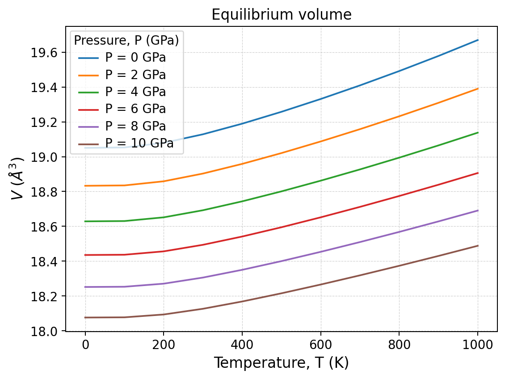
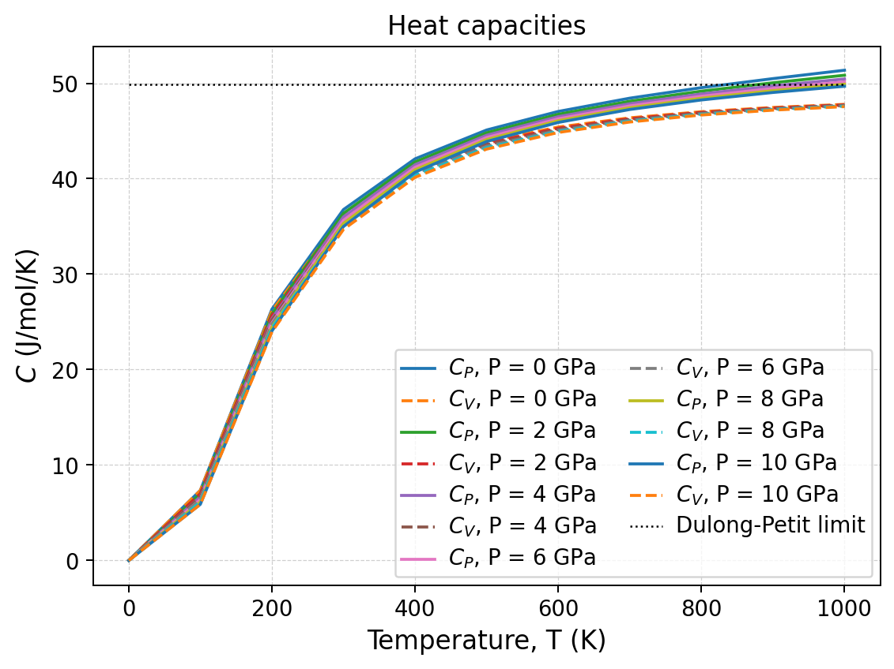
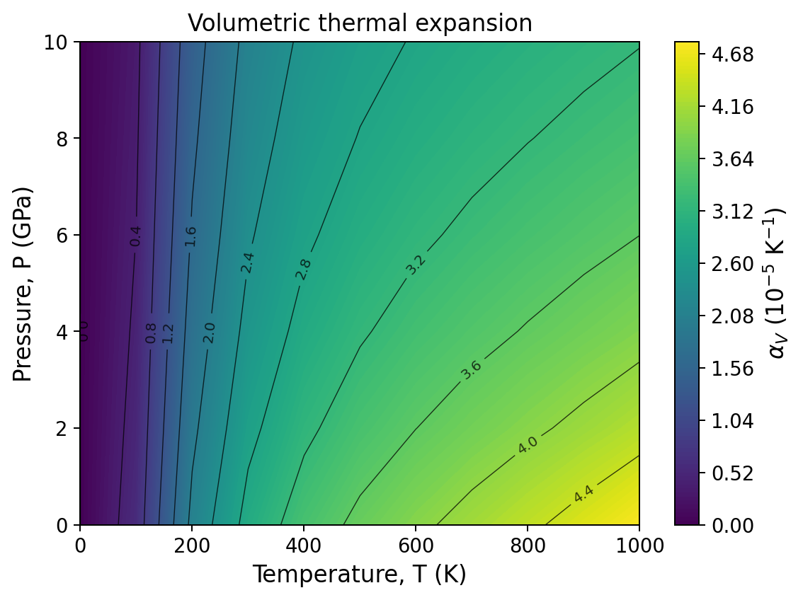

Quasi-Harmonic Approximation
============================

This tutorial extends the MgO harmonic calculation to finite pressure and
temperature.  Quantas fits the volume dependence of the static and vibrational
contributions, minimizes the appropriate thermodynamic potential, and produces
equilibrium structural and thermodynamic properties on a pressure-temperature
grid.

Scientific objective
--------------------

For temperatures from 0 to 1000 K and pressures from 0 to 10 GPa, calculate:

- equilibrium volume, :math:`V(P,T)`;
- isothermal and adiabatic bulk moduli, :math:`K_T` and :math:`K_S`;
- volumetric and axial thermal expansion;
- :math:`C_V`, :math:`C_P`, and :math:`C_P-C_V`;
- thermodynamic and mode-weighted Grüneisen parameters;
- equilibrium lattice parameters.

Dataset and relationship to HA
------------------------------

The tutorial uses the same normalized MgO input as the HA tutorial:

:download:`Download the MgO YAML input <../_downloads/mgo_b3lyp.yaml>`

In HA, the eleven volumes were independent calculation points.  In QHA, their
static energies and phonon properties define continuous volume-dependent
models.  Quantas then searches these models for the equilibrium state at every
requested pressure and temperature.

Inspecting the static energy-volume range
-----------------------------------------

Before running QHA, inspect the pressure range represented by the static
energy-volume dataset:

.. code-block:: console

   quantas qha inspect examples/qha/crystal-qha/mgo_b3lyp.yaml \
       --degree 3 \
       --eos BM3 \
       --report mgo_qha_inspect.log

The preview evaluates pressure from both a third-degree polynomial and a
third-order Birch--Murnaghan energy EOS.  Selected rows are:

.. code-block:: text

       V              E             P polynomial   P EOS
     (A^3)       (Ha cell^-1)          (GPa)       (GPa)
   15.495427  -2.754467055837E+02      47.20332    48.88299
   18.896862  -2.754628820004E+02      -0.37565    -0.06903
   21.164485  -2.754585023425E+02     -13.95094   -15.29253

The BM3 preview yields:

.. code-block:: text

   E0 = -275.46288 Ha cell^-1
   V0 = 18.889084 A^3
   K0 = 167.81087 GPa
   K' = 3.897373
   RMSE = 1.8692458E-06 Ha cell^-1
   Quality = good

The sampled static dataset spans approximately -15 to 49 GPa according to this
fit.  The tutorial domain, 0--10 GPa, is therefore comfortably inside the
static pressure coverage.  This does not by itself guarantee that every
finite-temperature equilibrium point is interpolation-only, but it is an
important preliminary check.

Choosing the QHA model
----------------------

This tutorial uses:

``--scheme freq``
   Fit each phonon branch as a function of volume and evaluate the frequencies
   at the equilibrium volume.  The input marks mode continuity as ``assumed``;
   it is suitable for this curated example but is not presented as an
   independently verified branch-tracking result.

``--minimization poly``
   Represent the free-energy curves by polynomials and minimize them at each
   pressure-temperature point.

``--energy-degree 3`` and ``--frequency-degree 3``
   Use third-degree volume fits for the static/free-energy and frequency
   branches.

``--thermal-expansion mixed_derivative``
   Calculate :math:`\alpha_V` from the mixed derivative of the fitted
   free-energy surface.  The mode-Grüneisen route remains available as an
   internal consistency comparison.

The choices are appropriate for this dataset and tutorial.  They are not
universal defaults for all materials: fit quality, sampling range, branch
continuity, and extrapolation must be assessed for each calculation.

Running QHA from the command line
---------------------------------

.. code-block:: console

   quantas qha run examples/qha/crystal-qha/mgo_b3lyp.yaml \
       --scheme freq \
       --minimization poly \
       --thermal-expansion mixed_derivative \
       --temperature 0 1000 100 \
       --pressure 0 10 2 \
       --energy-degree 3 \
       --frequency-degree 3 \
       --output mgo_qha.hdf5 \
       --report mgo_qha.log \
       --verbosity standard \
       --no-progress \
       --force

The grid contains 11 temperatures and 6 pressures, for 66 equilibrium states.
The workflow summary for this run reports:

.. code-block:: text

   processed points: 66
   successful points: 66
   warning points: 0
   failed points: 0
   stopped: False

Reading the QHA results
-----------------------

Pressure and temperature effects
^^^^^^^^^^^^^^^^^^^^^^^^^^^^^^^^

Selected values at 0 GPa are:

.. list-table::
   :header-rows: 1
   :widths: 10 15 15 15 16 13 13

   * - T (K)
     - V (ų)
     - :math:`K_T` (GPa)
     - :math:`K_S` (GPa)
     - :math:`\alpha_V` (10⁻⁵ K⁻¹)
     - :math:`\gamma`
     - :math:`C_P-C_V` (J mol⁻¹ K⁻¹)
   * - 0
     - 19.050555
     - 169.13961
     - 169.13961
     - 0.000000
     - 0.00000
     - 0.0000
   * - 300
     - 19.128633
     - 163.53085
     - 165.72304
     - 2.933514
     - 1.52324
     - 0.4863
   * - 1000
     - 19.669793
     - 132.62196
     - 142.54810
     - 4.771473
     - 1.56860
     - 3.5766

At 10 GPa, the same temperatures give:

.. list-table::
   :header-rows: 1
   :widths: 10 15 15 15 16 13 13

   * - T (K)
     - V (ų)
     - :math:`K_T` (GPa)
     - :math:`K_S` (GPa)
     - :math:`\alpha_V` (10⁻⁵ K⁻¹)
     - :math:`\gamma`
     - :math:`C_P-C_V` (J mol⁻¹ K⁻¹)
   * - 0
     - 18.076209
     - 210.55424
     - 210.55424
     - 0.000000
     - 0.00000
     - 0.0000
   * - 300
     - 18.126469
     - 206.93427
     - 208.73471
     - 2.110356
     - 1.37426
     - 0.3018
   * - 1000
     - 18.488160
     - 188.59458
     - 197.05656
     - 3.187630
     - 1.40759
     - 2.1336

Several expected trends are visible:

- temperature expands the cell at every pressure;
- pressure compresses the cell and reduces :math:`\alpha_V`;
- :math:`K_T` decreases with temperature but increases strongly with pressure;
- :math:`K_S` exceeds :math:`K_T` at finite temperature because
  :math:`C_P>C_V`;
- the thermodynamic and mode-weighted Grüneisen parameters are close over the
  resolved range.

The last point is an internal consistency observation, not an independent
experimental validation.  For this run, the RMS difference between the two
macroscopic Grüneisen estimates is approximately 0.00546.

Structural results
^^^^^^^^^^^^^^^^^^

Because the input contains a volume-dependent structural path, Quantas also
reconstructs the equilibrium cell.  At 0 GPa:

.. code-block:: text

      T       V          a          b          c
     (K)    (A^3)       (A)        (A)        (A)
      0   19.050555   4.239577   4.239577   4.239577
    300   19.128633   4.245361   4.245361   4.245361
   1000   19.669793   4.285024   4.285024   4.285024

MgO is cubic, so :math:`a=b=c` and each linear expansion coefficient equals
one third of the volumetric coefficient.  The report explicitly verifies that
the trace of the linear expansion tensor agrees with :math:`\alpha_V`.

Exporting QHA tables
--------------------

Equilibrium volume can be exported as CSV:

.. code-block:: console

   quantas qha export mgo_qha.hdf5 \
       --property VT \
       --format csv \
       --output mgo_qha_VT.csv

:download:`Download the complete equilibrium-volume CSV table <../_downloads/tutorials/qha/mgo_qha_VT.csv>`

.. code-block:: text

   P (GPa),T (K),VT (A^3)
   0.00,0.00,19.050555
   0.00,300.00,19.128633
   0.00,1000.00,19.669793
   2.00,0.00,18.832876
   2.00,300.00,18.903092
   2.00,1000.00,19.390178

The expansion method is retained in a property-specific export:

.. code-block:: console

   quantas qha export mgo_qha.hdf5 \
       --property alphaV \
       --format csv \
       --output mgo_qha_alphaV.csv

:download:`Download the complete thermal-expansion CSV table <../_downloads/tutorials/qha/mgo_qha_alphaV.csv>`

.. code-block:: text

   P (GPa),T (K),alphaV (K^-1),alphaV method
   0.00,0.00,0.000000E+00,mixed_derivative
   0.00,300.00,2.933514E-05,mixed_derivative
   0.00,1000.00,4.771473E-05,mixed_derivative
   10.00,300.00,2.110356E-05,mixed_derivative
   10.00,1000.00,3.187630E-05,mixed_derivative

Generating selected QHA plots
-----------------------------

Equilibrium volume
^^^^^^^^^^^^^^^^^^

.. code-block:: console

   quantas qha plot mgo_qha.hdf5 \
       --property VT \
       --output qha_figures \
       --preset publication \
       --format png \
       --dpi 180

   Equilibrium volume as a function of temperature for each pressure.  The
   positive slope is thermal expansion; the downward displacement of the curves
   is pressure-induced compression.  The curvature shows that expansion is not
   constant over the full temperature range.

Heat capacities
^^^^^^^^^^^^^^^

.. code-block:: console

   quantas qha plot mgo_qha.hdf5 \
       --property heat_capacities \
       --energy-unit J/mol \
       --output qha_figures \
       --preset publication \
       --format png \
       --dpi 180

   :math:`C_V` is shown with dashed lines and :math:`C_P` with solid lines.
   Their difference grows with temperature because thermal expansion couples
   heat input to mechanical work.  The dotted horizontal line is the
   Dulong--Petit limit for two atoms per formula unit.  The QHA :math:`C_P` may
   exceed this harmonic classical limit because it includes the expansion term.

Pressure-temperature map of thermal expansion
^^^^^^^^^^^^^^^^^^^^^^^^^^^^^^^^^^^^^^^^^^^^^^

.. code-block:: console

   quantas qha plot mgo_qha.hdf5 \
       --property alphaV \
       --2d \
       --cmap viridis \
       --levels 12 \
       --output qha_figures \
       --preset publication \
       --format png \
       --dpi 180

   The contour map summarizes the coupled response.  Expansion increases with
   temperature and decreases with pressure.  The map must be interpreted only
   inside the calculated pressure-temperature domain and together with the
   input-volume coverage and workflow warnings.

Running the same calculation from Python
----------------------------------------

The public API reproduces the same scientific choices and result grids.

:download:`Download the QHA API script <../_downloads/tutorials/qha/tutorial_api.py>`

.. literalinclude:: ../_downloads/tutorials/qha/tutorial_api.py
   :language: python
   :linenos:

Run it with:

.. code-block:: console

   python examples/qha/tutorial_api.py \
       examples/qha/crystal-qha/mgo_b3lyp.yaml \
       --output-dir qha_tutorial

The script first calls :func:`quantas.api.qha.inspect`, then runs QHA through
:func:`quantas.api.qha.run`.  It writes a report and HDF5 result, builds the
same selected neutral plot specifications, and renders them using the public
rendering bridge.

Expected terminal summary:

.. code-block:: text

   Static pressure coverage from BM3: -15.29 to 48.88 GPa
   Grid shape: 11 x 6
   Successful points: 66
   Failed points: 0
   Written: qha_tutorial/mgo_qha_api.hdf5
   Written: qha_tutorial/mgo_qha_api.log

Inspecting the typed result in Python
-------------------------------------

The module-specific payload exposes NumPy arrays without converting display
precision into stored precision:

.. code-block:: python

   from quantas.api import qha

   result = qha.read_result("mgo_qha.hdf5")
   data = qha.get_result(result)

   print(data.temperature.shape)       # (11,)
   print(data.pressure.shape)          # (6,)
   print(data.equilibrium_volume.shape)  # (11, 6)
   print(data.thermal_expansion.shape)   # (11, 6)
   print(data.lattice_parameters.shape)  # (11, 6, 6)

The arrays retain native ``float64`` values.  Formatting in reports and figures
is applied only by the renderers.

Exercise: sensitivity to interpolation and minimization
-------------------------------------------------------

A QHA result is not determined only by the input data.  It also depends on how
the volume dependence is represented.  Two independent choices are especially
important:

- ``freq`` or ``td`` interpolation;
- polynomial or equation-of-state minimization of the free-energy curve.

This exercise compares the four combinations at 300 K and 0 GPa while keeping
the input, polynomial degrees, thermal-expansion method, and pressure-
temperature state unchanged.

Running the four CLI calculations
^^^^^^^^^^^^^^^^^^^^^^^^^^^^^^^^^

Use distinct result names so that no calculation overwrites another:

.. code-block:: console

   quantas qha run examples/qha/crystal-qha/mgo_b3lyp.yaml \
       --scheme freq --minimization poly \
       --temperature 300 300 1 --pressure 0 0 1 \
       --energy-degree 3 --frequency-degree 3 \
       --thermal-expansion mixed_derivative \
       --output qha_freq_poly.hdf5 --report qha_freq_poly.log \
       --no-progress --force

   quantas qha run examples/qha/crystal-qha/mgo_b3lyp.yaml \
       --scheme td --minimization poly --no-mode-gruneisen \
       --temperature 300 300 1 --pressure 0 0 1 \
       --energy-degree 3 --frequency-degree 3 \
       --thermal-expansion mixed_derivative \
       --output qha_td_poly.hdf5 --report qha_td_poly.log \
       --no-progress --force

   quantas qha run examples/qha/crystal-qha/mgo_b3lyp.yaml \
       --scheme freq --minimization eos --eos BM3 \
       --temperature 300 300 1 --pressure 0 0 1 \
       --energy-degree 3 --frequency-degree 3 \
       --thermal-expansion mixed_derivative \
       --output qha_freq_bm3.hdf5 --report qha_freq_bm3.log \
       --no-progress --force

   quantas qha run examples/qha/crystal-qha/mgo_b3lyp.yaml \
       --scheme td --minimization eos --eos BM3 --no-mode-gruneisen \
       --temperature 300 300 1 --pressure 0 0 1 \
       --energy-degree 3 --frequency-degree 3 \
       --thermal-expansion mixed_derivative \
       --output qha_td_bm3.hdf5 --report qha_td_bm3.log \
       --no-progress --force

The same comparison can be automated through the public API:

:download:`Download the method-comparison script <../_downloads/tutorials/qha/compare_methods.py>`

.. code-block:: console

   python examples/qha/compare_methods.py \
       examples/qha/crystal-qha/mgo_b3lyp.yaml \
       --output qha_method_comparison.csv

Complete the table
^^^^^^^^^^^^^^^^^^

Read the values from the reports or from the CSV produced by the script.  The
reference row is filled; complete the other rows before reading the discussion
below.

.. list-table:: QHA method comparison at 300 K and 0 GPa
   :header-rows: 1
   :widths: 9 12 9 12 12 14 12 12 10

   * - Scheme
     - Minimization
     - EOS
     - V (ų)
     - :math:`K_T` (GPa)
     - :math:`\alpha_V` (10⁻⁵ K⁻¹)
     - :math:`C_V` (J mol⁻¹ K⁻¹)
     - :math:`C_P` (J mol⁻¹ K⁻¹)
     - :math:`\gamma`
   * - freq
     - poly
     - --
     - 19.128633
     - 163.53085
     - 2.933514
     - 36.27882
     - 36.76515
     - 1.52324
   * - td
     - poly
     - --
     -
     -
     -
     -
     -
     -
   * - freq
     - eos
     - BM3
     -
     -
     -
     -
     -
     -
   * - td
     - eos
     - BM3
     -
     -
     -
     -
     -
     -

What should be compared?
^^^^^^^^^^^^^^^^^^^^^^^^

First compare ``freq`` and ``td`` at fixed minimization.  For this curated MgO
dataset the two interpolation schemes agree very closely at 300 K: the volume
is identical at the shown precision and the differences in the principal
thermodynamic quantities are below about 0.05%.  This indicates that fitting
mode-resolved frequencies or fitting the derived harmonic functions produces
nearly the same local free-energy surface for this state.

Next compare polynomial and BM3 minimization at fixed interpolation.  The
change is larger: relative to ``freq/poly``, ``freq/eos`` changes the volume by
about 0.24%, lowers :math:`K_T` by about 3.1%, and raises
:math:`\alpha_V` by about 3.7%.  Heat capacities change much less.  The main
sensitivity therefore comes from the curvature and minimum of the fitted
free-energy-volume relation, rather than from the harmonic thermodynamic
interpolation itself.

These percentages are properties of this dataset, volume interval, fit degree,
EOS family, and selected state.  They are not universal accuracy rankings.
Agreement between methods increases confidence only when all fits are
well-conditioned and the equilibrium volume remains inside the sampled range.

Optional extension: EOS-family sensitivity
^^^^^^^^^^^^^^^^^^^^^^^^^^^^^^^^^^^^^^^^^^^

Repeat the EOS rows with ``BM2``, ``BM4``, ``PT3`` and ``V3``.  Add one row per
model and compare the fitted volume, curvature, and warning record.  The purpose
is not to select the model that is numerically closest to the polynomial result,
but to determine whether scientifically reasonable EOS choices give stable
conclusions over the sampled compression range.

Reproducibility checkpoints
---------------------------

For the distributed input and the options used above:

- all 66 pressure-temperature points complete successfully;
- the BM3 inspection fit gives :math:`V_0\approx18.889084` ų and
  :math:`K_0\approx167.81087` GPa;
- at 0 GPa and 300 K, :math:`V\approx19.128633` ų and
  :math:`\alpha_V\approx2.933514\times10^{-5}` K⁻¹;
- at 10 GPa and 300 K, :math:`V\approx18.126469` ų and
  :math:`\alpha_V\approx2.110356\times10^{-5}` K⁻¹;
- no structural extrapolation is reported for the selected grid;
- the stored result records ``mixed_derivative`` as the source of all 66
  thermal-expansion values.

Scientific limits
-----------------

The tutorial validates reproducibility of this workflow, not universal validity
of QHA.  Before applying the same options to another material, examine:

- dynamical stability and non-positive frequencies;
- mode continuity when using the frequency scheme;
- static and vibrational volume coverage;
- fit quality and local failures;
- extrapolation warnings;
- phase transitions or strong intrinsic anharmonicity outside QHA.
