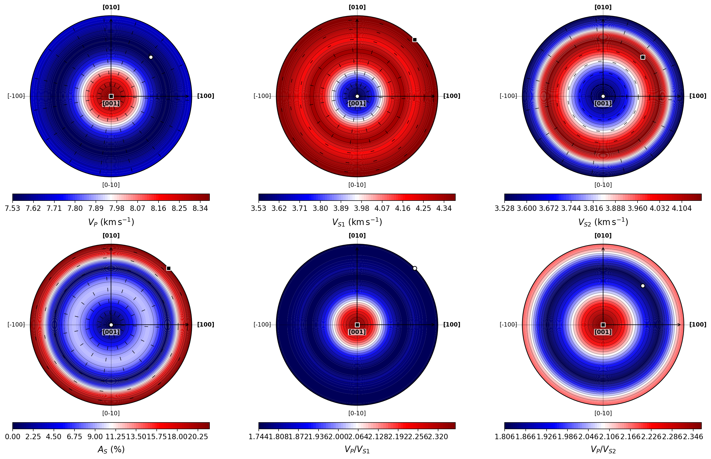
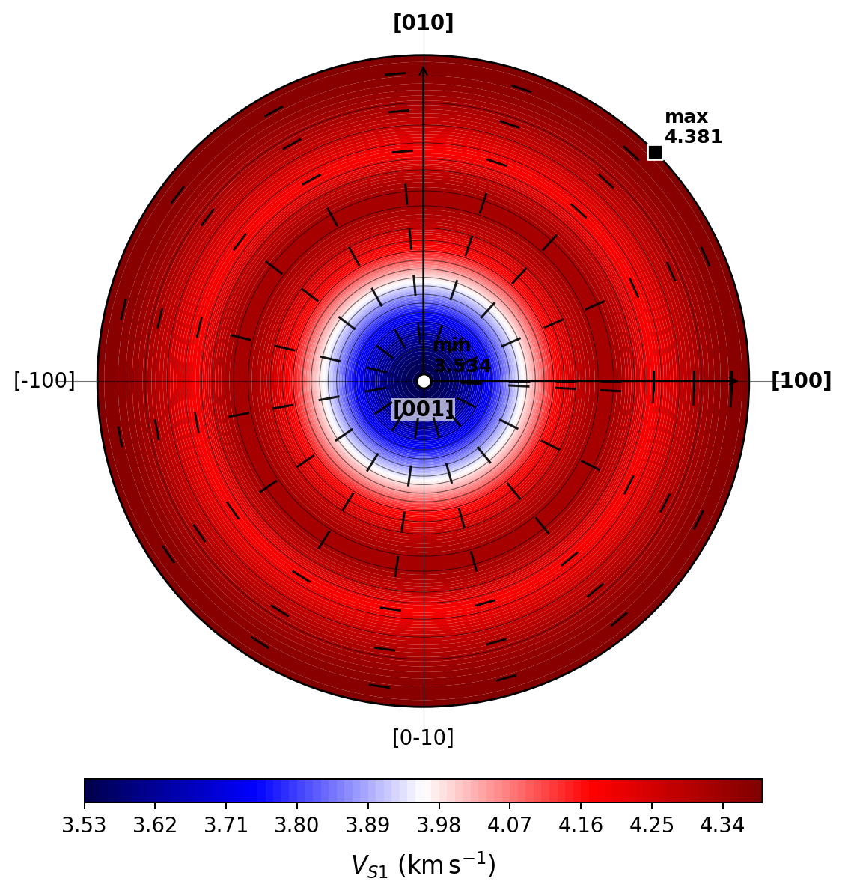
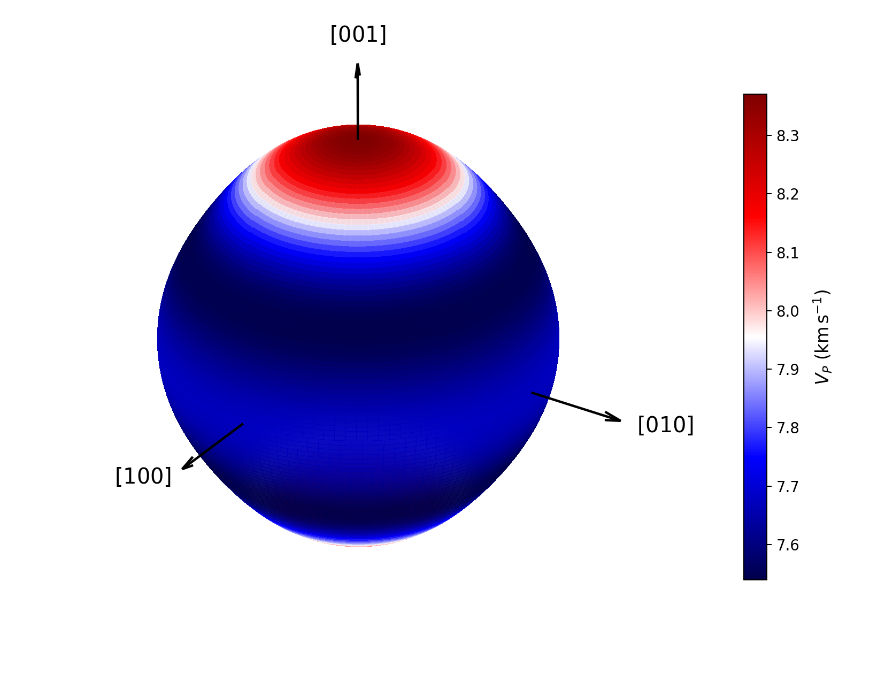

Seismic-wave analysis
=====================

This tutorial solves the Christoffel equation for a single crystal of
hydroxylapatite.  It calculates phase and group velocities, polarization axes,
shear-wave splitting, power-flow quantities, acoustic enhancement, and
sampling diagnostics.  The calculation is performed first from the command
line and then through the public Python API.

The underlying theory is presented in :doc:`../theory/seismic`; the workflow
organization is described in :doc:`../workflows/seismic`.

Scientific questions
--------------------

The tutorial examines:

- how the three acoustic phase velocities vary with propagation direction;
- where the two shear branches become degenerate or strongly split;
- how the energy-flow direction differs from the wave normal;
- how tracked polarization axes should be interpreted;
- what enhancement and caustic-candidate diagnostics mean;
- how spherical maps and physical three-dimensional surfaces represent the
  same acoustic field.

Dataset
-------

The input is a hexagonal hydroxylapatite stiffness tensor with density
:math:`3178\ \mathrm{kg\,m^{-3}}`.  It is distributed at
``examples/elasticity/hydroxylapatite.dat`` because the same physical tensor is
also suitable for the Elasticity workflow.

:download:`Download hydroxylapatite.dat <../_downloads/hydroxylapatite.dat>`

.. code-block:: text

   Hydroxylapatite
       187.208   65.193   84.703    0.000    0.000    0.000
                 187.208   84.703    0.000    0.000    0.000
                           222.658    0.000    0.000    0.000
                                      39.687    0.000    0.000
                                                39.687    0.000
                                                          61.007
   3178

The first six numeric rows define the stiffness matrix in GPa.  The final value
is the density in kg m⁻³.  Density is essential because Christoffel
eigenvalues are converted to squared velocities through :math:`C/\rho`.

Choosing the sampling calculation
----------------------------------

The tutorial samples the upper hemisphere with:

- 61 polar values;
- 121 azimuthal values;
- no duplicated azimuthal seam;
- the ``enhancement`` calculation level;
- tracked polarization axes.

The selected level is hierarchical:

``phase``
   Phase velocity, eigenvalues, polarization, and degeneracy diagnostics.

``group``
   All phase quantities plus group velocity, ray direction, and power-flow
   angle.

``enhancement``
   All phase and group quantities plus curvature, area factor, enhancement,
   and caustic-candidate diagnostics.

A coarse grid is adequate for learning and keeps the tutorial fast.  Extrema
reported from SEISMIC are sampled-grid extrema, so production work should test
angular convergence.

Running SEISMIC from the command line
-------------------------------------

.. code-block:: console

   quantas seismic run examples/elasticity/hydroxylapatite.dat \
       --hemisphere upper \
       --level enhancement \
       --ntheta 61 \
       --nphi 121 \
       --track-polarizations \
       --output hydroxylapatite_seismic.hdf5 \
       --report hydroxylapatite_seismic.log \
       --verbosity standard \
       --no-progress \
       --force

The command produces:

``hydroxylapatite_seismic.hdf5``
   Native result containing the elastic input, spherical grid, phase field,
   group field, enhancement field, tracking diagnostics, options, and
   provenance.

``hydroxylapatite_seismic.log``
   Deterministic scientific report.

Reading the report
------------------

Sampling summary
^^^^^^^^^^^^^^^^

.. code-block:: text

   Seismic calculation summary
   ---------------------------

              Property         |      Value
     --------------------------+----------------
     Job name                  | Hydroxylapatite
     Elastic symmetry          | hexagonal
     Density / kg m^-3         | 3178.000000
     Mechanical stability      | stable
     Sampling level            | enhancement
     Hemisphere                | upper
     Polar samples             | 61
     Azimuthal samples         | 121
     Sampled directions        | 7381
     Azimuthal seam duplicated | no
     Polarization tracking     | yes

The spherical field stores modes in the stable order
:math:`V_{S2},V_{S1},V_P`.  The labels :math:`S1` and :math:`S2` order the fast
and slow shear branches away from degeneracy; exactly at a shear degeneracy,
individual transverse eigenvectors are not unique.

Isotropic reference velocities
^^^^^^^^^^^^^^^^^^^^^^^^^^^^^^^

The Hill-average elastic moduli provide a useful isotropic reference:

.. code-block:: text

   Hill-average isotropic velocity reference
   -----------------------------------------

      Quantity |   Value
     ----------+-----------
     V_S       | 4.00911178
     V_P       | 7.64303712
     V_P / V_S | 1.90641657

These values are not angular averages of the sampled single-crystal speeds.
They are calculated from the Hill bulk and shear moduli and the supplied
density.  They provide a compact aggregate reference against which the
single-crystal directional fields can be compared.

Phase velocities
^^^^^^^^^^^^^^^^

The sampled extrema are:

.. list-table::
   :header-rows: 1
   :widths: 14 18 18 18

   * - Mode
     - Minimum / km s⁻¹
     - Maximum / km s⁻¹
     - Range anisotropy / %
   * - :math:`V_P`
     - 7.539892
     - 8.370323
     - 10.43897
   * - :math:`V_{S1}`
     - 3.533842
     - 4.381418
     - 21.41623
   * - :math:`V_{S2}`
     - 3.533842
     - 4.167169
     - 16.44787

The maximum :math:`V_P` occurs along the input-frame :math:`z` direction,
which corresponds to the hexagonal :math:`[001]` axis.  Its minimum is oblique
to the principal axes.  Both shear branches are degenerate along :math:`[001]`
at approximately 3.53384 km s⁻¹, as expected for propagation along the
high-symmetry axis of this tensor.

Shear splitting and velocity ratios
^^^^^^^^^^^^^^^^^^^^^^^^^^^^^^^^^^^^

The maximum sampled shear splitting is:

.. code-block:: text

   V_S1 - V_S2 maximum = 0.84757530 km s^-1
   Directional S-wave anisotropy maximum = 21.41623306 %

It occurs close to the basal plane, where the contrast between the two
transverse branches is largest.  Along the :math:`c` axis the shear eigenvalues
coincide, so the splitting is zero and the individual transverse polarization
basis is not unique.

The directional :math:`V_P/V_S` ratios are also reported.  They are useful
observables, but they should not be confused with the single isotropic
Hill-reference ratio.

Group velocity and power flow
^^^^^^^^^^^^^^^^^^^^^^^^^^^^^

At the ``group`` and ``enhancement`` levels, the report gives both the wave
normal and the ray direction at each extremum.  In an anisotropic medium these
directions need not coincide.  The group speed is the magnitude of the energy-
flow velocity; the power-flow angle measures the deflection between wave normal
and ray direction.

For :math:`V_P` in this example the difference is small near the speed extrema.
For shear waves, the group-speed field and ray direction can differ more
substantially from the phase-normal geometry, especially near rapidly changing
polarizations or near-degenerate branches.

Enhancement and caustic candidates
^^^^^^^^^^^^^^^^^^^^^^^^^^^^^^^^^^^

The calculation reports extrema of :math:`\log_{10}(A)` and masks for finite,
resolved, and possible caustic points.  For this grid:

.. code-block:: text

   Mode  Finite resolved points  Caustic candidates  Non-finite points
   V_P                    7381                   0                  0
   V_S1                   7260                   0                  0
   V_S2                   7260                   0                  0

The lower count for the shear modes comes from unresolved degeneracy points,
not from failed phase velocities.  A zero candidate count means that no sampled
point satisfies the selected curvature threshold.  It does not prove that the
continuous surface contains no caustic between grid points.

Polarization tracking diagnostics
^^^^^^^^^^^^^^^^^^^^^^^^^^^^^^^^^

The report records sign alignments, shear-branch exchanges, ambiguous
permutations, and rotations within a degenerate shear subspace.  These are not
physical discontinuities added to the result: they document the deterministic
choices required to represent axial eigenvectors continuously on an ordered
grid.

A polarization axis has no intrinsic arrow direction, so :math:`\mathbf p` and
:math:`-\mathbf p` describe the same physical axis.  Near an exact degeneracy,
the separate shear axes are not uniquely defined even though their two-
dimensional transverse subspace remains well defined.

Exporting sampled fields
------------------------

Export all sampled quantities to CSV:

.. code-block:: console

   quantas seismic export hydroxylapatite_seismic.hdf5 \
       --output hydroxylapatite_seismic.csv

The export contains one row per sampled direction and acoustic mode.  The
header identifies the stable mode ordering and includes phase, group,
enhancement, degeneracy, and tracking fields:

.. code-block:: text

   # Quantas sampled seismic-wave export
   # Job,Hydroxylapatite
   # Density / kg m^-3,3178
   # Mode order,"V_S2, V_S1, V_P"
   point_index,mode,theta_rad,theta_degree,phi_rad,phi_degree,...

This is intentionally a detailed machine-readable table.  Filtering by
``mode`` and selecting only the columns required for a downstream analysis is
usually more practical than opening the full CSV in a text editor.

Selected plots
--------------

Six-panel seismic summary
^^^^^^^^^^^^^^^^^^^^^^^^^

.. code-block:: console

   quantas seismic plot hydroxylapatite_seismic.hdf5 \
       --summary \
       --polarization \
       --axis-labels crystal \
       --preset publication \
       --dpi 180 \
       --output hydroxylapatite_summary

   Equal-area upper-hemisphere summary of :math:`V_P`, :math:`V_{S1}`, and
   :math:`V_{S2}`, directional shear anisotropy, and the two directional
   :math:`V_P/V_S` ratios.  Minimum and maximum markers are selected from the
   sampled grid.  Decimated black segments show tracked polarization axes on
   maps where they are defined.

The summary makes the hexagonal pattern immediately visible.  The central
point is :math:`[001]`; the outer boundary is the basal plane.  The
compressional wave is fastest along :math:`[001]`, while the largest shear
splitting occurs toward the edge of the projection.

A single shear map with polarization
^^^^^^^^^^^^^^^^^^^^^^^^^^^^^^^^^^^^

.. code-block:: console

   quantas seismic plot hydroxylapatite_seismic.hdf5 \
       --2d \
       --property phase_v_s1 \
       --projection equal_area \
       --polarization \
       --polarization-stride 8 \
       --axis-labels crystal \
       --preset publication \
       --dpi 180 \
       --output hydroxylapatite_vs1

   Fast shear-wave phase velocity :math:`V_{S1}`.  The central minimum is the
   shear degeneracy on :math:`[001]`; the fast branch reaches its maximum near
   the basal plane.  Polarization segments are axial, not directed arrows, and
   should not be interpreted inside unresolved degenerate points.

Three-dimensional compressional phase surface
^^^^^^^^^^^^^^^^^^^^^^^^^^^^^^^^^^^^^^^^^^^^^^^

.. code-block:: console

   quantas seismic plot hydroxylapatite_seismic.hdf5 \
       --3d \
       --surface phase \
       --mode v_p \
       --geometry physical \
       --axis-labels crystal \
       --no-polarization \
       --preset publication \
       --dpi 180 \
       --output hydroxylapatite_vp_surface

   Physical :math:`V_P` surface completed by antipodal symmetry from the
   sampled upper hemisphere.  Radius and color both encode phase speed.  The
   elongation along :math:`[001]` reflects the maximum compressional velocity
   in that direction.

The ``slowness`` and ``group`` surface types answer different questions.
Slowness geometry is especially useful for wave-normal constructions, whereas
the group surface represents energy-flow wavefronts.

Running the same workflow from Python
-------------------------------------

The complete public-API script is distributed with the examples:

:download:`Download the SEISMIC API script <../_downloads/tutorials/seismic/tutorial_api.py>`

.. literalinclude:: ../_downloads/tutorials/seismic/tutorial_api.py
   :language: python
   :linenos:

Run it with:

.. code-block:: console

   python examples/seismic/tutorial_api.py \
       examples/elasticity/hydroxylapatite.dat \
       --output-dir seismic_tutorial

The script uses only supported public namespaces:

.. code-block:: python

   from quantas.api import common, rendering, seismic

It demonstrates:

- construction of :class:`quantas.api.seismic.Options`;
- typed access through :func:`quantas.api.seismic.get_result`;
- HDF5 and CSV export;
- an extended deterministic report;
- a summary specification wrapped in a public ``PlotCollection``;
- a selected map with polarization axes;
- a physical phase-velocity surface.

The printed checkpoints are:

.. code-block:: text

   Sampled directions: 7381
   Isotropic V_S / km s^-1: 4.00911178
   Isotropic V_P / km s^-1: 7.64303712
   V_P range / km s^-1: 7.53989166 8.37032277
   V_S1 range / km s^-1: 3.53384250 4.38141779
   V_S2 range / km s^-1: 3.53384250 4.16716850

Inspecting structured fields
----------------------------

.. code-block:: python

   from quantas.api import seismic

   result = seismic.read_result("hydroxylapatite_seismic.hdf5")
   payload = seismic.get_result(result)

   phase = payload.field.phase
   vp = phase.for_mode("v_p")
   vs1 = phase.for_mode("v_s1")

   print(phase.n_points)
   print(vp.phase_speeds.shape)
   print(vs1.polarizations.shape)
   print(phase.shear_axis_candidate_mask.sum())

   if payload.field.group is not None:
       group_vp = payload.field.group.for_mode("v_p")
       print(group_vp.group_speeds.shape)
       print(group_vp.power_flow_angles.shape)

   if payload.field.enhancement is not None:
       print(payload.field.enhancement.log10_enhancement.shape)
       print(payload.field.enhancement.caustic_candidate_mask.sum())

All arrays use the same ordered spherical grid.  Masks must be respected when
working with degenerate or unresolved quantities.

CLI/API equivalence
-------------------

.. code-block:: python

   import numpy as np
   from quantas.api import seismic

   cli = seismic.get_result(
       seismic.read_result("hydroxylapatite_seismic.hdf5")
   )
   api = seismic.get_result(
       seismic.read_result(
           "seismic_tutorial/hydroxylapatite_seismic_api.hdf5"
       )
   )

   np.testing.assert_allclose(
       cli.field.phase.phase_speeds,
       api.field.phase.phase_speeds,
   )
   np.testing.assert_allclose(
       cli.field.group.group_speeds,
       api.field.group.group_speeds,
       equal_nan=True,
   )
   np.testing.assert_allclose(
       cli.field.enhancement.log10_enhancement,
       api.field.enhancement.log10_enhancement,
       equal_nan=True,
   )

Reproducibility checkpoints
---------------------------

For the documented grid and default numerical tolerances:

.. list-table::
   :header-rows: 1

   * - Quantity
     - Expected value
   * - Elastic symmetry
     - ``hexagonal``
   * - Sampled directions
     - 7381
   * - Isotropic :math:`V_S` / km s⁻¹
     - 4.00911178
   * - Isotropic :math:`V_P` / km s⁻¹
     - 7.64303712
   * - Minimum :math:`V_P` / km s⁻¹
     - 7.53989166
   * - Maximum :math:`V_P` / km s⁻¹
     - 8.37032277
   * - Maximum shear splitting / km s⁻¹
     - 0.84757530
   * - Maximum directional shear anisotropy / %
     - 21.41623306
   * - Caustic candidates on this grid
     - 0

The phase speeds at a fixed sampled direction should be invariant to batch
size.  Sampled extrema, equivalent-point counts, and possible caustic detection
can change when angular resolution or numerical tolerances are changed.

Grid-convergence exercise
-------------------------

Repeat the calculation with a denser grid:

.. code-block:: console

   quantas seismic run examples/elasticity/hydroxylapatite.dat \
       --hemisphere upper \
       --level enhancement \
       --ntheta 121 \
       --nphi 241 \
       --output hydroxylapatite_seismic_dense.hdf5 \
       --report hydroxylapatite_seismic_dense.log \
       --no-progress \
       --force

Compare:

- phase-velocity minima and maxima;
- maximum shear splitting;
- number and location of shear-axis candidate points;
- extrema of :math:`\log_{10}(A)`;
- caustic-candidate count.

Phase fields generally converge more smoothly than enhancement fields because
enhancement depends on curvature.  A candidate that appears only on one coarse
grid should be treated as a numerical hypothesis requiring refinement, not as
a confirmed physical caustic.
