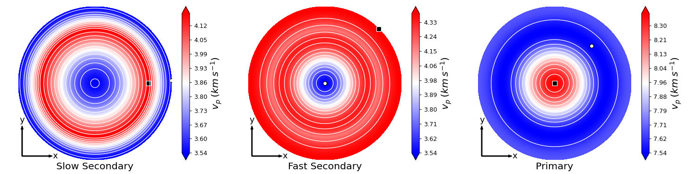

.. _seismic_tutorial:

==============================
Seismic wave analysis tutorial
==============================

  :Last updated: |today|
  :Author: **Gianfranco Ulian**

Preliminary operations
======================

Download the :download:`hydroxylapatite input file<../downloads/hydroxylapatite.dat>`,
which contains the second-order elastic moduli tensor of hydroxylapatite in 
Voigt's notation (values in GPa) and the density of the mineral, expressed in 
:math:`kg\ m^{-3}`. [1]_

Put this file in a folder of your choice and enter in this folder via the 
command prompt (or console under Linux/Mac OSX).

Analysis of the acoustic wave velocities by solving the Christoffel's equation
==============================================================================

This analysis is conducted in an automated mode by Quantas, so it is sufficient
to type:

.. code-block:: console

  > quantas seismic hydroxylapatite.dat 

to perform it.

Quantas reports the initial settings used in this analysis:

.. code-block:: console
  
  ________                       __
  \_____  \  __ _______    _____/  |______    ______
   /  / \  \|  |  \__  \  /    \   __\__  \  /  ___/
  /   \_/.  \  |  // __ \|   |  \  |  / __ \_\___ \
  \_____\ \_/____/(____  /___|  /__| (____  /____  >
         \__>          \/     \/          \/     \/
                                              v0.9.1
  Authors: Gianfranco Ulian
  Copyright 2020, University of Bologna
  
  
  Calculator: wave velocities from Christoffel's equation
  
  Measurement units
  -------------------------------------
   - pressure:    GPa

  Number of angular points
  -------------------------------------
   - ntheta:      180
   - nphi:        720

  Measurement units
  -------------------------------------
   - pressure:    GPa

  Plotting
  -------------------------------------
   - requested:   True
   - dpi:         80
   - 3D plots:    True
   - 2D plots:    True
   - projection:  Lambert equal area

.. warning::

  At the moment, only elastic constants expressed in GPa are supported. If you
  want to follow this tutorial with elastic constants for a system of your 
  choice, and their value are not in  GPa, please, convert them in this units
  before creating the input file and starting the analysis.
  
Then, the input file is read and relevant properties are printed on screen (and
in the output file ``hydroxylapatite_SEISMIC.txt``):

.. code-block:: console

  Reading input file: hydroxylapatite.dat
  Analysis of the sound velocities in Hydroxylapatite
  
  Stiffness matrix (values in GPa)
      187.2080       65.1930       84.7030        0.0000        0.0000        0.0000
       65.1930      187.2080       84.7030        0.0000        0.0000        0.0000
       84.7030       84.7030      222.6580        0.0000        0.0000        0.0000
        0.0000        0.0000        0.0000       39.6870        0.0000        0.0000
        0.0000        0.0000        0.0000        0.0000       39.6870        0.0000
        0.0000        0.0000        0.0000        0.0000        0.0000       61.0070
  
  Compliance tensor (values in TPa^-1)
     6.758054    -1.437660    -2.023971     0.000000     0.000000     0.000000
    -1.437660     6.758054    -2.023971     0.000000     0.000000     0.000000
    -2.023971    -2.023971     6.031101     0.000000     0.000000     0.000000
     0.000000     0.000000     0.000000    25.197168     0.000000     0.000000
     0.000000     0.000000     0.000000     0.000000    25.197168     0.000000
     0.000000     0.000000     0.000000     0.000000     0.000000    16.391562
  
Then, the Quantas calculated the phase velocities, group velocities, power flow
angle and the enhancement factor of the mineral along on different directions.

.. code-block:: console

  Start calculation of velocities by solving Christoffel's equation
    [##################################################]  100%

After this operation ended, both 3D (spherical) and 2D (polar) plots of the
calculated properties are made.

.. code-block:: console 

  Calculated data exported to hydroxylapatite_SEISMIC.hdf5
  - making 3D plots of phase velocity
  - making 2D plots of phase velocity
     *  Slow Secondary: anisotropy =  16.6 %
     *  Fast Secondary: anisotropy =  21.4 %
     *         Primary: anisotropy =  10.4 %
  - making 3D plots of relative phase velocity
  - making 2D plots of relative phase velocity
  - making 3D plots of group velocity
  - making 2D plots of group velocity
     *  Slow Secondary: anisotropy =  21.3 %
     *  Fast Secondary: anisotropy =  21.4 %
     *         Primary: anisotropy =  10.4 %
  - making 3D plots of relative group velocity
  - making 2D plots of relative group velocity
  - making 3D plots of powerflow angle
  - making 2D plots of powerflow angle
  - making 3D plots of enhancement factor
  - making 2D plots of enhancement factor
  - making 2D plots of different ratios:
     * S-wave anisotropy = 200*(v_s1-v_s2)/(v_s1+v_s2)
     * v_P/v_s1
     * v_P/v_s2
  - making 2D plots of polarization

The produced polar plots should be like the following ones:

         secondary and primary phase velocities.

Upper hemisphere equal area projection of the slow secondary, fast secondary
and primary phase velocities.

   

         secondary and primary group velocities.
   
Upper hemisphere equal area projection of the slow secondary, fast secondary
and primary group velocities.

         secondary and primary power flow angle.

Upper hemisphere equal area projection of the slow secondary, fast secondary
and primary power flow angle.

         secondary and primary enhancement factor.

Upper hemisphere equal area projection of the slow secondary, fast secondary
and primary enhancement factor.

         secondary and primary polarization of the phase velocities.

Upper hemisphere equal area projection of the slow secondary, fast secondary
and primary polarization of the phase velocities.

.. note:: 

  The calculated data reported in the ``hydroxylapatite_SEISMIC.hdf5`` contains
  the values used to generate the 2D and 3D plots of the elastic properties of
  the crystalline material. They can be extracted to generate plots according 
  to the user's preferences via:
  
  .. code-block:: console 
    
    quantas export seismic hydroxylapatite_SEISMIC.hdf5

.. rubric:: References

.. [1] Ulian, G., Valdre, G., 2018. Second-order elastic constants of hexagonal 
       hydroxylapatite (P63) from ab initio quantum mechanics: comparison between DFT 
       functionals and basis sets. Int. J. Quantum Chem. 118, e25500
