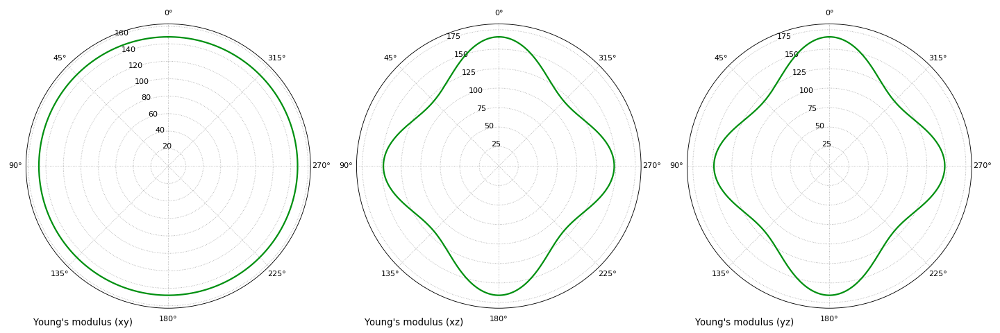
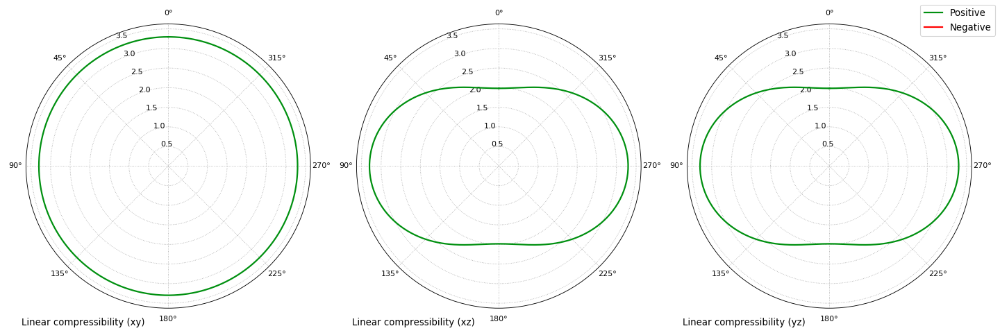
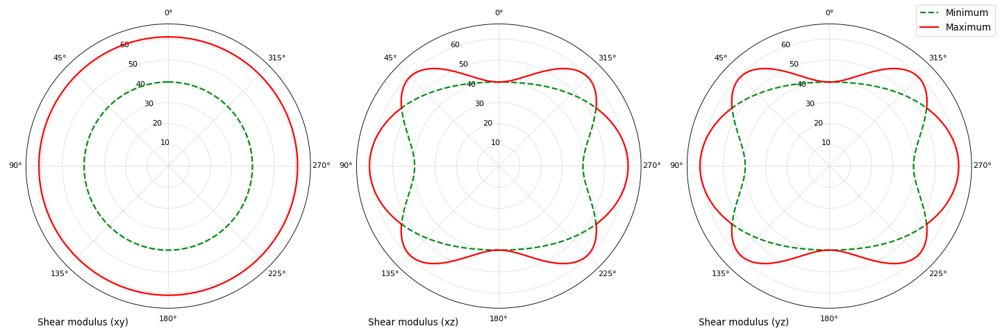
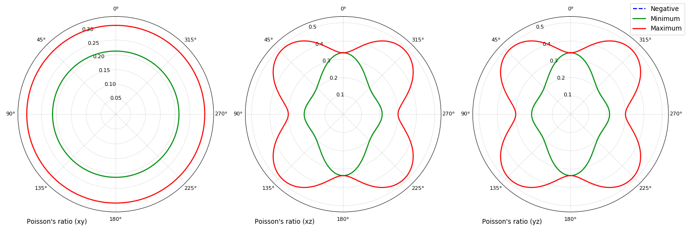
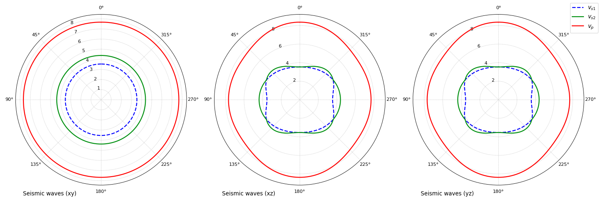

.. _soec_tutorial:

=============================================
Second-Order Elastic Moduli Analysis tutorial
=============================================

  :Last updated: |today|
  :Author: **Gianfranco Ulian**

Preliminary operations
======================

Download the :download:`hydroxylapatite input file<../downloads/hydroxylapatite.dat>`, 
which contains the second-order elastic tensor of hydroxylapatite in Voigt 
notation (:math:`6 \times 6` matrix, values in GPa) and the density of the mineral, 
expressed in :math:`kg\ m^{-3}`. [1]_

Put this file in a folder of your choice and enter in this folder via the 
command prompt (or console under Linux/Mac OSX).

Analysis of the second-order elastic constants
==============================================

This analysis is conducted in an automated mode by Quantas, so it is sufficient to type:

.. code-block:: console

  > quantas soec hydroxylapatite.dat 

to perform it.

Quantas reports the initial settings used in this analysis:

.. code-block:: console
  
  ________                       __
  \_____  \  __ _______    _____/  |______    ______
   /  / \  \|  |  \__  \  /    \   __\__  \  /  ___/
  /   \_/.  \  |  // __ \|   |  \  |  / __ \_\___ \
  \_____\ \_/____/(____  /___|  /__| (____  /____  >
         \__>          \/     \/          \/     \/
                                              v0.9.0
  Authors: Gianfranco Ulian
  Copyright 2020, University of Bologna
  
  
  Calculator: Second-order elastic constants analysis
  
  Measurement units
  -------------------------------------
   - pressure:    GPa

.. warning::

  At the moment, only elastic constants expressed in GPa are supported. If you want to follow 
  this tutorial with elastic constants for a system of your choice, and their value are not in 
  GPa, please, convert them in this units before creating the input file and starting the 
  analysis.
  
Then, the input file is read and relevant properties are printed on screen (and in the output 
file ``hydroxylapatite_SOEC.txt``):

.. code-block:: console

  Reading input file: hydroxylapatite.dat
  
  Elastic analysis of Hydroxylapatite
  
  System is hexagonal
  Density: 3178.0 kg m^-3
  
  Stiffness matrix (values in GPa)
      187.2080       65.1930       84.7030        0.0000        0.0000        0.0000
       65.1930      187.2080       84.7030        0.0000        0.0000        0.0000
       84.7030       84.7030      222.6580        0.0000        0.0000        0.0000
        0.0000        0.0000        0.0000       39.6870        0.0000        0.0000
        0.0000        0.0000        0.0000        0.0000       39.6870        0.0000
        0.0000        0.0000        0.0000        0.0000        0.0000       61.0070
  
  Compliance tensor (values in TPa^-1)
     6.758054    -1.437660    -2.023971     0.000000     0.000000     0.000000
    -1.437660     6.758054    -2.023971     0.000000     0.000000     0.000000
    -2.023971    -2.023971     6.031101     0.000000     0.000000     0.000000
     0.000000     0.000000     0.000000    25.197168     0.000000     0.000000
     0.000000     0.000000     0.000000     0.000000    25.197168     0.000000
     0.000000     0.000000     0.000000     0.000000     0.000000    16.391562
  
A symmetry analysis on the values of the SOECs matrix (correctly) revealed that the system is
hexagonal, and the stiffness and compliance matrices are reported.

Polycrystalline (average) properties:

.. code-block:: console 

  Average properties
            Bulk      Young's      Shear     Poisson's 
          modulus     modulus     modulus      ratio   
           (GPa)       (GPa)       (GPa)               
  Voigt  118.47467   136.63989    52.24120    0.30778  
  Reuss  116.60441   131.05436    49.91864    0.31268  
  Hill   117.53954   133.85036    51.07992    0.31021  

and the eigenvalues of the stiffness matrix:

.. code-block:: console 

  Eigenvalues of the stiffness matrix:
      lambda_1: 39.68700
      lambda_2: 39.68700
      lambda_3: 61.00700
      lambda_4: 116.82176
      lambda_5: 122.01500
      lambda_6: 358.23724

are calculated and reported. The eigenvalues are all positive, meaning that the system is 
mechanically stable.

.. note::

  If any of the eigenvalues were negative, the analysis would have stopped, detecting the 
  instability of the system.
  
Quantas then proceeds searching for the minimum and maximim values of:

  - Young's modulus;
  - linear compressibility;
  - shear modulus;
  - Poisson's ratio
  - seismic waves (*if the density is present in input*)

along crystal directions, assuming the system as a monocrystal. The results of this procedure 
are reported in tabular format for Young's modulus and linear compressibility:

.. code-block:: console 

  Variations of the elastic moduli:
  
      --------------------------------------------------------------------------------
                 |         Young's modulus          |      Linear compressibility
      -----------|----------------------------------|---------------------------------
                 |      E_min            E_max      |    beta_min         beta_max
      Values     |    117.6414         165.8072     |     1.9832           3.2964
      -----------|----------------------------------|---------------------------------
      Anisotropy |              1.4094              |              1.6622
      -----------|----------------------------------|---------------------------------
                 |     0.5213           0.0000      |     0.0000           0.7071
      Axis       |     0.5213           0.0000      |     0.0000           0.7071
                 |     0.6757           1.0000      |     1.0000           0.0000
      --------------------------------------------------------------------------------
  Notes: E min/max values in GPa, beta min/max values in TPa^-1
  
for shear modulus and Poisson's ratio:

.. code-block:: console 

      --------------------------------------------------------------------------------
                 |          Shear modulus           |         Poisson's ratio
      -----------|----------------------------------|---------------------------------
                 |      G_min            G_max      |     nu_min           nu_max
      Values     |     39.6870          61.0075     |     0.1944           0.4857
      -----------|----------------------------------|---------------------------------
      Anisotropy |              1.5372              |              2.4987
      -----------|----------------------------------|---------------------------------
                 |     0.5000           -0.6832     |     0.0000           0.7356
      1st Axis   |     0.8660           0.7302      |     -1.0000          -0.0002
                 |     0.0000           0.0000      |     -0.0000          -0.6775
      -----------|----------------------------------|---------------------------------
                 |     0.5000           -0.6832     |     0.0000           0.7356
      2nd Axis   |     0.8660           0.7302      |     -1.0000          -0.0002
                 |     0.0000           0.0000      |     -0.0000          -0.6775
      --------------------------------------------------------------------------------
  Notes: G min/max values in GPa
  
and for seismic wave velocities:

.. code-block:: console 

  Variations of the seismic velocities:
  
      -------------------------------------------------------------------------------------
                 |          V_s1          |          V_s2          |          V_p
      -----------|------------------------|------------------------|-----------------------
                 |    min         max     |    min         max     |    min         max
      Values     |   3.5338      4.1768   |   3.5338      4.3814   |   7.5397      8.3703
      -----------|------------------------|------------------------|-----------------------
      Anisotropy |         1.1819         |         1.2398         |         1.1102
      -----------|------------------------|------------------------|-----------------------
                 |   0.0000      0.8597   |  -0.0000      0.7071   |   0.5987      0.0000
      Axis       |  -0.0000     -0.0000   |  -0.0000      0.7071   |   0.5987      0.0000
                 |  -1.0000      0.5109   |   1.0000      0.0000   |  -0.5320     -1.0000
      -------------------------------------------------------------------------------------
  Notes: min/max values in km s^-1

Analysis of elastic properties on :math:`(xy)`, :math:`(xz)` and :math:`(yz)` planes
====================================================================================

By using the ``--polar`` option, the elastic properties are evaluated on the cited planes:

.. code-block:: console

  > quantas soec hydroxylapatite.dat --polar

The analysis proceeds calculating the bi-dimensional variations of the cited properties on the 
:math:`(xy)`, :math:`(xz)` and :math:`(yz)` planes:

.. code-block:: console

 - Calculation of polar (2D) properties:
     * along (xy)
         a. Young's modulus
         b. Linear compressibility
         c. Shear modulus
         d. Poisson's ratio
         e. Wave velocities
     * along (xz)
         a. Young's modulus
         b. Linear compressibility
         c. Shear modulus
         d. Poisson's ratio
         e. Wave velocities
     * along (yz)
         a. Young's modulus
         b. Linear compressibility
         c. Shear modulus
         d. Poisson's ratio
         e. Wave velocities

  Calculation time:     62.7 sec

Some polar plots of the elastic properties can be produced in an automated mode if the command is launched as:

.. code-block:: console

  > quantas soec hydroxylapatite.dat --polar --plot
  
.. note::

  To generate publication-ready picture, it is recommended to increase the dot-per-inch (DPI) 
  of the output images by using, for example:
  
  .. code-block:: console
  
    > quantas soec hydroxylapatite.dat --polar --plot --dpi 300

If plots are requested, the following lines will be printed:

.. code-block:: console 

  Plotting results as requested:
   - figure hydroxylapatite_SOEC_E.png generated
   - figure hydroxylapatite_SOEC_LC.png generated
   - figure hydroxylapatite_SOEC_G.png generated
   - figure hydroxylapatite_SOEC_Nu.png generated
   - figure hydroxylapatite_SOEC_waves.png generated
  
  Calculated data exported to hydroxylapatite_SOEC.hdf5

The produced polar plots should be like the following ones:

   

   

   

   

.. note:: 

  The calculated data reported in the ``hydroxylapatite_SOEC.hdf5`` contains the values used to
  generate the 2D polar plots of the elastic properties of the crystalline material. They can 
  be extracted to generate plots according to the user's preferences via:
  
  .. code-block:: console 
    
    quantas export soec hydroxylapatite_SOEC.hdf5

.. rubric:: References

.. [1] Ulian, G., Valdre, G., 2018. Second-order elastic constants of hexagonal 
       hydroxylapatite (P63) from ab initio quantum mechanics: comparison between DFT 
       functionals and basis sets. Int. J. Quantum Chem. 118, e25500
