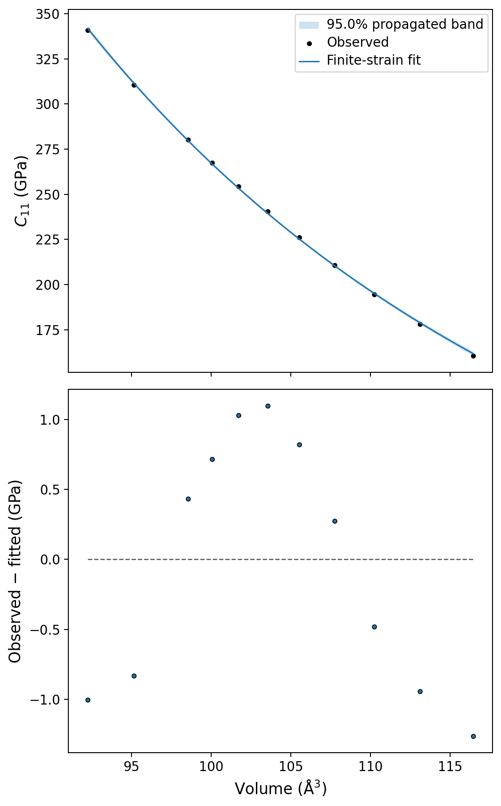
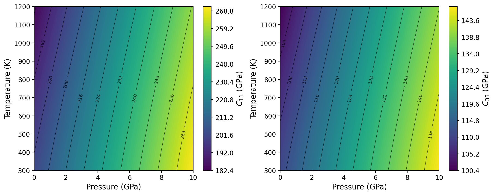
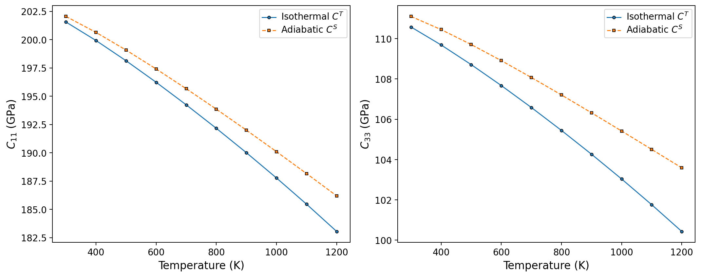
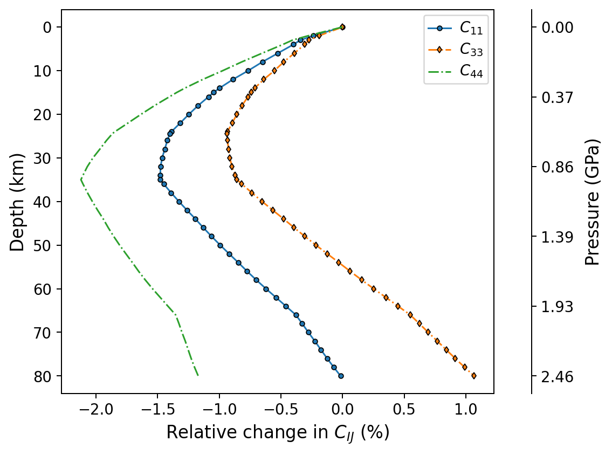
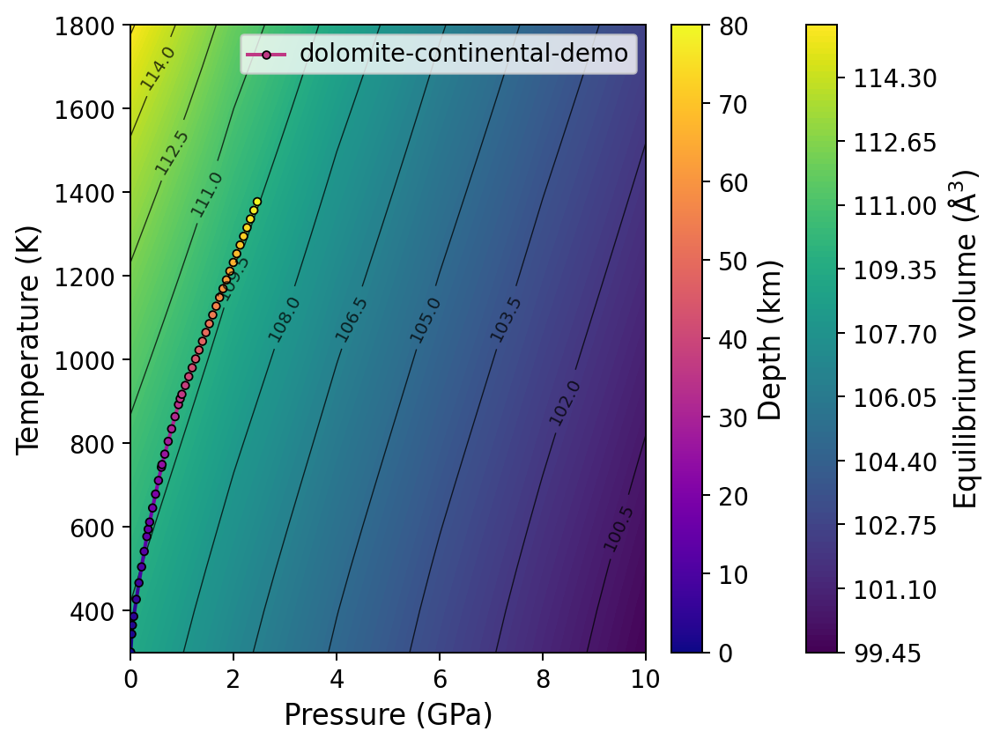

Thermoelasticity
================

This tutorial develops a complete quasi-static thermoelastic analysis of
PBE0 dolomite.  It begins with a quasi-harmonic pressure-temperature result and
a series of static elastic tensors, calibrates a reusable cold finite-strain
model, and then evaluates that model at a single state, on a rectangular
pressure-temperature grid, and along a continental depth profile.

The tutorial deliberately follows the staged design of Quantas:

.. code-block:: text

   QHA input or result
           +
   static Cij(V) series
           |
           v
   model calibration
           |
           +--> one P-T state --> Elasticity/SEISMIC input
           |
           +--> rectangular P-T grid --> HDF5 + CSV + contour plots
           |
           +--> geological profile --> HDF5 + CSV + depth plots

The scientific theory is described in :doc:`../theory/thermoelasticity`.  The
operational model and validation policies are described in
:doc:`../workflows/thermoelasticity`.

Scientific objective
--------------------

The goal is to determine the evolution of the dolomite elastic tensor under
combined pressure and temperature using the quasi-static approximation,

.. math::

   C^T_{IJ}(P,T)
   \simeq
   C^{\mathrm c}_{IJ}\!\left[V_{\mathrm{QHA}}(P,T)\right].

The cold elastic model is calibrated from static second-order elastic
coefficients sampled at several volumes.  The QHA calculation supplies the
equilibrium volume and thermodynamic quantities at finite pressure and
temperature.  Quantas can then reconstruct:

- the isothermal tensor :math:`C^T(P,T)`;
- the adiabatic tensor :math:`C^S(P,T)`, when the required QHA fields exist;
- density and equilibrium volume;
- propagated fit and volume uncertainties;
- mechanical-stability diagnostics;
- extrapolation masks for the QHA coordinate domain and elastic-volume domain.

This workflow does **not** calculate the explicit strain derivatives of the
phonon frequencies.  Temperature enters the cold tensor through the QHA
volume, followed by the explicit isothermal-to-adiabatic conversion where
available.

Dataset
-------

The tutorial combines two curated datasets.

Static elastic series
^^^^^^^^^^^^^^^^^^^^^

The thermoelastic input contains eleven CRYSTAL calculations from -6 to
20 GPa.  Each calculation includes:

- the static electronic energy;
- primitive-cell volume and density;
- a complete pressure-corrected Wallace stiffness tensor;
- the lattice and ordered atomic structure;
- tensor-frame normalization metadata.

The normalized input is distributed here:

:download:`Download the dolomite thermoelastic YAML <../_downloads/tutorials/thermoelasticity/dol_pbe0_thermoelastic.yaml>`

The original CRYSTAL outputs are retained under
``examples/thermoelasticity/crystal_outputs``.  The list file contains:

.. code-block:: text

   dol_pbe0_soec_p-06.out
   dol_pbe0_soec_p-04.out
   dol_pbe0_soec_p-02.out
   dol_pbe0_soec_p+00.out
   dol_pbe0_soec_p+02.out
   dol_pbe0_soec_p+04.out
   dol_pbe0_soec_p+06.out
   dol_pbe0_soec_p+08.out
   dol_pbe0_soec_p+10.out
   dol_pbe0_soec_p+15.out
   dol_pbe0_soec_p+20.out

The CRYSTAL ``PRESSURE`` keyword is essential.  It ensures that the reported
coefficients already contain the hydrostatic pre-stress correction required for
wave propagation and thermoelastic reconstruction.  Quantas must not apply the
same correction a second time.

QHA dataset
^^^^^^^^^^^

The QHA input contains seven volumes, 27 q-points, and 30 phonon modes for the
primitive dolomite cell:

:download:`Download the dolomite QHA YAML <../_downloads/tutorials/thermoelasticity/dol_pbe0_qha.yaml>`

The tutorial evaluates the QHA model from 300 to 1800 K and from 0 to 10 GPa.
This wider temperature interval is needed because the geological profile later
reaches approximately 1380 K.

Before continuing
-----------------

A reliable thermoelastic calculation needs more than two files with compatible
names.  Check the following scientific conditions first.

#. The QHA and elastic calculations describe the same normalized cell.
#. Static elastic tensors are sampled over a volume interval broad enough to
   contain the QHA equilibrium volumes of interest.
#. Every elastic tensor uses one common Cartesian frame.
#. The same Voigt and shear-strain convention is used throughout.
#. The static tensors include the appropriate pressure correction.
#. The QHA result contains :math:`C_V` and the thermal-expansion tensor if an
   adiabatic tensor is required.
#. The requested pressure-temperature states are meaningful for the material;
   Quantas does not determine phase stability or decomposition boundaries.

Stage 1: generating the thermoelastic input
-------------------------------------------

Starting from the CRYSTAL outputs, create the normalized YAML with:

.. code-block:: console

   cd examples/thermoelasticity/crystal_outputs

   quantas thermoelasticity inpgen dol_pbe0_soec.txt \
       --list \
       --jobname "Dolomite PBE0 QSA thermoelasticity" \
       --output ../dol_pbe0_thermoelastic.yaml \
       --force

During input generation Quantas:

- reads every elastic tensor and its pressure;
- sorts the points consistently;
- checks ordered-atom correspondence;
- determines the elastic symmetry;
- co-rotates sampled tensors to a single reference frame;
- stores the original and normalized frame metadata.

The beginning of the resulting file records the scientific conventions:

.. code-block:: yaml

   schema:
     name: quantas-thermoelastic-input
     version: '1.0'
   job: Dolomite PBE0 QSA thermoelasticity
   method: quasistatic
   interface: crystal
   conventions:
     strain: eulerian-finite-strain
     stiffness: wallace-hydrostatic-stress-strain
     prestress: applied-by-crystal-pressure-keyword
     tensor_orientation: crystal

The YAML is intentionally readable.  It is also the normalized contract used by
both CLI and Python frontends.

Stage 2: preparing the QHA result
---------------------------------

The QHA workflow is described in detail in :doc:`qha`.  For this tutorial, run:

.. code-block:: console

   quantas qha run examples/qha/crystal-phonons/dol_pbe0.yaml \
       --scheme freq \
       --minimization poly \
       --thermal-expansion mixed_derivative \
       --temperature 300 1800 100 \
       --pressure 0 10 2 \
       --energy-degree 3 \
       --frequency-degree 3 \
       --output dolomite_qha.hdf5 \
       --report dolomite_qha.log \
       --verbosity standard \
       --no-progress \
       --force

The resulting archive supplies the equilibrium-volume field
:math:`V(P,T)`, density normalization, :math:`C_V`, and the Cartesian
thermal-expansion tensor needed by the later reconstruction.

The QHA calculation reports 16 temperatures and 6 pressures.  Selected
zero-pressure values are:

.. list-table::
   :header-rows: 1
   :widths: 14 18 18 18

   * - T (K)
     - V (ų)
     - :math:`K_T` (GPa)
     - :math:`\alpha_V` (10⁻⁵ K⁻¹)
   * - 300
     - 109.1678
     - 90.218
     - 2.2953
   * - 800
     - 110.7406
     - 80.819
     - 3.2812
   * - 1200
     - 112.3460
     - 70.932
     - 3.9607

The cell expands and softens as temperature rises.  Pressure reverses part of
this expansion and increases the bulk modulus.

Stage 3: calibrating the cold finite-strain model
-------------------------------------------------

Calibration is performed once.  The resulting fit archive can then be reused
for many points, grids, and profiles.

.. code-block:: console

   quantas thermoelasticity run \
       examples/thermoelasticity/dol_pbe0_thermoelastic.yaml \
       dolomite_qha.hdf5 \
       --reference-eos BM3 \
       --finite-strain-order 3 \
       --adiabatic auto \
       --validation standard \
       --plot \
       --plot-output dolomite_fit_plots \
       --plot-preset publication \
       --output dolomite_fit.hdf5 \
       --report dolomite_fit.log \
       --verbosity standard \
       --no-progress \
       --force

Scientific choices
^^^^^^^^^^^^^^^^^^

``--reference-eos BM3``
   Fit the static energy-volume data with a third-order Birch--Murnaghan EOS.
   The fitted :math:`V_0`, :math:`K_0`, and :math:`K'_0` are shared by all
   component fits.

``--finite-strain-order 3``
   Retain the quadratic finite-strain term in the cold elastic expansion.

``--adiabatic auto``
   Preserve the isothermal QSA model and prepare the archived thermodynamic
   fields needed to construct :math:`C^S` during point, grid, or profile
   analysis.

``--validation standard``
   Keep supported fits, report cautionary conditions, and reject only
   scientifically unacceptable failures.

Reference EOS
^^^^^^^^^^^^^

The report gives:

.. code-block:: text

   Static reference EOS
   EOS               BM3
   V0                107.8981 +/- 0.0426 A^3
   K0                 93.2830 +/- 0.7105 GPa
   Kprime              3.7556 +/- 0.2667
   Fit quality          good
   R squared            1.0000

The reference EOS is fitted from the static electronic energies.  It is not the
finite-temperature QHA EOS.

Independent components
^^^^^^^^^^^^^^^^^^^^^^

Dolomite has trigonal-low elastic symmetry in the selected Cartesian frame.
The active independent components are:

.. code-block:: text

   C11  C12  C13  C14  C15  C33  C44

All seven component fits are classified as ``supported`` for this dataset.  A
supported classification means that the volume span, design conditioning,
leave-one-out behavior, and residual diagnostics satisfy the selected quality
policy.  It does not mean that the model is exact or universally
extrapolatable.

A small warning is emitted because the mass inferred independently from the
CRYSTAL density-volume pairs varies by 0.001712%.  The spread is small enough
for the normalized-cell mass to remain usable, but the provenance is retained
rather than silently discarded.

Understanding the fit figure
^^^^^^^^^^^^^^^^^^^^^^^^^^^^

   Observed and fitted :math:`C_{11}(V)` with residuals and the propagated
   95% confidence band.

The stiffness decreases as the volume expands.  The residuals remain close to
zero compared with the full :math:`C_{11}` range, but they are not random noise
with known experimental variance: the source calculations provide no SOEC
uncertainties, so the report labels the residual sum of squares as unweighted.
The confidence band therefore describes propagated parameter uncertainty under
the fitted model, not a complete uncertainty budget for the electronic-
structure calculation.

Why the fit archive contains no reconstructed tensor grid
^^^^^^^^^^^^^^^^^^^^^^^^^^^^^^^^^^^^^^^^^^^^^^^^^^^^^^^^^

Immediately after calibration, the report states:

.. code-block:: text

   Grid reconstruction                 deferred
   Grid tensors                        0
   Isothermal tensor condition         absent
   Adiabatic tensor condition          absent

This is intentional.  ``run`` calibrates a reusable scientific model; it does
not assume which P--T states the user wants to analyze.  Reconstruction occurs
in the later ``analysis`` stage.

Inspecting the calibrated archive
---------------------------------

.. code-block:: console

   quantas thermoelasticity inspect dolomite_fit.hdf5

The relevant summary is:

.. code-block:: text

   Stage                 model calibration
   Reference EOS         BM3
   Independent Cij       C11 C12 C13 C14 C15 C33 C44
   Tensor conditions     isothermal, adiabatic on analysis
   Frame status          normalized
   P support (GPa)       0-10
   T support (K)         300-1800
   Fit quality           supported=7

The pressure and temperature support shown here comes from the archived QHA
coordinates.  Elastic-volume support is checked independently at every
reconstructed state.

Stage 4: evaluating one state
-----------------------------

Evaluate the adiabatic tensor at 5 GPa and 800 K:

.. code-block:: console

   quantas thermoelasticity analysis point dolomite_fit.hdf5 5 800 \
       --tensor-condition adiabatic \
       --extrapolation fail \
       --output dolomite_5GPa_800K.dat \
       --force

The point table is:

.. code-block:: text

   Thermoelastic point (adiabatic)
   Pressure              5.0000 GPa
   Temperature           800.00 K
   Volume                104.9943 A^3
   Density               2908.74 kg m^-3
   C11_S                 230.2963 +/- 0.3460 GPa
   C12_S                  82.1914 +/- 0.4334 GPa
   C13_S                  70.2862 +/- 0.2907 GPa
   C14_S                  20.4173 +/- 0.3598 GPa
   C15_S                 -14.6793 +/- 0.1088 GPa
   C33_S                 126.7214 +/- 0.4290 GPa
   C44_S                  45.4699 +/- 0.2486 GPa
   Mechanically stable   True
   QHA extrapolated      False
   Elastic extrapolated  False

The two extrapolation flags are independent:

``QHA extrapolated``
   The requested pressure or temperature lies outside the archived QHA
   coordinate range.

``Elastic extrapolated``
   The reconstructed QHA volume lies outside the sampled static elastic-volume
   interval.

Both are false here, and the full Wallace stiffness matrix is positive
definite.

Reusable Elasticity/SEISMIC input
^^^^^^^^^^^^^^^^^^^^^^^^^^^^^^^^^

The output file contains the complete symmetric :math:`6\times6` adiabatic
tensor followed by the QHA-consistent density:

.. code-block:: text

   Dolomite PBE0 QSA thermoelasticity | P=5 GPa, T=800 K, C^S
       230.296285   82.191419   70.286248   20.417263  -14.679291    0.000000
        82.191419  230.296285   70.286248  -20.417263   14.679291    0.000000
        70.286248   70.286248  126.721432   -0.000000    0.000000    0.000000
        20.417263  -20.417263   -0.000000   45.469942   -0.000000   14.679291
       -14.679291   14.679291    0.000000   -0.000000   45.469942   20.417263
         0.000000    0.000000    0.000000   14.679291   20.417263   74.052433
   2908.73674895

:download:`Download the generated state input <../_downloads/tutorials/thermoelasticity/dolomite_5GPa_800K.dat>`

It can be passed directly to the other tensor workflows:

.. code-block:: console

   quantas elasticity run dolomite_5GPa_800K.dat
   quantas seismic run dolomite_5GPa_800K.dat

This is the simplest practical example of Quantas interoperability.

Stage 5: evaluating a pressure-temperature grid
-----------------------------------------------

Construct a grid from 0 to 10 GPa and 300 to 1200 K:

.. code-block:: console

   quantas thermoelasticity analysis grid dolomite_fit.hdf5 \
       --pressure 0 10 2 \
       --temperature 300 1200 100 \
       --tensor-condition both \
       --extrapolation fail \
       --output dolomite_grid.hdf5 \
       --table-output dolomite_grid.csv \
       --table-format csv \
       --uncertainties \
       --force

The HDF5 archive stores full :math:`6\times6` tensors.  The wide CSV retains
only symmetry-independent components, avoiding redundant columns.  The first
rows contain fields such as:

.. code-block:: text

   pressure_GPa,temperature_K,volume_A3,density_kg_m3,
   C11_T_GPa,sigma_C11_T_GPa,...,C11_S_GPa,sigma_C11_S_GPa,...,
   qha_extrapolated,elastic_extrapolated,adiabatic_valid,
   mechanically_stable,minimum_stiffness_eigenvalue_GPa

At 300 K:

.. list-table::
   :header-rows: 1
   :widths: 12 16 16 16 16

   * - P (GPa)
     - V (ų)
     - :math:`C^T_{11}` (GPa)
     - :math:`C^T_{33}` (GPa)
     - :math:`C^T_{44}` (GPa)
   * - 0
     - 109.1678
     - 201.5613
     - 110.5776
     - 40.1602
   * - 4
     - 104.8363
     - 230.1133
     - 125.9168
     - 45.6836
   * - 8
     - 101.2062
     - 257.4719
     - 140.2764
     - 50.8689

Compression stiffens every listed component.  Temperature produces the
opposite trend at fixed pressure because thermal expansion moves the system to
a larger equilibrium volume.

:download:`Download the complete grid table <../_downloads/tutorials/thermoelasticity/dolomite_grid.csv>`

Pressure-temperature maps
^^^^^^^^^^^^^^^^^^^^^^^^^

Generate two isothermal stiffness maps:

.. code-block:: console

   quantas thermoelasticity plot pt dolomite_grid.hdf5 \
       --component C11 \
       --component C33 \
       --tensor-condition isothermal \
       --quantity value \
       --layout facets \
       --levels 12 \
       --isolines \
       --isoline-labels \
       --preset publication \
       --output dolomite_pt_plots \
       --format png \
       --dpi 180

   Isothermal :math:`C_{11}` and :math:`C_{33}` over the analyzed P--T grid.

The nearly vertical contour orientation shows that pressure is the dominant
control over this domain.  Their finite tilt records thermal softening.  The
relative slopes differ between :math:`C_{11}` and :math:`C_{33}`, so a scalar
bulk-modulus trend cannot replace the tensorial analysis.

Stage 6: comparing isothermal and adiabatic tensors
---------------------------------------------------

At constant pressure, compare :math:`C^T` and :math:`C^S`:

.. code-block:: console

   quantas thermoelasticity plot compare dolomite_grid.hdf5 \
       --component C11 \
       --component C33 \
       --pressure 0 \
       --layout facets \
       --preset publication \
       --output dolomite_compare_plots \
       --format png \
       --dpi 180

   Isothermal and adiabatic :math:`C_{11}` and :math:`C_{33}` at 0 GPa.

Selected values are:

.. list-table::
   :header-rows: 1
   :widths: 12 18 18 18 18

   * - T (K)
     - :math:`C^T_{11}`
     - :math:`C^S_{11}`
     - :math:`C^T_{33}`
     - :math:`C^S_{33}`
   * - 300
     - 201.5613
     - 202.0548
     - 110.5776
     - 111.1018
   * - 800
     - 192.1630
     - 193.8586
     - 105.4477
     - 107.2084
   * - 1200
     - 183.0517
     - 186.1955
     - 100.4355
     - 103.5912

All values are in GPa.  The adiabatic tensor is stiffer for the normal
components shown, and the separation increases with temperature.  In this
example :math:`C_{44}` is unchanged by the adiabatic correction because the
thermal-stress vector and symmetry constrain the correction to the relevant
normal/coupled subspace.

Stage 7: evaluating a geological profile
----------------------------------------

The profile is deliberately separated from the rectangular grid.  It evaluates
only the states required by the geological path.

Profile definition
^^^^^^^^^^^^^^^^^^

The tutorial uses PREM pressure and a layered steady conductive continental
temperature model from 0 to 80 km:

:download:`Download the profile specification <../_downloads/tutorials/thermoelasticity/dolomite_continental_profile.yaml>`

The profile is an illustrative demonstration of the accepted formalism.  The
thermal parameters must be replaced by a documented regional model before
quantitative geological interpretation.  Quantas also does not test whether
dolomite remains the stable phase over the entire path.

The pressure and temperature models are independent:

.. code-block:: yaml

   pressure:
     model: prem

   temperature:
     model: continental-conductive
     surface_temperature_K: 300.0
     surface_heat_flow_mW_m2: 55.0
     layers:
       - name: upper crust
         thickness_km: 15.0
         conductivity_W_mK: 2.5
         heat_production_uW_m3: 0.8
       - name: lower crust
         thickness_km: 20.0
         conductivity_W_mK: 2.5
         heat_production_uW_m3: 0.4
       - name: lithospheric mantle
         thickness_km: 45.0
         conductivity_W_mK: 3.3
         heat_production_uW_m3: 0.02

Run the profile analysis:

.. code-block:: console

   quantas thermoelasticity analysis profile dolomite_fit.hdf5 \
       --profile-spec \
       examples/thermoelasticity/dolomite_continental_profile.yaml \
       --tensor-condition both \
       --extrapolation fail \
       --output dolomite_profile.hdf5 \
       --table-output dolomite_profile.csv \
       --table-format csv \
       --uncertainties \
       --plot \
       --force

The profile contains 45 depth points because layer boundaries and other
critical depths are inserted in addition to the regular 2 km spacing.

Selected profile states
^^^^^^^^^^^^^^^^^^^^^^^

.. list-table::
   :header-rows: 1
   :widths: 10 13 13 14 14 14 14

   * - Depth (km)
     - P (GPa)
     - T (K)
     - V (ų)
     - :math:`C^S_{11}`
     - :math:`C^S_{33}`
     - :math:`C^S_{44}`
   * - 0
     - 0.000
     - 300
     - 109.1678
     - 202.0548
     - 111.1018
     - 40.1602
   * - 15
     - 0.339
     - 594
     - 109.6213
     - 199.9423
     - 110.2774
     - 39.6202
   * - 35
     - 0.961
     - 906
     - 109.8861
     - 199.0656
     - 110.1504
     - 39.3080
   * - 80
     - 2.458
     - 1377
     - 109.5623
     - 202.0226
     - 112.2875
     - 39.6900

Stiffness values are in GPa.  The volume initially increases because thermal
expansion dominates the pressure increase.  At greater depth the pressure term
becomes strong enough to reverse part of that expansion.  The tensor response
is consequently non-monotonic:

- :math:`C^S_{11}` reaches a minimum change of approximately -1.48% near
  35 km and almost returns to its surface value at 80 km;
- :math:`C^S_{33}` reaches a shallow minimum and ends approximately 1.07%
  above its surface value;
- :math:`C^S_{44}` reaches approximately -2.12% near 35 km and remains about
  1.17% below its surface value at 80 km.

This is precisely why a coupled P--T path is more informative than a pressure-
only or temperature-only curve.

:download:`Download the complete profile table <../_downloads/tutorials/thermoelasticity/dolomite_profile.csv>`

Relative profile plot
^^^^^^^^^^^^^^^^^^^^^

.. code-block:: console

   quantas thermoelasticity plot profile dolomite_profile.hdf5 \
       --profile-name dolomite-continental-demo \
       --component C11 \
       --component C33 \
       --component C44 \
       --tensor-condition adiabatic \
       --mode relative \
       --layout overlay \
       --uncertainty none \
       --pressure-axis \
       --color-by component \
       --preset publication \
       --output dolomite_profile_plots \
       --format png \
       --dpi 180

   Relative changes in :math:`C^S_{11}`, :math:`C^S_{33}`, and
   :math:`C^S_{44}` along the illustrative continental path.

The profile plot emphasizes relative response and therefore omits uncertainty
bands for the three-component overlay.  Absolute values and uncertainties
remain available in the CSV and HDF5 products.

Checking the P--T and volume domain
^^^^^^^^^^^^^^^^^^^^^^^^^^^^^^^^^^^

.. code-block:: console

   quantas thermoelasticity plot domain dolomite_profile.hdf5 \
       --profile-name dolomite-continental-demo \
       --profiles \
       --extrapolation \
       --color-profiles-by-depth \
       --preset publication \
       --output dolomite_domain_plots \
       --format png \
       --dpi 180

   The geological path over the archived QHA equilibrium-volume field.

The path lies inside the QHA coordinate domain and inside the sampled elastic-
volume interval, so no extrapolation region is marked.  The background shows
that the path crosses nearly constant-volume contours: temperature-driven
expansion is progressively countered by pressure-driven compression.

Running the same workflow from Python
-------------------------------------

The complete public-API script is distributed with the examples:

:download:`Download the Thermoelasticity API script <../_downloads/tutorials/thermoelasticity/tutorial_api.py>`

.. literalinclude:: ../_downloads/tutorials/thermoelasticity/tutorial_api.py
   :language: python
   :linenos:

Run it from the project root:

.. code-block:: console

   python examples/thermoelasticity/tutorial_api.py \
       --output-dir thermoelasticity_tutorial

The script performs the same stages as the CLI:

#. run the dolomite QHA calculation;
#. calibrate the static cold finite-strain model;
#. write the fit HDF5 archive and report;
#. evaluate 5 GPa and 800 K;
#. write a shared Elasticity/SEISMIC input;
#. evaluate and export the rectangular P--T grid;
#. evaluate and export the geological profile;
#. generate the selected plots.

The key API distinction is between calibration and analysis:

.. code-block:: python

   fit_result = thermoelasticity.run(
       thermoelastic_input,
       qha_result,
       options=thermoelasticity.Options(
           reference_eos="BM3",
           finite_strain_order=3,
           adiabatic_mode="auto",
       ),
   )

   grid_result = thermoelasticity.analyze_grid(
       fit_result,
       pressure=thermoelasticity.regular_grid(0.0, 10.0, 2.0),
       temperature=thermoelasticity.regular_grid(300.0, 1200.0, 100.0),
       extrapolation_policy="fail",
   )

The fit result is reusable and does not contain a reconstructed grid.  The
analysis result contains full isothermal and adiabatic tensors for the requested
coordinates.

Accessing typed arrays
^^^^^^^^^^^^^^^^^^^^^^

.. code-block:: python

   payload = thermoelasticity.get_result(grid_result)

   print(payload.temperature.shape)          # (10,)
   print(payload.pressure.shape)             # (6,)
   print(payload.equilibrium_volume.shape)   # (10, 6)
   print(payload.independent_stiffness.shape)  # (10, 6, 7)
   print(payload.stiffness_isothermal.shape)   # (10, 6, 6, 6)
   print(payload.stiffness_adiabatic.shape)    # (10, 6, 6, 6)

The array order is temperature, pressure, and then tensor indices or component
index.  Use ``payload.independent_labels`` rather than assuming a fixed
component order.

Interpreting warnings and quality flags
---------------------------------------

A production analysis should explicitly inspect:

- component-fit quality and residuals;
- QHA-coordinate extrapolation masks;
- elastic-volume extrapolation masks;
- adiabatic validity masks;
- mechanical stability and minimum eigenvalues;
- phase stability and geological applicability outside Quantas.

``--extrapolation fail`` is used throughout this tutorial so that no state can
silently leave either support domain.  ``warn`` is useful for exploratory maps,
but the corresponding masks must remain visible in reports and figures.

The quasi-static approximation must also be interpreted correctly.  A smooth
and stable result does not prove that explicit vibrational strain derivatives
are negligible.  It only shows that the selected cold finite-strain model and
QHA volume field produce a numerically supported QSA reconstruction.

Reproducibility checkpoints
---------------------------

A correct run of the distributed data and options should reproduce the
following values within ordinary floating-point and formatting differences.

.. list-table::
   :header-rows: 1
   :widths: 54 23 23

   * - Quantity
     - Expected value
     - Unit or status
   * - Reference :math:`V_0`
     - 107.8981
     - ų
   * - Reference :math:`K_0`
     - 93.2830
     - GPa
   * - Reference :math:`K'_0`
     - 3.7556
     - dimensionless
   * - Supported independent fits
     - 7
     - components
   * - :math:`C^S_{11}` at 5 GPa, 800 K
     - 230.2963
     - GPa
   * - Density at 5 GPa, 800 K
     - 2908.7367
     - kg m⁻³
   * - Minimum profile :math:`C^S_{11}` change
     - -1.4794
     - %
   * - QHA extrapolated grid/profile states
     - 0
     - states
   * - Elastic extrapolated grid/profile states
     - 0
     - states
   * - Mechanical stability
     - true
     - every analyzed state

Suggested exercises
-------------------

#. Repeat the calibration with ``--finite-strain-order 2`` and compare the
   residuals, fitted pressure derivatives, and reconstructed high-pressure
   tensor.
#. Change ``--reference-eos`` from BM3 to BM2 or BM4 and examine whether the
   reference parameters are supported by the static energy-volume range.
#. Plot ``C14`` and ``C15``.  Explain why signed coupling components require a
   different visual interpretation from positive normal moduli.
#. Evaluate the same grid with ``--tensor-condition isothermal`` only and
   compare file size and table columns.
#. Replace the illustrative continental profile with a documented regional
   geotherm and cite every adopted density and thermal parameter.
#. Export a point to SEISMIC and compare directional phase velocities at two
   depths along the profile.
#. Deliberately request an unsupported state with ``--extrapolation warn``.
   Locate the warning and both extrapolation masks, then repeat with
   ``--extrapolation fail``.

Next steps
----------

The fit archive can be reused without repeating calibration.  From here, the
most natural extensions are:

- :doc:`elasticity` for directional elastic properties at selected P--T states;
- :doc:`seismic` for phase and group velocities using exported adiabatic
  tensors;
- :doc:`../theory/earth_profiles` for documented terrestrial paths;
- :doc:`../formats/thermoelastic_hdf5` for the native result structure.
